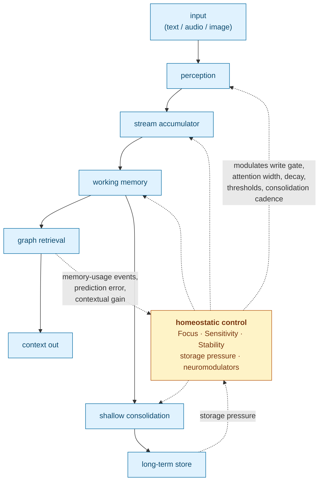

# Cortext

**A closed-loop context and memory engine for streaming AI.**

Most memory systems for LLMs are open-loop: text flows in, gets chunked,
embedded, summarized, and retrieved, while the parameters that govern those
stages stay fixed. Cortext is different. Retrieval outcomes, prediction error,
storage pressure, and consolidation results feed back into three continuous
control parameters: **Focus (F)**, **Sensitivity (S)**, and **Stability (T)**.
Those parameters modulate write gating, attention width, decay, thresholds, and
consolidation cadence for the next input.

Cortext ingests text, audio, and image signals, persists source-backed memory
traces, builds graph associations, retrieves compact context packets, and runs
explicit shallow consolidation over stored embeddings. The design borrows from
cognitive-science ideas such as working-memory limits, reconsolidation, serial
position effects, and emotional modulation, but as engineering heuristics, not
as a claim to model human memory.

## Why Cortext Exists

Cortext began for a personal reason. In 2022, my father-in-law was diagnosed
with dementia. Since then I have been focused on building systems that help
people with memory loss preserve continuity, confidence, and independence.

The same architecture is useful for long-horizon LLM memory, but the primary
motivation is human: Cortext is designed for realtime streams where the system
must notice what matters, surface relevant context, and avoid forcing the user
to manually manage memory. A care context requires homeostasis. Salience,
confusion, and emotional state change through the day, and that is exactly what
an open-loop memory system cannot track.

## The Loop



The current production loop is implemented as small operations in
`src/operations/`:

- `focus_feedback`, `sensitivity_feedback`, `stability_feedback` adjust the
  three control knobs from retrieval and usage outcomes.
- `accumulator`, `accumulator_scores`, `spike_bypass`, and `write_gate` turn
  streaming signals into bounded memory writes.
- `embedding_prediction_error` contributes a surprise signal to the feedback
  path.
- `neuromodulators` and `emotion_cascade` modulate encoding and
  reconsolidation strength.
- `reconsolidation` and `constructive_recall_internal` update current memory
  surfaces on re-exposure instead of blindly duplicating memories.
- `graph_retrieval` combines embedding similarity, durable graph edges,
  reconstruction-aware ranking, and temporal scoring.
- `soft_anchor` maintains provisional anchor evidence without treating it as
  immutable ground truth.

## Current Release Scope

The v1 release is a hard-cut runtime. It keeps the embedding/graph memory
engine and removes the heavier research stack from the production surface.

This branch does **not** ship an internal decoder stack, provider registry,
semantic extractor, summarizer, static label bank, fact layer, experimental
label-bucket graph, or mode-selected deep consolidation path. Git history
preserves those experiments, including the cognitive-mechanisms branch and its
ablation tools; the release surface documented here is intentionally smaller.

## What Cortext Provides

- Native C++20 API and a stable C ABI.
- FFI bindings for Python, Go, JavaScript/TypeScript, Dart, and WebAssembly.
- Text, audio, and image processing calls that can store durable memory.
- Text, audio, and image embed-only calls that do not mutate memory state.
- Working-memory and long-term retrieval packets returned as JSON through the
  C ABI.
- Explicit `Consolidate()` / `cortext_consolidate_json()` shallow replay.
- `Reset()` / `cortext_reset()` for volatile processor-state reset without
  deleting durable memories.
- SQLite metadata storage plus sqlite-objstore payload storage by default.
- External database/object-store callback seams for embedders that own storage.

## Runtime Model

Cortext's required encoder is `augmem/AIST-87M` in the local GGUF layout under
`models/AIST-87M-GGUF/`. The engine auto-discovers `AIST-87M_q8_0.gguf` or
`AIST-87M_q5_1.gguf`, or you can pin the model explicitly with
`CORTEXT_AIST_MODEL_PATH`. If the model cannot be resolved, engine creation
fails rather than falling back to a different embedding space.

AIST is a multimodal embedding model: text, audio, speech, and image inputs map
into one retrieval space. Audio inputs use 16 kHz mono float32 PCM. Image inputs
use row-major RGB/RGBA bytes with explicit width, height, and channel count.

Every database pins the encoder fingerprint that produced its embeddings. That
guard exists because mixing embedding spaces silently corrupts retrieval.

`source_id` is opaque provenance. Cortext uses it for exact same-source grouping
and hydration, not for hidden behavior switches.

## Storage Model

Cortext separates metadata/database storage from payload/object storage. SQLite
is the supported default, but embedders can own persistence topology.

- `cortext::Store` and `cortext::Transaction` define the database boundary for
  schema, query, and transactional work. `SQLiteStore` is the built-in
  implementation.
- `cortext::ObjectStore` and `cortext::ObjectTransaction` define
  content-addressed payload storage. `SqlObjectStore` is the current
  sqlite-objstore-backed implementation over a `Store`.
- `Cortext::Create()` has overloads for the default SQLite path, a
  caller-supplied database store, a caller-supplied object store, or both.

Alternate providers are extension points today, not bundled backends.

## Release Evidence

The current release probe compared this source tree against a preserved old
replay binary using the same local AIST GGUF model. The model rotation alone did
not explain the observed A/B drop. The main regression was a reconsolidation
policy that appended reconstruction rows without advancing
`current_memory_embeddings`, leaving graph retrieval on stale memory surfaces.

After restoring current-surface advancement and removing the experimental
label-bucket graph from production, dense and full sparse replay runs matched
the old binary exactly when built against the same system GGML runtime:
`retr_diffs=0` and `rank_diffs=0`. The local judge service was unavailable
during that pass, so historical blind-judge win counts still need a fresh judge
run before being quoted as current release numbers.

Use the replay executable for end-to-end memory behavior checks:

```bash
cmake -S . -B build -DCMAKE_BUILD_TYPE=Debug -DCORTEXT_BUILD_EXAMPLES=ON
cmake --build build -j --target cortext_chat_replay_live_run
./build/examples/benchmark/cortext_chat_replay_live_run --help
```

For long-horizon harness work:

```bash
python scripts/run_memory_harness.py --max-conversations 2 --max-turns 360 --max-total 720 --no-multi
```

## Build And Test

Core native builds require a C++20 compiler and CMake. SQLite is built from the
bundled `third_party/sqlite` source tree.

```bash
cmake -S . -B build -DCMAKE_BUILD_TYPE=Debug
cmake --build build -j
ctest --test-dir build -R cortext_tests --output-on-failure
```

Audio and image ingestion/embedding support is enabled by default and is part
of the supported Cortext build contract. The AIST GGML kernel backend is built
from bundled source by default; use `CORTEXT_USE_SYSTEM_GGML=ON` only when you
intentionally want to link against a preinstalled GGML runtime. Unsupported
text-only builds must opt out explicitly with `CORTEXT_ENABLE_AUDIO=OFF` or
`CORTEXT_ENABLE_IMAGE=OFF` plus
`CORTEXT_ALLOW_UNSUPPORTED_TEXT_ONLY_BUILD=ON`.

OpenTelemetry support is enabled by default. Use
`CORTEXT_DISABLE_OPENTELEMETRY=ON` only when you want a no-op telemetry build
without the OpenTelemetry dependency.

The CI release gate runs the model-free suite directly:

```bash
./build/tests/cortext_tests '~[aist]' --reporter compact
```

Examples are optional:

```bash
cmake -S . -B build -DCMAKE_BUILD_TYPE=Debug -DCORTEXT_BUILD_EXAMPLES=ON
cmake --build build -j
./build/examples/topical_chat_analysis/cortext_topical_chat_analysis --help
```

## C++ Quickstart

```cpp
#include <cortext/cortext.hpp>

#include <iostream>

int main()
{
  cortext::Cortext::Config cfg;
  cfg.focus = 0.7;        // F: attentional precision
  cfg.sensitivity = 0.5;  // S: reactivity to surprise
  cfg.stability = 0.8;    // T: plasticity vs. retention

  auto engine = cortext::Cortext::Create(cfg, "memory.db", "models");

  auto context = engine->ProcessText("Bailey likes tennis balls.", "chat/main");
  for (const auto &memory : context.retrieved_memory)
    {
      std::cout << memory.id << " " << memory.source_id << "\n";
    }

  auto embedding = engine->EmbedText("embed without storing");
  std::cout << "embedding dims: " << embedding.size() << "\n";

  engine->Consolidate();
  engine->Flush();
}
```

The three `Config` fields are the primary control knobs; most other tunable
parameters are derived from them through transformations specified in the paper.

Primary public entrypoints:

- C++ API: `include/cortext/cortext.hpp`
- C API: `include/cortext/capi.h`

## C ABI And FFI

The C ABI lives in `include/cortext/capi.h`. JSON-returning helpers allocate
strings owned by Cortext; callers must release them with `cortext_string_free`.

Primary calls:

| Purpose | C ABI |
|---|---|
| create | `cortext_create_with_config` |
| process text/audio/image | `cortext_process_*_json` |
| embed text/audio/image only | `cortext_embed_*_json` |
| explicit shallow consolidation | `cortext_consolidate_json` |
| commit buffered writes | `cortext_flush` |
| reset volatile state | `cortext_reset` |
| diagnostics | `cortext_last_error`, `cortext_version` |

Bindings live under `bindings/`:

- `bindings/python`: `ctypes`
- `bindings/go`: `cgo`
- `bindings/javascript`: Node-API plus TypeScript declarations
- `bindings/dart`: `dart:ffi`
- `bindings/wasm`: browser ES-module wrapper over the WebAssembly C ABI

Build the shared library for FFI consumers with CMake:

```bash
cmake --preset ffi-release
cmake --build --preset ffi-release --target cortext
```

Node's native addon uses the Node-enabled CMake preset:

```bash
cmake --preset ffi-release-node
cmake --build --preset ffi-release-node --target cortext cortext_node
```

Zig can also build the shared library when supplied with target-compatible
prebuilt GGML artifacts:

```bash
zig build check -Dshared=true -Dggml=true \
  -Dggml_include=/path/to/ggml/include \
  -Dggml_lib=/path/to/libggml \
  -Dggml_base_lib=/path/to/libggml-base \
  -Dggml_cpu_lib=/path/to/libggml-cpu
```

## WebAssembly

The browser build uses Emscripten and emits an ES module plus a `.wasm` payload:

```bash
./build-wasm.sh
```

Outputs:

```text
build-wasm/dist/wasm/cortext.js
build-wasm/dist/wasm/cortext.wasm
```

The generated module exports the public C ABI and `malloc/free`. A small
JavaScript wrapper lives in `bindings/wasm/cortext.js`, and a browser demo lives
in `examples/web/`.

Cortext still needs the AIST GGUF embedding model. For demos, either select the
model file in the browser UI or embed the model directory into the virtual
filesystem at build time:

```bash
./build-wasm.sh -DCORTEXT_WASM_PRELOAD_MODELS_DIR="$PWD/models/AIST-87M-GGUF"
```

Serve the repository root after building:

```bash
python3 -m http.server 8000
```

Then open `http://localhost:8000/examples/web/`.

## Repository Layout

- `include/`, `src/`: public headers and C++ implementation.
- `src/operations/`: control-loop and memory pipeline operations.
- `tests/`: Catch2 test suite.
- `examples/`: benchmarks, demos, and smoke tests.
- `bindings/`: Python, Go, JavaScript/TypeScript, Dart, and WebAssembly FFI.
- `scripts/`, `tools/`: experiment harnesses and offline utilities.
- `docs/paper/`: manuscript source and generated markdown.
- `models/`: local model assets.
- `third_party/`: vendored native dependencies.

## Paper

The formal specification of the architecture is generated at
`docs/paper/_manuscript/index.md` from the source sections in
`docs/paper/sections/`. If you want to understand why the loop is shaped the
way it is, start with the paper's knob derivations, stability/plasticity
analysis, homeostatic threshold control, consolidation section, and release
evidence.

Regenerate the paper with:

```bash
QUARTO_DISABLE_GIT=1 QUARTO_DISABLE_GITHUB=1 quarto render docs/paper
```
