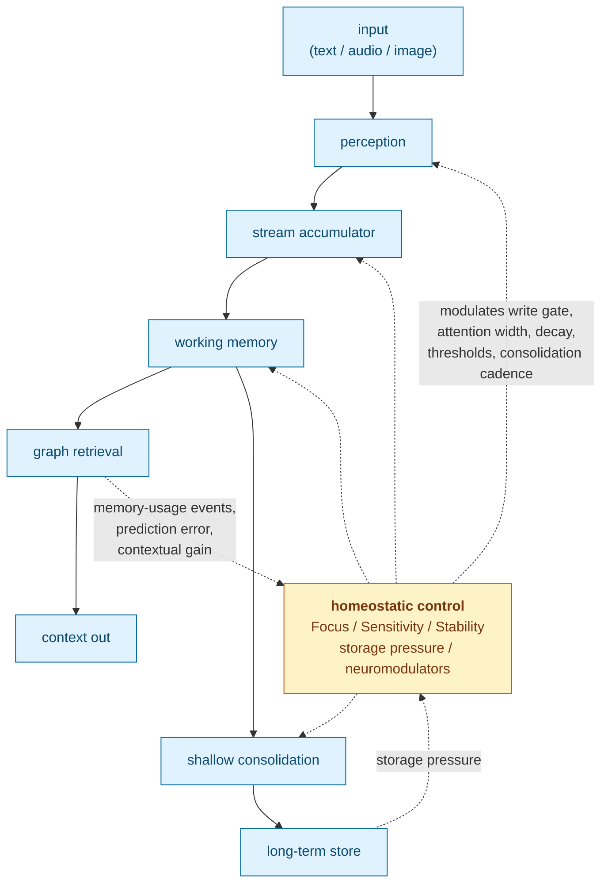

# Cortext

**A closed-loop memory engine for streaming AI.**

Cortext turns live text, audio, and image streams into durable, source-backed
memory. It stores compact traces, builds graph associations, retrieves relevant
context, and runs explicit shallow consolidation over embeddings. It ships as a
C++20 library with a stable C ABI and bindings for Python, Go,
JavaScript/TypeScript, Dart, and WebAssembly.

Most LLM memory systems are open-loop. Content is chunked, embedded,
summarized, and retrieved while the parameters that govern those stages stay
fixed. Cortext feeds retrieval outcomes, prediction error, storage pressure, and
consolidation results back into three continuous control knobs: **Focus (F)**,
**Sensitivity (S)**, and **Stability (T)**. Those knobs modulate write gating,
attention width, decay, thresholds, and consolidation cadence for the next
input.

## Results

The strongest result so far is a hosted frontier-judge eval on a public Meta
Multi-Session Chat slice (2026-06-30). Cortext won 7 of 9 probes by majority
(21 of 27 blind judgment rows) and used 98% fewer context tokens than
traditional chat+RAG.

| Outcome | Probe-majority wins | Raw wins | Probe-bootstrap row-win 95% CI | Mean context tokens |
|---|---:|---:|---:|---:|
| Cortext native | 7/9 | 21/27 | [0.519, 0.963] | 998 |
| Traditional chat+RAG | 0/9 | 0/27 | [0.000, 0.000] | 49,196 |
| Full-history upper bound | 0/9 | 1/27 | [0.000, 0.111] | 185,439 |
| Hosted compaction rollup | 1/9 | 5/27 | [0.037, 0.444] | n/a |
| No-majority split | 1/9 | n/a | n/a | n/a |

That is a 97.97% context-token reduction versus traditional chat+RAG
(probe-bootstrap 95% CI [97.77%, 98.17%]). Cortext also had the lowest mean
judged noise: 1.85, against 4.70, 5.00, and 3.63 for the other three systems.

**Caveat:** this is not yet a full sufficiency-match claim. Traditional
chat+RAG scored higher mean sufficiency (4.67 versus 4.41), and the compaction
baseline scored 4.63. Cortext wins on token cost, judge preference, and noise,
not yet on raw sufficiency.

Protocol: the replay processed 9,130 text turns from 708 rows of the Hugging
Face `nayohan/multi_session_chat` mirror, with daily source-time consolidation
at 02:00 UTC, a 5,000-event warmup, and 9 probes at 500-event intervals. The
judge was `gpt-5.5` over hosted OpenAI Chat Completions at a 1,000,000-token
context, three blind repetitions per probe, `judge_seed=42`, 2,000 bootstrap
samples, all 27 judgments completed across four text-only systems. The strict
gates passed: judge prompt fits context, full-history prompt fits judge context,
no future or current-turn leakage, hidden labels absent, text-only RAG
baselines. Artifact:
`docs/paper/artifacts/msc_frontier_late_200dlg_gpt55_20260630T053427Z/judge_openai_gpt55_four_system_clean.json`.

A post-optimization full replay on the same 9,130-turn MSC slice preserved the
native probe behavior exactly while flattening graph-retrieval latency. The 9
progress checkpoints reported `GraphRetrieve.total` between 13.7 ms and 27.7
ms, and the 9 judged probe turns reported 21.8-28.6 ms. Non-timing probe fields,
retrieved/working memory IDs, retrieval counts, memory counts, and consolidation
counts matched the saved baseline exactly. Artifact:
`docs/paper/artifacts/graph_profile/full_msc_verify_final/summary_slim.json`.

A follow-up 128k-capped RAG ablation on the same probes used six blinded
systems and three hosted `gpt-5.5` judgments per probe. Cortext won 6/9 probes
by majority and 19/27 rows, the capped compaction rollup won 3/9 probes and
8/27 rows, and semantic-vector-only,
lexical-keyword-only, rolling-window-only, and 16k hybrid chat+vector RAG each
won 0/9 probes and 0/27 rows. The max estimated judge prompt was 116,425
tokens under a 128,000 context cap; actual OpenAI usage was 1,871,994 prompt
tokens and 39,001 completion tokens. Mean context tokens were 816 for Cortext,
88 for semantic vector RAG, 224 for lexical RAG, 15,999 for rolling-window
chat, 15,999 for hybrid RAG, and 7,110 for compaction. Artifact:
`docs/paper/artifacts/msc_rag_ablation_128k_gpt55_20260630T_actual/judge_openai_gpt55_rag_ablation_128k.json`.

An earlier local blind-judge pass (2026-06-28) on a one-year sparse replay,
judged by Gemma4-12B-AWQ over vLLM at a 131,072-token context, completed 93/93
judgments.

| System | Per-31-probe wins | Raw wins | Mean context tokens |
|---|---:|---:|---:|
| Cortext native | 15.7/31 | 47/93 | 467 |
| Traditional chat RAG | 5.3/31 | 16/93 | 7,447 |
| Full-history upper bound | 1.0/31 | 3/93 | 15,974 |
| Tie / unclear | 9.0/31 | 27/93 | n/a |

Cortext's three single-repetition counts were 14, 17, and 16 of 31, bracketing
the historical 15-win A/B baseline. Mean context was 467 tokens versus 7,447 for
traditional RAG, a 93.7% reduction.

A separate release probe confirmed the original v1.0 hard cut was
behavior-preserving.
Against a preserved replay binary on the same AIST GGUF model and system GGML
runtime, dense and full sparse replay matched exactly: `retr_diffs=0` and
`rank_diffs=0`.

Full protocol and artifacts live in `docs/paper/sections/9_experimental.qmd` and
the generated manuscript at `docs/paper/_manuscript/index.md`.

Replay and harness tools:

```bash
cmake --build build -j --target cortext_chat_replay_live_run
./build/examples/benchmark/cortext_chat_replay_live_run --help
python scripts/run_memory_harness.py --max-conversations 2 --max-turns 360 --max-total 720 --no-multi
scripts/run_msc_frontier_judge.sh
```

## Status

Cortext v1.1 is the hard-cut production runtime: the embedding and graph memory
engine, and nothing else. The older research stack (decoder, provider registry,
semantic extractor, summarizer, static label bank, fact layer, label-bucket
graph, mode-selected deep consolidation) is preserved in git but not shipped.
The release surface is deliberately smaller than the research history. The v1.1
line keeps the same product surface while shipping release-hardening fixes for
storage growth, CI coverage, media validation, environment hook isolation,
volatile accumulator state, paper artifacts, and store ownership.

## Build And Test

Requirements:

- C++20 compiler
- CMake
- Git and Python 3 for default dependency and model bootstrap

The default build fetches bundled native dependencies and downloads the required
AIST GGUF model into `models/AIST-87M-GGUF/`. Configure, build, and test:

```bash
cmake -S . -B build -DCMAKE_BUILD_TYPE=Debug
cmake --build build -j
ctest --test-dir build -R cortext_tests --output-on-failure
```

The model-free CI release gate runs:

```bash
./build/tests/cortext_tests '~[aist]' --reporter compact
```

Examples are optional:

```bash
cmake -S . -B build -DCMAKE_BUILD_TYPE=Debug -DCORTEXT_BUILD_EXAMPLES=ON
cmake --build build -j
./build/examples/topical_chat_analysis/cortext_topical_chat_analysis --help
```

## C++ Quickstart

```cpp
#include <cortext/cortext.hpp>

#include <iostream>

int main()
{
  cortext::Cortext::Config cfg;
  cfg.focus = 0.7;        // F: attentional precision
  cfg.sensitivity = 0.5;  // S: reactivity to surprise
  cfg.stability = 0.8;    // T: plasticity vs. retention

  auto engine = cortext::Cortext::Create(cfg, "memory.db", "models");

  auto context = engine->ProcessText("Bailey likes tennis balls.", "chat/main");
  for (const auto &memory : context.retrieved_memory)
    {
      std::cout << memory.id << " " << memory.source_id << "\n";
    }

  auto embedding = engine->EmbedText("embed without storing");
  std::cout << "embedding dims: " << embedding.size() << "\n";

  engine->Consolidate();
  engine->Flush();
}
```

Public entrypoints:

- C++ API: `include/cortext/cortext.hpp`
- C API: `include/cortext/capi.h`

## What Cortext Provides

- Native C++20 API and stable C ABI.
- FFI bindings for Python, Go, JavaScript/TypeScript, Dart, and WebAssembly.
- Text, audio, and image processing calls that store durable memory.
- Text, audio, and image embed-only calls that do not mutate memory state.
- Working-memory and long-term retrieval packets returned as JSON.
- Explicit `Consolidate()` / `cortext_consolidate_json()` shallow replay.
- `Reset()` / `cortext_reset()` for volatile processor-state reset that keeps
  durable memories.
- SQLite metadata storage plus sqlite-objstore payload storage by default.
- External database and object-store callback seams for embedders that own
  storage.

## Runtime Model

Cortext's required encoder is `augmem/AIST-87M` in the local GGUF layout under
`models/AIST-87M-GGUF/`. The default build downloads and verifies
`AIST-87M_q8_0.gguf` automatically. The engine auto-discovers
`AIST-87M_q8_0.gguf` or `AIST-87M_q5_1.gguf`, or you can pin a path with
`CORTEXT_AIST_MODEL_PATH`. If the model cannot be resolved, engine creation
fails instead of falling back to a different embedding space.

AIST is multimodal: text, audio, speech, and image inputs map into one retrieval
space. Audio inputs use 16 kHz mono float32 PCM. Image inputs use row-major
RGB/RGBA bytes with explicit width, height, and channel count.

Every database pins the encoder fingerprint that produced its embeddings,
because mixing embedding spaces silently corrupts retrieval. `source_id` is
opaque provenance, used for exact same-source grouping and hydration, not hidden
behavior switches.

Default build flags are opt-out:

- `CORTEXT_FETCH_AIST_MODEL=ON` downloads AIST during `cmake --build`.
- `CORTEXT_AIST_MODEL_QUANT=q8_0` selects the quantization; use `q5_1` or `all`.
- `CORTEXT_FETCH_GGML=ON` fetches and builds the bundled GGML backend.
- `CORTEXT_DISABLE_OPENTELEMETRY=OFF` fetches the OpenTelemetry API; exporters
  stay off unless `CORTEXT_OPENTELEMETRY_EXPORTERS=ON`.
- `CORTEXT_USE_SYSTEM_GGML=ON` with `CORTEXT_FETCH_AIST_MODEL=OFF` are overrides
  for packagers or offline builds, not the default release path.
- `CORTEXT_EXPERIMENT_HOOKS=OFF` compiles out eval-only ablation env hooks.
  Set it to `ON` only for controlled mechanism sweeps.

Operational environment variables are intentionally narrow:

- Model/runtime: `CORTEXT_AIST_MODEL_PATH`,
  `CORTEXT_AIST_TOKENIZER_GGUF_PATH`, `CORTEXT_AIST_RUNTIME`,
  `CORTEXT_AIST_GGML_BACKEND`, `CORTEXT_AIST_THREADS`,
  `CORTEXT_AIST_N_GPU_LAYERS`, `CORTEXT_AIST_CONTEXT_LENGTH`, and
  `CORTEXT_GGML_LOG_LEVEL`.
- Threading: `CORTEXT_EMBED_THREADS` and `CORTEXT_INFER_THREADS`.
- SQLite/store tuning: `CORTEXT_SQLITE_SYNCHRONOUS`,
  `CORTEXT_SQLITE_WAL_AUTOCHECKPOINT`, `CORTEXT_SQLITE_JOURNAL_MODE`,
  `CORTEXT_SQLITE_LOCKING_MODE`, `CORTEXT_SQLITE_TEMP_STORE`,
  `CORTEXT_SQLITE_TRANSACTION_MODE`, `CORTEXT_SQLITE_PAGE_SIZE`,
  `CORTEXT_SQLITE_MMAP_SIZE`, `CORTEXT_SQLITE_CACHE_SIZE_KB`,
  `CORTEXT_OBJSTORE_BACKEND`, `CORTEXT_OBJSTORE_SYNC`, `SQLITE_VEC_PATH`,
  `CORTEXT_FOREGROUND_WAL_CHECKPOINT`, `CORTEXT_EVICTION_MIN_DB_BYTES`, and
  `CORTEXT_EVICTION_MIN_DB_AVAIL_PCT`.
- Eval wrappers that need OpenAI credentials use `--env-file` or
  `CORTEXT_EVAL_ENV_FILE`; repo-local `.env` is the only implicit fallback.

## Storage Model

Cortext separates metadata storage from payload storage. SQLite is the supported
default, but embedders can own persistence topology.

- `cortext::Store` and `cortext::Transaction` define the database boundary for
  schema, query, and transactional work. `SQLiteStore` is the built-in
  implementation.
- Store and transaction instances are single-owner handles: do not call methods
  concurrently on the same instance unless the caller provides external
  synchronization. For multiple instances or processes pointed at the same
  database, use a single writer per database; Cortext does not merge concurrent
  writer state. Schema migrations take a SQLite `BEGIN IMMEDIATE` write lock up
  front so concurrent startup cannot race on the applied migration set.
- `cortext::ObjectStore` and `cortext::ObjectTransaction` define
  content-addressed payload storage. `SqlObjectStore` is the current
  sqlite-objstore-backed implementation over a `Store`.
- `Cortext::Create()` has overloads for the default SQLite path, a
  caller-supplied database store, a caller-supplied object store, or both.

Alternate providers are extension points today, not bundled backends.

## How It Works

The production loop is built from small operations in `src/operations/`.



Key pieces:

- `focus_feedback`, `sensitivity_feedback`, and `stability_feedback` adjust the
  three control knobs from retrieval and usage outcomes.
- `accumulator`, `accumulator_scores`, `spike_bypass`, and `write_gate` turn
  streaming signals into bounded memory writes.
- `embedding_prediction_error` contributes surprise to the feedback path.
- `neuromodulators` and `emotion_cascade` modulate encoding and reconsolidation
  strength.
- `reconsolidation` and `constructive_recall_internal` update existing memory
  surfaces on re-exposure instead of duplicating memories.
- `graph_retrieval` combines embedding similarity, durable graph edges,
  reconstruction-aware ranking, and temporal scoring.
- `soft_anchor` maintains provisional anchor evidence without treating it as
  immutable ground truth.

The three `Config` fields are the primary control knobs. Most other tunable
parameters derive from them through transformations specified in the paper.

## C ABI And FFI

The C ABI lives in `include/cortext/capi.h`. JSON-returning helpers allocate
strings owned by Cortext; callers must release them with `cortext_string_free`.

| Purpose | C ABI |
|---|---|
| create | `cortext_create_with_config` |
| process text/audio/image | `cortext_process_*_json` |
| embed text/audio/image only | `cortext_embed_*_json` |
| explicit shallow consolidation | `cortext_consolidate_json` |
| commit buffered writes | `cortext_flush` |
| reset volatile state | `cortext_reset` |
| diagnostics | `cortext_last_error`, `cortext_version` |

Bindings live under `bindings/`:

- `bindings/python`: `ctypes`
- `bindings/go`: `cgo`
- `bindings/javascript`: Node-API plus TypeScript declarations
- `bindings/dart`: `dart:ffi`
- `bindings/wasm`: browser ES-module wrapper over the WebAssembly C ABI

Build the shared library for FFI consumers:

```bash
cmake --preset ffi-release
cmake --build --preset ffi-release --target cortext
```

Node's native addon uses the Node-enabled preset:

```bash
cmake --preset ffi-release-node
cmake --build --preset ffi-release-node --target cortext cortext_node
```

Zig can also build the shared library. The default Zig path downloads and
verifies AIST and compiles the bundled GGML CPU backend; prebuilt GGML paths are
an override for packagers.

```bash
zig build check
```

## WebAssembly

The browser build uses Emscripten and emits an ES module plus a `.wasm` payload:

```bash
./build-wasm.sh
```

Outputs:

```text
build-wasm/dist/wasm/cortext.js
build-wasm/dist/wasm/cortext.wasm
```

The module exports the public C ABI and `malloc/free`. A small JavaScript
wrapper lives in `bindings/wasm/cortext.js`, and a browser demo lives in
`examples/web/`.

The browser build still needs the AIST GGUF model. For demos, either select the
model file in the browser UI or embed the model directory into the virtual
filesystem at build time:

```bash
./build-wasm.sh -DCORTEXT_WASM_PRELOAD_MODELS_DIR="$PWD/models/AIST-87M-GGUF"
```

Serve the repository root after building:

```bash
python3 -m http.server 8000
```

Then open `http://localhost:8000/examples/web/`.

## Repository Layout

- `include/`, `src/`: public headers and C++ implementation.
- `src/operations/`: control-loop and memory pipeline operations.
- `tests/`: Catch2 test suite.
- `examples/`: benchmarks, demos, and smoke tests.
- `bindings/`: Python, Go, JavaScript/TypeScript, Dart, and WebAssembly FFI.
- `scripts/`, `tools/`: experiment harnesses and offline utilities.
- `docs/paper/`: manuscript source and generated markdown.
- `models/`: local model assets.
- `third_party/`: vendored native dependencies.

## Paper

The architecture is specified in the manuscript generated at
`docs/paper/_manuscript/index.md` from the source sections in
`docs/paper/sections/`. To understand why the loop is shaped the way it is, start
with the knob derivations, stability/plasticity analysis, homeostatic threshold
control, the consolidation section, and the release evidence.

Regenerate it with:

```bash
QUARTO_DISABLE_GIT=1 QUARTO_DISABLE_GITHUB=1 quarto render docs/paper
```

## Motivation

Cortext began for a personal reason. In 2022, my father-in-law was diagnosed
with dementia. Since then I have been focused on building systems that help
people with memory loss preserve continuity, confidence, and independence.

The same architecture is useful for long-horizon LLM memory, but the primary
motivation is human. Cortext is built for realtime streams where the system has
to notice what matters, surface relevant context, and avoid forcing the user to
manage memory by hand. A care context needs homeostasis. Salience, confusion,
and emotional state change through the day, and that is exactly what an
open-loop memory system cannot track.
