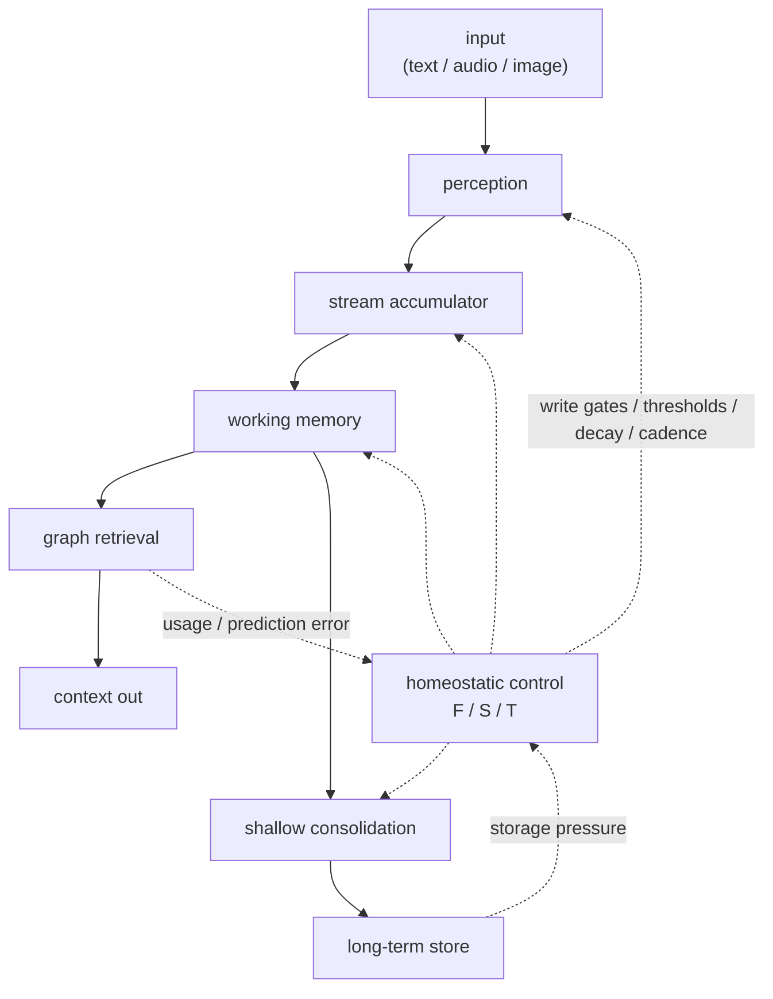

# Cortext

**A closed-loop memory engine for streaming AI.**

Cortext turns live text, audio, and image streams into durable, source-backed
memory. It stores compact traces, builds graph associations, retrieves relevant
context, and runs explicit shallow consolidation in a local C++20 runtime.

What makes it different:

- **Closed-loop control:** retrieval outcomes, prediction error, storage
  pressure, and consolidation feedback update three continuous knobs:
  **Focus (F)**, **Sensitivity (S)**, and **Stability (T)**.
- **Multimodal memory:** text, audio, speech, and image inputs share one AIST
  embedding space.
- **Small native surface:** C++20 library, stable C ABI, and bindings for
  Python, Go, JavaScript/TypeScript, Dart, and WebAssembly.
- **Durable by default:** SQLite metadata, sqlite-objstore payload storage, and
  extension seams for embedders that own persistence.
- **Evidence tracked with the code:** experiment artifacts and manuscript
  sections live under `docs/paper/`.

## Results Snapshot

The headline result is a hosted frontier-judge eval on a public Meta
Multi-Session Chat slice. Cortext won 7 of 9 probes by majority, won 21 of 27
blind judgment rows, and used 97.97% fewer context tokens than traditional
chat+RAG.

| Eval | Result | Context Cost |
|---|---|---:|
| MSC hosted frontier judge, 9 probes, 3 reps | Cortext 7/9 probe wins, 21/27 row wins | 998 tokens vs 49,196 for chat+RAG |
| MSC 128k RAG ablation, 6 systems | Cortext 6/9 probe wins, 19/27 row wins | 816 tokens; compaction 7,110; rolling window 15,999 |
| One-year sparse replay, local Gemma4 judge | Cortext 47/93 raw wins | 467 tokens vs 7,447 for chat+RAG |
| Long-horizon mechanism sweep | No removal improved the stack | Mechanisms retained under the hard-cut rule |

Caveat: this is not a full raw-sufficiency-match claim yet. In the hosted MSC
run, traditional chat+RAG and compaction scored slightly higher mean
sufficiency. Cortext's current win is context cost, judge preference, lower
noise, and a smaller production surface.

Full protocols, caveats, and artifacts are in
`docs/paper/sections/9_experimental.qmd` and the generated manuscript at
`docs/paper/_manuscript/index.md`.

## Status

Cortext v1.1.1 is the hard-cut production line: the embedding and graph memory
engine, release-hardening fixes, and the current bindings. Older research
components are preserved in git history but not shipped in the runtime surface.

## Build And Test

Requirements:

- C++20 compiler
- CMake
- Git and Python 3 for default dependency/model bootstrap

The default build fetches bundled native dependencies and downloads the required
AIST GGUF model plus vocab into `models/`.

```bash
cmake -S . -B build -DCMAKE_BUILD_TYPE=Debug
cmake --build build -j
ctest --test-dir build -R cortext_tests --output-on-failure
```

Model-free CI-style test gate:

```bash
./build/tests/cortext_tests '~[aist]' --reporter compact
```

Examples:

```bash
cmake -S . -B build -DCMAKE_BUILD_TYPE=Debug -DCORTEXT_BUILD_EXAMPLES=ON
cmake --build build -j
./build/examples/topical_chat_analysis/cortext_topical_chat_analysis --help
```

## C++ Quickstart

```cpp
#include <cortext/cortext.hpp>

#include <iostream>

int main()
{
  cortext::Cortext::Config cfg;
  cfg.focus = 0.7;        // F: attentional precision
  cfg.sensitivity = 0.5;  // S: reactivity to surprise
  cfg.stability = 0.8;    // T: plasticity vs. retention

  auto engine = cortext::Cortext::Create (cfg, "memory.db", "models");

  auto context = engine->ProcessText ("Bailey likes tennis balls.", "chat/main");
  for (const auto &memory : context.retrieved_memory)
    {
      std::cout << memory.id << " " << memory.source_id << "\n";
    }

  auto embedding = engine->EmbedText ("embed without storing");
  std::cout << "embedding dims: " << embedding.size () << "\n";

  engine->Consolidate ();
  engine->Flush ();
}
```

Public entrypoints:

- C++ API: `include/cortext/cortext.hpp`
- C API: `include/cortext/capi.h`

## API Surface

Cortext provides:

- Text, audio, and image processing calls that store durable memory.
- Text, audio, and image embed-only calls that do not mutate memory.
- Working-memory and long-term retrieval packets returned as JSON.
- Explicit shallow consolidation through `Consolidate()` /
  `cortext_consolidate_json()`.
- Volatile state reset through `Reset()` / `cortext_reset()` while durable
  memories remain.
- SQLite-backed default storage plus callback seams for external stores.

Bindings live under `bindings/`:

- `bindings/python`: `ctypes`
- `bindings/go`: `cgo`
- `bindings/javascript`: Node-API plus TypeScript declarations
- `bindings/dart`: `dart:ffi`
- `bindings/wasm`: browser ES-module wrapper over the WebAssembly C ABI

Build the shared library for FFI consumers:

```bash
cmake --preset ffi-release
cmake --build --preset ffi-release --target cortext
```

Node's native addon uses the Node-enabled preset:

```bash
cmake --preset ffi-release-node
cmake --build --preset ffi-release-node --target cortext cortext_node
```

## Runtime Model

Cortext's required encoder is `augmem/AIST-87M` in GGUF layout under
`models/AIST-87M-GGUF/`. The engine auto-discovers `AIST-87M_q8_0.gguf` or
`AIST-87M_q5_1.gguf`, or you can pin a model path with
`CORTEXT_AIST_MODEL_PATH`. If the model cannot be resolved, engine creation
fails instead of silently switching embedding spaces.

AIST maps text, audio, speech, and images into one retrieval space. Audio inputs
use 16 kHz mono float32 PCM. Image inputs use row-major RGB/RGBA bytes with
explicit width, height, and channel count.

Important build flags:

- `CORTEXT_FETCH_AIST_MODEL=ON`: download AIST during build.
- `CORTEXT_AIST_MODEL_QUANT=q8_0`: choose `q8_0`, `q5_1`, or `all`.
- `CORTEXT_FETCH_GGML=ON`: fetch and build bundled GGML.
- `CORTEXT_USE_SYSTEM_GGML=ON`: use a preinstalled GGML for packagers.
- `CORTEXT_EXPERIMENT_HOOKS=OFF`: compile out eval-only ablation hooks.

Operational environment variables are intentionally narrow. Most deployments
only need model/runtime overrides (`CORTEXT_AIST_MODEL_PATH`,
`CORTEXT_AIST_THREADS`, `CORTEXT_AIST_N_GPU_LAYERS`) and SQLite tuning
(`CORTEXT_SQLITE_*`, `CORTEXT_OBJSTORE_*`) when packaging or profiling.

Every database pins the encoder fingerprint that produced its embeddings,
because mixing embedding spaces corrupts retrieval. `source_id` is opaque
provenance for grouping and hydration, not a hidden behavior switch.

## Storage Model

Cortext separates metadata from payload storage:

- `cortext::Store` / `cortext::Transaction` define the database boundary.
- `SQLiteStore` is the built-in metadata store.
- `cortext::ObjectStore` / `cortext::ObjectTransaction` define payload storage.
- `SqlObjectStore` is the built-in sqlite-objstore implementation.

Store and transaction instances are single-owner handles. For multiple
processes or instances pointed at the same database, use a single writer per
database; Cortext does not merge concurrent writer state.

## How It Works



The production loop is built from small operations in `src/operations/`.
Retrieval combines embedding similarity, durable graph edges,
reconstruction-aware ranking, and temporal scoring. Feedback adjusts F/S/T so
later writes, decay, thresholds, attention width, and consolidation cadence
adapt to the stream.

## WebAssembly

The browser build uses Emscripten and emits an ES module plus `.wasm` payload:

```bash
./build-wasm.sh
```

The wrapper lives in `bindings/wasm/cortext.js`; the browser demo lives in
`examples/web/`. For demos, either select the AIST model file in the UI or
preload it:

```bash
./build-wasm.sh -DCORTEXT_WASM_PRELOAD_MODELS_DIR="$PWD/models"
python3 -m http.server 8000
```

Then open `http://localhost:8000/examples/web/`.

## Repository Layout

- `include/`, `src/`: public headers and C++ implementation.
- `src/operations/`: control-loop and memory pipeline operations.
- `tests/`: Catch2 test suite.
- `examples/`: benchmarks, demos, and smoke tests.
- `bindings/`: Python, Go, JavaScript/TypeScript, Dart, and WebAssembly FFI.
- `scripts/`, `tools/`: experiment harnesses and offline utilities.
- `docs/paper/`: manuscript source, generated markdown, and artifacts.
- `models/`, `third_party/`: local model assets and vendored dependencies.

## Paper

The architecture and experimental record are specified in the manuscript:

```bash
QUARTO_DISABLE_GIT=1 QUARTO_DISABLE_GITHUB=1 quarto render docs/paper
```

Start with `docs/paper/_manuscript/index.md`, or edit source sections under
`docs/paper/sections/`.

## Motivation

Cortext began for a personal reason. In 2022, my father-in-law was diagnosed
with dementia. The long-term goal is memory augmentation that helps people
preserve continuity, confidence, and independence.

The same architecture is useful for long-horizon LLM memory, but the primary
motivation is human: a realtime system that notices what matters, surfaces
relevant context, and does not force the user to manage memory by hand.
