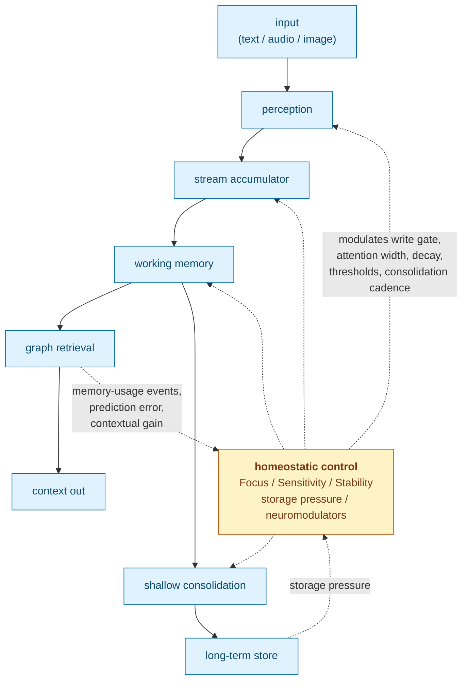

# Cortext

**A closed-loop memory engine for streaming AI.**

Cortext is a C++20 library for turning live text, audio, and image streams into
durable, source-backed memory. It stores compact traces, builds graph
associations, retrieves relevant context packets, and runs explicit shallow
consolidation over embeddings.

Most LLM memory systems are open-loop: content is chunked, embedded,
summarized, and retrieved while the parameters that govern those stages stay
fixed. Cortext feeds retrieval outcomes, prediction error, storage pressure, and
consolidation results back into three continuous control parameters: **Focus
(F)**, **Sensitivity (S)**, and **Stability (T)**. Those knobs modulate write
gating, attention width, decay, thresholds, and consolidation cadence for the
next input.

## Status

Cortext v1.0 is the hard-cut production runtime. It keeps the embedding and
graph memory engine, and it does not ship the older research decoder stack,
provider registry, semantic extractor, summarizer, static label bank, fact
layer, experimental label-bucket graph, or mode-selected deep consolidation
path. The current release surface is intentionally smaller than the research
history preserved in git.

## Build And Test

Requirements:

- C++20 compiler
- CMake
- Git and Python 3 for default dependency/model bootstrap

Configure, build, and run tests. The default build fetches bundled native
dependencies and downloads the required AIST GGUF model into
`models/AIST-87M-GGUF/`.

```bash
cmake -S . -B build -DCMAKE_BUILD_TYPE=Debug
cmake --build build -j
ctest --test-dir build -R cortext_tests --output-on-failure
```

The model-free CI release gate runs:

```bash
./build/tests/cortext_tests '~[aist]' --reporter compact
```

Examples are optional:

```bash
cmake -S . -B build -DCMAKE_BUILD_TYPE=Debug -DCORTEXT_BUILD_EXAMPLES=ON
cmake --build build -j
./build/examples/topical_chat_analysis/cortext_topical_chat_analysis --help
```

## C++ Quickstart

```cpp
#include <cortext/cortext.hpp>

#include <iostream>

int main()
{
  cortext::Cortext::Config cfg;
  cfg.focus = 0.7;        // F: attentional precision
  cfg.sensitivity = 0.5;  // S: reactivity to surprise
  cfg.stability = 0.8;    // T: plasticity vs. retention

  auto engine = cortext::Cortext::Create(cfg, "memory.db", "models");

  auto context = engine->ProcessText("Bailey likes tennis balls.", "chat/main");
  for (const auto &memory : context.retrieved_memory)
    {
      std::cout << memory.id << " " << memory.source_id << "\n";
    }

  auto embedding = engine->EmbedText("embed without storing");
  std::cout << "embedding dims: " << embedding.size() << "\n";

  engine->Consolidate();
  engine->Flush();
}
```

Primary public entrypoints:

- C++ API: `include/cortext/cortext.hpp`
- C API: `include/cortext/capi.h`

## What Cortext Provides

- Native C++20 API and stable C ABI.
- FFI bindings for Python, Go, JavaScript/TypeScript, Dart, and WebAssembly.
- Text, audio, and image processing calls that can store durable memory.
- Text, audio, and image embed-only calls that do not mutate memory state.
- Working-memory and long-term retrieval packets returned as JSON.
- Explicit `Consolidate()` / `cortext_consolidate_json()` shallow replay.
- `Reset()` / `cortext_reset()` for volatile processor-state reset without
  deleting durable memories.
- SQLite metadata storage plus sqlite-objstore payload storage by default.
- External database/object-store callback seams for embedders that own storage.

## Runtime Model

Cortext's required encoder is `augmem/AIST-87M` in the local GGUF layout under
`models/AIST-87M-GGUF/`. The default CMake build downloads and verifies the
preferred `AIST-87M_q8_0.gguf` file automatically. The engine auto-discovers
`AIST-87M_q8_0.gguf` or `AIST-87M_q5_1.gguf`, or you can pin the model
explicitly with `CORTEXT_AIST_MODEL_PATH`. If the model cannot be resolved,
engine creation fails rather than falling back to a different embedding space.

AIST is a multimodal embedding model: text, audio, speech, and image inputs map
into one retrieval space. Audio inputs use 16 kHz mono float32 PCM. Image inputs
use row-major RGB/RGBA bytes with explicit width, height, and channel count.

Every database pins the encoder fingerprint that produced its embeddings. That
guard exists because mixing embedding spaces silently corrupts retrieval.

`source_id` is opaque provenance. Cortext uses it for exact same-source grouping
and hydration, not for hidden behavior switches.

Default builds are opt-out:

- `CORTEXT_FETCH_AIST_MODEL=ON` downloads AIST during `cmake --build`.
- `CORTEXT_AIST_MODEL_QUANT=q8_0` selects the preferred quantization; use
  `q5_1` or `all` when needed.
- `CORTEXT_FETCH_GGML=ON` fetches and builds the bundled GGML backend.
- `CORTEXT_DISABLE_OPENTELEMETRY=OFF` fetches the OpenTelemetry API dependency;
  exporter dependencies stay off unless `CORTEXT_OPENTELEMETRY_EXPORTERS=ON`.
- `CORTEXT_USE_SYSTEM_GGML=ON` and `CORTEXT_FETCH_AIST_MODEL=OFF` are override
  paths for packagers or offline builds, not the default release path.

## Storage Model

Cortext separates metadata/database storage from payload/object storage. SQLite
is the supported default, but embedders can own persistence topology.

- `cortext::Store` and `cortext::Transaction` define the database boundary for
  schema, query, and transactional work. `SQLiteStore` is the built-in
  implementation.
- `cortext::ObjectStore` and `cortext::ObjectTransaction` define
  content-addressed payload storage. `SqlObjectStore` is the current
  sqlite-objstore-backed implementation over a `Store`.
- `Cortext::Create()` has overloads for the default SQLite path, a
  caller-supplied database store, a caller-supplied object store, or both.

Alternate providers are extension points today, not bundled backends.

## How It Works

The current production loop is implemented as small operations in
`src/operations/`.



Key pipeline pieces:

- `focus_feedback`, `sensitivity_feedback`, and `stability_feedback` adjust the
  three control knobs from retrieval and usage outcomes.
- `accumulator`, `accumulator_scores`, `spike_bypass`, and `write_gate` turn
  streaming signals into bounded memory writes.
- `embedding_prediction_error` contributes surprise to the feedback path.
- `neuromodulators` and `emotion_cascade` modulate encoding and
  reconsolidation strength.
- `reconsolidation` and `constructive_recall_internal` update current memory
  surfaces on re-exposure instead of blindly duplicating memories.
- `graph_retrieval` combines embedding similarity, durable graph edges,
  reconstruction-aware ranking, and temporal scoring.
- `soft_anchor` maintains provisional anchor evidence without treating it as
  immutable ground truth.

The three `Config` fields are the primary control knobs; most other tunable
parameters are derived from them through transformations specified in the paper.

## Current Evidence

The current release probe compared this source tree against a preserved old
replay binary using the same local AIST GGUF model. After restoring
current-surface advancement and removing the experimental label-bucket graph
from production, dense and full sparse replay runs matched the preserved binary
exactly when built against the same system GGML runtime: `retr_diffs=0` and
`rank_diffs=0`.

A fresh local blind-judge pass on 2026-06-28 used the one-year sparse replay,
with Gemma4-12B-AWQ served by vLLM at a 131,072-token context window. The judge
saw text-only structurally normalized blind packets for three repetitions per
probe and completed 93/93 judgments.

| Outcome | Raw wins | Per-31-probe equivalent | Mean context tokens |
|---|---:|---:|---:|
| Cortext native | 47/93 | 15.7/31 | 467 |
| Traditional chat RAG | 16/93 | 5.3/31 | 7,447 |
| Full-history upper bound | 3/93 | 1.0/31 | 15,974 |
| Tie / unclear | 27/93 | 9.0/31 | n/a |

Cortext's three single-repetition counts were 14, 17, and 16 wins out of 31,
which brackets the historical 15-win A/B baseline. Mean Cortext context was 467
tokens versus 7,447 for traditional RAG, a 93.7% context-token reduction.

On 2026-06-30, a hosted frontier-judge pass evaluated a public Meta
Multi-Session Chat validation slice materialized from the Hugging Face
`nayohan/multi_session_chat` mirror. The replay processed 9,130 text turns from
708 rows, used daily source-time consolidation at 02:00 UTC, warmed up for 5,000
events, and judged 9 probes at 500-event intervals. The judge was `gpt-5.5`
through hosted OpenAI Chat Completions with a 1,000,000-token context setting,
three blind repetitions per probe, `judge_seed=42`, and 2,000 bootstrap samples.
All 27/27 judgments completed with four text-only systems: Cortext native,
traditional chat+RAG, full-history upper bound, and a hosted `gpt-5.5`
compacting-session rollup baseline. The strict gates passed:
`judge_prompt_fits_context_window`, `full_history_prompt_fits_judge_context`,
no future/current-turn context leakage, hidden labels absent, and text-only RAG
baselines.

| Outcome | Raw wins | Win rate | Probe-bootstrap 95% CI | Mean sufficiency | Mean noise | Mean context tokens |
|---|---:|---:|---:|---:|---:|---:|
| Cortext native | 21/27 | 0.778 | [0.519, 0.963] | 4.41 | 1.85 | 998 |
| Traditional chat RAG | 0/27 | 0.000 | [0.000, 0.000] | 4.67 | 4.70 | 49,196 |
| Full-history upper bound | 1/27 | 0.037 | [0.000, 0.111] | 4.52 | 5.00 | 185,439 |
| Hosted compaction rollup | 5/27 | 0.185 | [0.037, 0.444] | 4.63 | 3.63 | n/a |

Mean Cortext context was 998 tokens versus 49,196 for traditional chat+RAG, a
97.97% context-token reduction with a probe-bootstrap 95% CI of
[97.77%, 98.17%]. This result is strong on token reduction, judge wins, and
noise, but it is not yet a full sufficiency-match claim: traditional chat+RAG
had higher mean sufficiency (4.67 versus 4.41), and the hosted compaction
baseline was also higher at 4.63. The aggregate artifact is
`eval_runs/msc_frontier_late_200dlg_gpt55_20260630T053427Z/judge_openai_gpt55_four_system_clean.json`.

The full protocol and artifact path are recorded in
`docs/paper/sections/9_experimental.qmd` and the generated manuscript at
`docs/paper/_manuscript/index.md`.

Replay and harness tools:

```bash
cmake --build build -j --target cortext_chat_replay_live_run
./build/examples/benchmark/cortext_chat_replay_live_run --help
python scripts/run_memory_harness.py --max-conversations 2 --max-turns 360 --max-total 720 --no-multi
scripts/run_msc_frontier_judge.sh
```

## C ABI And FFI

The C ABI lives in `include/cortext/capi.h`. JSON-returning helpers allocate
strings owned by Cortext; callers must release them with `cortext_string_free`.

Primary calls:

| Purpose | C ABI |
|---|---|
| create | `cortext_create_with_config` |
| process text/audio/image | `cortext_process_*_json` |
| embed text/audio/image only | `cortext_embed_*_json` |
| explicit shallow consolidation | `cortext_consolidate_json` |
| commit buffered writes | `cortext_flush` |
| reset volatile state | `cortext_reset` |
| diagnostics | `cortext_last_error`, `cortext_version` |

Bindings live under `bindings/`:

- `bindings/python`: `ctypes`
- `bindings/go`: `cgo`
- `bindings/javascript`: Node-API plus TypeScript declarations
- `bindings/dart`: `dart:ffi`
- `bindings/wasm`: browser ES-module wrapper over the WebAssembly C ABI

Build the shared library for FFI consumers with CMake:

```bash
cmake --preset ffi-release
cmake --build --preset ffi-release --target cortext
```

Node's native addon uses the Node-enabled CMake preset:

```bash
cmake --preset ffi-release-node
cmake --build --preset ffi-release-node --target cortext cortext_node
```

Zig can also build the shared library. The default Zig path downloads/verifies
AIST and compiles the bundled GGML CPU backend; prebuilt GGML paths are only an
override for packagers.

```bash
zig build check
```

## WebAssembly

The browser build uses Emscripten and emits an ES module plus a `.wasm` payload:

```bash
./build-wasm.sh
```

Outputs:

```text
build-wasm/dist/wasm/cortext.js
build-wasm/dist/wasm/cortext.wasm
```

The generated module exports the public C ABI and `malloc/free`. A small
JavaScript wrapper lives in `bindings/wasm/cortext.js`, and a browser demo lives
in `examples/web/`.

Cortext still needs the AIST GGUF embedding model. For demos, either select the
model file in the browser UI or embed the model directory into the virtual
filesystem at build time:

```bash
./build-wasm.sh -DCORTEXT_WASM_PRELOAD_MODELS_DIR="$PWD/models/AIST-87M-GGUF"
```

Serve the repository root after building:

```bash
python3 -m http.server 8000
```

Then open `http://localhost:8000/examples/web/`.

## Repository Layout

- `include/`, `src/`: public headers and C++ implementation.
- `src/operations/`: control-loop and memory pipeline operations.
- `tests/`: Catch2 test suite.
- `examples/`: benchmarks, demos, and smoke tests.
- `bindings/`: Python, Go, JavaScript/TypeScript, Dart, and WebAssembly FFI.
- `scripts/`, `tools/`: experiment harnesses and offline utilities.
- `docs/paper/`: manuscript source and generated markdown.
- `models/`: local model assets.
- `third_party/`: vendored native dependencies.

## Paper

The formal specification of the architecture is generated at
`docs/paper/_manuscript/index.md` from the source sections in
`docs/paper/sections/`. If you want to understand why the loop is shaped the
way it is, start with the paper's knob derivations, stability/plasticity
analysis, homeostatic threshold control, consolidation section, and release
evidence.

Regenerate the paper with:

```bash
QUARTO_DISABLE_GIT=1 QUARTO_DISABLE_GITHUB=1 quarto render docs/paper
```

## Motivation

Cortext began for a personal reason. In 2022, my father-in-law was diagnosed
with dementia. Since then I have been focused on building systems that help
people with memory loss preserve continuity, confidence, and independence.

The same architecture is useful for long-horizon LLM memory, but the primary
motivation is human: Cortext is designed for realtime streams where the system
must notice what matters, surface relevant context, and avoid forcing the user
to manually manage memory. A care context requires homeostasis. Salience,
confusion, and emotional state change through the day, and that is exactly what
an open-loop memory system cannot track.
