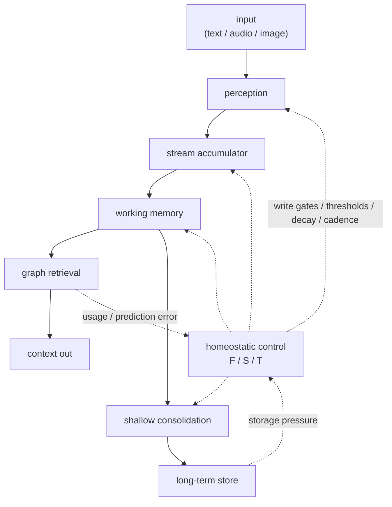

# Cortext

**Long-term memory for AI apps and agents — local, realtime, and ~50× fewer
context tokens than chat+RAG.**

Cortext gives a long-running assistant, agent, or device a durable memory.
You feed it a stream of events — chat turns, audio, images — and on every
call it returns a small packet (typically under 1,000 tokens) of the stored
memories most relevant to the current moment, ready to drop into an LLM
prompt or surface in a UI. It decides on its own what is worth storing, how
memories associate, which facts have been superseded by corrections, and what
to let fade. There is no manual memory management and no cloud dependency:
everything runs on-device in a C++20 runtime against a local SQLite file and
a bundled 87M-parameter embedding model.

Use it when a conversation or agent outlives its context window. Instead of
re-sending tens of thousands of tokens of history or maintaining a RAG
pipeline, you send Cortext's ~1k-token packet — in blind LLM-judge evals it
beat traditional chat+RAG on 7 of 9 probes while using 97.97% fewer context
tokens (see [Benchmarks](#benchmarks) and [Tradeoffs](#tradeoffs)). Cortext
began as memory augmentation for a family member living with dementia
(see [Motivation](#motivation)); the same engine serves long-horizon LLM
memory.

What makes it different:

- **Closed-loop control:** retrieval outcomes, prediction error, storage
  pressure, and consolidation feedback update three continuous knobs:
  **Focus (F)**, **Sensitivity (S)**, and **Stability (T)**.
- **Belief revision:** a correction writes a durable `supersedes` edge to the
  stale memory it replaces; retrieval ranks the correction first and keeps the
  old fact as demoted history.
- **Multimodal memory:** text, audio, speech, and image inputs share one AIST
  embedding space.
- **Small native surface:** C++20 library, stable C ABI, and bindings for
  Python, Go, JavaScript/TypeScript, Dart, and WebAssembly.
- **Durable by default:** SQLite metadata, sqlite-objstore payload storage, and
  extension seams for embedders that own persistence.
- **Evidence tracked with the code:** experiment artifacts and manuscript
  sections live under `docs/paper/`.

## Benchmarks

How these are measured: a long multi-session conversation is replayed through
each memory system; at probe points a judge LLM asks a question whose answer
appeared sessions earlier, and blind-scores each system's context packet for
relevance, sufficiency, and noise without knowing which system produced it.
Systems compared: Cortext, traditional chat+RAG, a full-history upper bound,
and compaction/rolling-window baselines.

Headline (hosted frontier judge, public Meta Multi-Session Chat slice, 9
probes × 3 repetitions): **Cortext won 7 of 9 probes by majority and 21 of 27
blind judgment rows, using 998 context tokens per turn versus 49,196 for
traditional chat+RAG — 97.97% fewer.** Its packets also carried roughly a
third of the judged noise (1.85 vs 4.70).

| Eval | Result | Context Cost |
|---|---|---:|
| MSC hosted frontier judge, 9 probes, 3 reps | Cortext 7/9 probe wins, 21/27 row wins | 998 tokens vs 49,196 for chat+RAG |
| MSC 128k RAG ablation, 6 systems | Cortext 6/9 probe wins, 19/27 row wins | 816 tokens; compaction 7,110; rolling window 15,999 |
| One-year sparse replay, local Gemma4 judge | Cortext 47/93 raw wins | 467 tokens vs 7,447 for chat+RAG |
| Long-horizon mechanism sweep | No removal improved the stack | Mechanisms retained under the hard-cut rule |

Unlimited context is not the alternative it sounds like: the hosted eval
includes a full-history upper-bound arm, and it took 1 of 27 blind rows. At
the separate 18,000-message stress horizon, keeping full history inside a
131k judge window meant dropping 123,359 items. On device the comparison is
starker still: a 49k-token prompt per turn costs seconds of prefill on local
hardware, while Cortext's ~1k-token packets keep retrieval realtime.

Full protocols, caveats, and artifacts are in
`docs/paper/sections/9_experimental.qmd` and the generated manuscript at
`docs/paper/_manuscript/index.md`.

## Tradeoffs

Chosen limits, stated plainly:

- **A little sufficiency for a lot of context.** This is not a
  raw-sufficiency-match claim: in the hosted run, chat+RAG and compaction
  scored slightly higher mean judged sufficiency (4.67 and 4.63 vs 4.41 on a
  5-point scale). Cortext's measured win is context cost, blind-judge
  preference, and much lower noise. If you can afford ~50k tokens per turn
  and the prefill latency that comes with them, full context is still more
  complete.
- **Pinned local encoder.** Retrieval quality rides on the bundled AIST-87M
  GGUF model (downloaded at build). Every database pins the encoder
  fingerprint that produced its embeddings, so you cannot hot-swap embedding
  models over an existing memory store.
- **Single writer per database.** One process owns writes; there is no
  multi-device sync or concurrent-writer merge yet.
- **Source-backed traces, not distilled facts.** v1 stores what it saw and
  retrieves it. There is no LLM extraction or summarization layer rewriting
  memories — deliberately, so every retrieved memory traces to a real input.
- **Native build.** C++20 and CMake today. Bindings for Python, Go,
  JavaScript/TypeScript, Dart, and WebAssembly ship in-tree, but there is no
  `pip install` yet.

## Status

Cortext v1.1.5 is the hard-cut production line: the embedding and graph memory
engine, release-hardening fixes, and the current bindings. Older research
components are preserved in git history but not shipped in the runtime surface.

## Build And Test

Requirements:

- C++20 compiler
- CMake
- Git and Python 3 for default dependency/model bootstrap

The default build fetches bundled native dependencies and downloads the required
AIST GGUF model plus vocab into `models/`.

```bash
cmake -S . -B build -DCMAKE_BUILD_TYPE=Debug
cmake --build build -j
ctest --test-dir build -R cortext_tests --output-on-failure
```

Model-free CI-style test gate:

```bash
./build/tests/cortext_tests '~[aist]' --reporter compact
```

Examples:

```bash
cmake -S . -B build -DCMAKE_BUILD_TYPE=Debug -DCORTEXT_BUILD_EXAMPLES=ON
cmake --build build -j
./build/examples/topical_chat_analysis/cortext_topical_chat_analysis --help
```

## Try It In A Minute

`cortext_cli` (built with `-DCORTEXT_BUILD_EXAMPLES=ON`, output under
`build/tools/cli/`) is a durable memory you can talk to from the shell.
Memories persist in the SQLite file across invocations:

```bash
alias cortext='./build/tools/cli/cortext_cli --db bailey.db --models models'

cortext remember "Bailey is allergic to bee stings and needs Benadryl within 10 minutes."
cortext remember "The vet appointment for Bailey is on July 12 at 9am with Dr. Okafor."

cortext recall "what should the vet know about the dog?"
#  1. [#3 · cli/main · ... · rel 0.91] The vet appointment for Bailey is on July 12 at 9am with Dr. Okafor.
#  2. [#1 · cli/main · ... · rel 0.80] Bailey is allergic to bee stings and needs Benadryl within 10 minutes.
```

Corrections supersede stale facts instead of competing with them:

```bash
cortext remember "Correction: the vet appointment was moved to July 14 at 2pm."

cortext recall "when is the vet appointment?" --top 1
#  1. [#5 · cli/main · ... · rel 0.92] Correction: the vet appointment was moved to July 14 at 2pm.
```

The July 12 memory is demoted at retrieval but kept as history.

`cortext repl` opens an interactive session (`/recall`, `/consolidate`,
`/stats`), `remember -` ingests one memory per stdin line for bulk import, and
`scripts/run-chat.sh` builds and launches the repl in one step. `recall` is
ephemeral: the query triggers retrieval but is not stored, so queries never
compete with real memories. Pass `--durable` to also store the query as a
stream event under the `cli/recall` source.

## C++ Quickstart

```cpp
#include <cortext/cortext.hpp>

#include <iostream>

int main()
{
  cortext::Cortext::Config cfg;
  cfg.focus = 0.7;        // F: attentional precision
  cfg.sensitivity = 0.5;  // S: reactivity to surprise
  cfg.stability = 0.8;    // T: plasticity vs. retention

  auto engine = cortext::Cortext::Create (cfg, "memory.db", "models");

  auto context = engine->ProcessText ("Bailey likes tennis balls.", "chat/main");
  for (const auto &memory : context.retrieved_memory)
    {
      std::cout << memory.id << " " << memory.source_id << "\n";
    }

  auto embedding = engine->EmbedText ("embed without storing");
  std::cout << "embedding dims: " << embedding.size () << "\n";

  engine->Consolidate ();
  engine->Flush ();
}
```

Public entrypoints:

- C++ API: `include/cortext/cortext.hpp`
- C API: `include/cortext/capi.h`

## API Surface

Cortext provides:

- Text, audio, and image processing calls that store durable memory.
- Text, audio, and image embed-only calls that do not mutate memory.
- Working-memory and long-term retrieval packets returned as JSON.
- Explicit shallow consolidation through `Consolidate()` /
  `cortext_consolidate_json()`.
- Volatile state reset through `Reset()` / `cortext_reset()` while durable
  memories remain.
- SQLite-backed default storage plus callback seams for external stores.

Bindings live under `bindings/`:

- `bindings/python`: `ctypes`
- `bindings/go`: `cgo`
- `bindings/javascript`: Node-API plus TypeScript declarations
- `bindings/dart`: `dart:ffi`
- `bindings/wasm`: browser ES-module wrapper over the WebAssembly C ABI

Build the shared library for FFI consumers:

```bash
cmake --preset ffi-release
cmake --build --preset ffi-release --target cortext
```

Node's native addon uses the Node-enabled preset:

```bash
cmake --preset ffi-release-node
cmake --build --preset ffi-release-node --target cortext cortext_node
```

## Runtime Model

Cortext's required encoder is `augmem/AIST-87M` in GGUF layout under
`models/AIST-87M-GGUF/`. The engine auto-discovers `AIST-87M_q8_0.gguf` or
`AIST-87M_q5_1.gguf`, or you can pin a model path with
`CORTEXT_AIST_MODEL_PATH`. If the model cannot be resolved, engine creation
fails instead of silently switching embedding spaces.

AIST maps text, audio, speech, and images into one retrieval space. Audio inputs
use 16 kHz mono float32 PCM. Image inputs use row-major RGB/RGBA bytes with
explicit width, height, and channel count.

Important build flags:

- `CORTEXT_FETCH_AIST_MODEL=ON`: download AIST during build.
- `CORTEXT_AIST_MODEL_QUANT=q8_0`: choose `q8_0`, `q5_1`, or `all`.
- `CORTEXT_FETCH_GGML=ON`: fetch and build bundled GGML.
- `CORTEXT_USE_SYSTEM_GGML=ON`: use a preinstalled GGML for packagers.
- `CORTEXT_EXPERIMENT_HOOKS=OFF`: compile out eval-only ablation hooks.

Operational environment variables are intentionally narrow. Most deployments
only need model/runtime overrides (`CORTEXT_AIST_MODEL_PATH`,
`CORTEXT_AIST_THREADS`, `CORTEXT_AIST_N_GPU_LAYERS`) and SQLite tuning
(`CORTEXT_SQLITE_*`, `CORTEXT_OBJSTORE_*`) when packaging or profiling.

Every database pins the encoder fingerprint that produced its embeddings,
because mixing embedding spaces corrupts retrieval. `source_id` is opaque
provenance for grouping and hydration, not a hidden behavior switch.

## Storage Model

Cortext separates metadata from payload storage:

- `cortext::Store` / `cortext::Transaction` define the database boundary.
- `SQLiteStore` is the built-in metadata store.
- `cortext::ObjectStore` / `cortext::ObjectTransaction` define payload storage.
- `SqlObjectStore` is the built-in sqlite-objstore implementation.

Store and transaction instances are single-owner handles. For multiple
processes or instances pointed at the same database, use a single writer per
database; Cortext does not merge concurrent writer state.

## How It Works



The production loop is built from small operations in `src/operations/`.
Retrieval combines embedding similarity, durable graph edges,
reconstruction-aware ranking, and temporal scoring. Feedback adjusts F/S/T so
later writes, decay, thresholds, attention width, and consolidation cadence
adapt to the stream.

## WebAssembly

The browser build uses Emscripten and emits an ES module plus `.wasm` payload:

```bash
./build-wasm.sh
```

The wrapper lives in `bindings/wasm/cortext.js`; the browser demo lives in
`examples/web/`. For demos, either select the AIST model file in the UI or
preload it:

```bash
./build-wasm.sh -DCORTEXT_WASM_PRELOAD_MODELS_DIR="$PWD/models"
python3 -m http.server 8000
```

Then open `http://localhost:8000/examples/web/`.

## Repository Layout

- `include/`, `src/`: public headers and C++ implementation.
- `src/operations/`: control-loop and memory pipeline operations.
- `tests/`: Catch2 test suite.
- `examples/`: benchmarks, demos, and smoke tests.
- `bindings/`: Python, Go, JavaScript/TypeScript, Dart, and WebAssembly FFI.
- `scripts/`, `tools/`: the `cortext_cli` tool, experiment harnesses, and
  offline utilities.
- `docs/paper/`: manuscript source, generated markdown, and artifacts.
- `models/`, `third_party/`: local model assets and vendored dependencies.

## Paper

The architecture and experimental record are specified in the manuscript:

```bash
QUARTO_DISABLE_GIT=1 QUARTO_DISABLE_GITHUB=1 quarto render docs/paper
```

Start with `docs/paper/_manuscript/index.md`, or edit source sections under
`docs/paper/sections/`.

## Motivation

Cortext began for a personal reason. In 2022, my father-in-law was diagnosed
with dementia. The long-term goal is memory augmentation that helps people
preserve continuity, confidence, and independence.

The same architecture is useful for long-horizon LLM memory, but the primary
motivation is human: a realtime system that notices what matters, surfaces
relevant context, and does not force the user to manage memory by hand.
