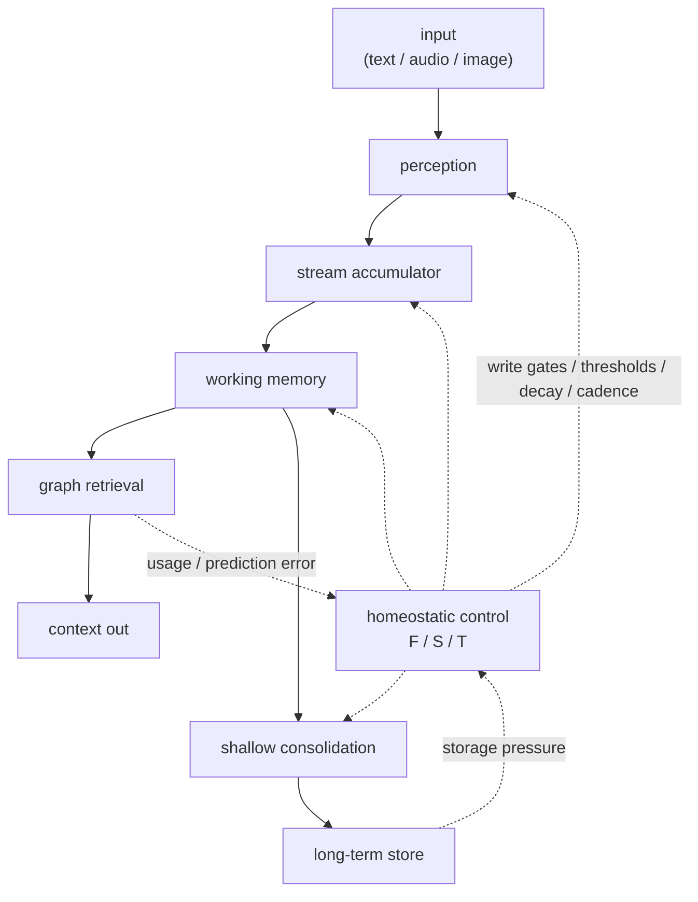

# Cortext

[](https://github.com/augmem/cortext/releases)
[](LICENSE)
[](https://pypi.org/project/augmem.cortext/)
[](https://www.npmjs.com/package/@augmem/cortext)

Local multimodal memory for AI apps, agents, devices, and humans.

Cortext is a C++20 memory engine that ingests text, audio, and image signals,
stores durable memory traces in SQLite, and returns a small context packet of
relevant memories on later calls. It is designed for long-running assistants
and realtime applications that need memory without sending an entire history
window back to an LLM.

Links: [Releases](https://github.com/augmem/cortext/releases) /
[Python](bindings/python/README.md) /
[JavaScript](bindings/javascript/README.md) /
[Paper](docs/paper/_manuscript/index.md) /
[Roadmap](ROADMAP.md)

## Recent Changes

- `v1.2.0`: Retention is now `Natural` (default), `Durable`, `Boundary`, and
  `Ephemeral`. Omitted retention is Natural: `force_boundary=false` and
  `force_write=false` so episode algorithms decide. `Durable` keeps force
  boundary + force write (explicit chat turns). `Boundary` forces the turn
  edge only. `Ephemeral` remains no-store query. Exposed on C++ Process*,
  C `cortext_process_json_options.retention`, and Python/JS/Go bindings.
- `v1.1.10`: public `Retention::Ephemeral` calls force a retrieval boundary
  without writing the query, so CLI/package recall works as documented.
- `v1.1.9`: package examples use real OpenAI Chat Completions message arrays.
- `v1.1.8`: PyPI and npm packages ship cross-platform native libraries/addons
  and download the verified AIST q8_0 model into a user cache on first use.
- Public retention policies: Natural (default/episode), Durable (force turn
  store), Boundary (force edge), Ephemeral (query without store).
- Command-line tools are built with `CORTEXT_BUILD_TOOLS=ON`; examples remain
  behind `CORTEXT_BUILD_EXAMPLES=ON`.

## Quick Start

Choose the surface you need.

Python:

```bash
pip install augmem.cortext
```

Node.js / TypeScript:

```bash
npm install @augmem/cortext
```

C++ from source:

```bash
cmake -S . -B build -DCMAKE_BUILD_TYPE=Release
cmake --build build -j
ctest --test-dir build -R cortext_tests --output-on-failure
```

Build the CLI:

```bash
cmake -S . -B build -DCMAKE_BUILD_TYPE=Release -DCORTEXT_BUILD_TOOLS=ON
cmake --build build -j --target cortext_cli
./build/tools/cli/cortext_cli --help
```

Default CMake/Zig builds **link Git AIST shards into `libcortext`** and
assemble the full GGUF on first load (no LFS, no runtime download, no
`CORTEXT_AIST_MODEL_PATH`). Refresh tracked shards with:

```bash
python3 scripts/shard_model.py
```

## Try It

`cortext_cli` is a small public-API smoke test and a useful local memory tool.
It writes durable memories to a SQLite file and supports ephemeral recall.

```bash
./build/tools/cli/cortext_cli --db bailey.db remember \
  "Bailey is allergic to bee stings and needs Benadryl within 10 minutes."

./build/tools/cli/cortext_cli --db bailey.db remember \
  "The vet appointment for Bailey is on July 12 at 9am with Dr. Okafor."

./build/tools/cli/cortext_cli --db bailey.db recall \
  "what should the vet know about the dog?"
```

Corrections supersede stale facts:

```bash
./build/tools/cli/cortext_cli --db bailey.db remember \
  "Correction: the vet appointment was moved to July 14 at 2pm."

./build/tools/cli/cortext_cli --db bailey.db recall \
  "when is the vet appointment?" --top 1
```

Other CLI commands:

```bash
./build/tools/cli/cortext_cli --db memory.db repl
./build/tools/cli/cortext_cli --db memory.db remember - < facts.txt
./build/tools/cli/cortext_cli --db memory.db consolidate
```

`recall` is ephemeral by default. Pass `--durable` if you also want the recall
query stored under the `cli/recall` source.

## Description

Cortext is built around a local feedback loop:

- **Durable memory:** signal metadata in SQLite, payloads in sqlite-objstore,
  and vector retrieval through sqlite-vec.
- **Multimodal embeddings:** text, audio, speech, and image inputs share one
  AIST-87M GGUF retrieval space.
- **Three control knobs:** Focus (F), Sensitivity (S), and Stability (T)
  derive thresholds, decay, storage cadence, consolidation, and retrieval
  behavior.
- **Graph-native context:** memories are connected by reinforcement,
  sequence, soft anchors, consolidation, and supersession edges.
- **Small native surface:** C++ facade, stable C ABI, and bindings for Python,
  Go, JavaScript/TypeScript, Dart, and WebAssembly.
- **Research traceability:** experiments, ablations, and manuscript sections
  live in `docs/paper/` next to the implementation.

Use Cortext when an app or agent outlives its context window. Instead of
resending tens of thousands of history tokens or maintaining a separate RAG
pipeline, you ask Cortext for the current memory packet and inject the returned
retrieval results into your model or UI.

## Build

Requirements:

- C++20 compiler
- CMake 3.16+
- Git and Python 3 for dependency/model bootstrap

Standard debug build:

```bash
cmake -S . -B build -DCMAKE_BUILD_TYPE=Debug
cmake --build build -j
ctest --test-dir build -R cortext_tests --output-on-failure
```

Model-free CI-style gate:

```bash
./build/tests/cortext_tests '~[aist]' --reporter compact
```

Build examples:

```bash
cmake -S . -B build -DCMAKE_BUILD_TYPE=Debug -DCORTEXT_BUILD_EXAMPLES=ON
cmake --build build -j --target cortext_topical_chat_analysis
./build/examples/topical_chat_analysis/cortext_topical_chat_analysis --help
```

Build an installable CLI with Zig:

```bash
zig build -Doptimize=ReleaseFast -Dshared=false -Dcli=true -Dfetch-aist-model=false
./zig-out/bin/cortext_cli --help
```

Cross-build CLI artifacts:

```bash
zig build -Dtarget=x86_64-linux-gnu -Doptimize=ReleaseFast -Dshared=false -Dcli=true -Dfetch-aist-model=false
zig build -Dtarget=aarch64-linux-gnu -Doptimize=ReleaseFast -Dshared=false -Dcli=true -Dfetch-aist-model=false
zig build -Dtarget=x86_64-windows-gnu -Doptimize=ReleaseFast -Dshared=false -Dcli=true -Dfetch-aist-model=false
zig build -Dtarget=x86_64-macos -Doptimize=ReleaseFast -Dshared=false -Dcli=true -Dfetch-aist-model=false
zig build -Dtarget=aarch64-macos -Doptimize=ReleaseFast -Dshared=false -Dcli=true -Dfetch-aist-model=false
```

Important CMake options:

- `CORTEXT_BUILD_TOOLS=ON`: build command-line tools.
- `CORTEXT_BUILD_EXAMPLES=ON`: build examples and benchmark demos.
- `CORTEXT_EMBED_AIST_MODEL=ON` **(default)**: link AIST shards into `libcortext` and assemble at load. Opt out with `=OFF` / `-Dembed-aist-model=false`.
- `CORTEXT_FETCH_AIST_MODEL=ON`: only used when bootstrapping missing shards at build time (default off).
- `CORTEXT_AIST_MODEL_QUANT=q8_0`: choose `q8_0`, `q5_1`, or `all` when fetching a full model to re-shard.
- `CORTEXT_FETCH_GGML=ON`: fetch and build bundled GGML.
- `CORTEXT_USE_SYSTEM_GGML=ON`: use a preinstalled GGML for packagers.
- `CORTEXT_EXPERIMENT_HOOKS=OFF`: compile out eval-only ablation hooks.

## C++ API

<!-- C++ quickstart matching the ProcessText retention contract in include/cortext/cortext.hpp -->

```cpp
#include <cortext/cortext.hpp>

#include <iostream>
#include <string>

std::string MemoryText (const cortext::Cortext::Context::Memory &memory)
{
  std::string text;
  for (const auto &blob : memory.content)
    {
      if (!text.empty ())
        {
          text.push_back (' ');
        }
      text.append (blob.begin (), blob.end ());
    }
  return text;
}

int main ()
{
  cortext::Cortext::Config cfg;
  cfg.focus = 0.7;
  cfg.sensitivity = 0.5;
  cfg.stability = 0.8;

  auto engine = cortext::Cortext::Create (cfg, "memory.db");

  engine->ProcessText ("The garage door code is 8841.", "chat/main",
                       cortext::Retention::Durable);

  auto ctx = engine->ProcessText (
      "garage door code",
      "chat/query",
      cortext::Retention::Ephemeral);

  for (const auto &memory : ctx.retrieved_memory)
    {
      std::cout << memory.relevance << " " << MemoryText (memory) << "\n";
    }

  if (ctx.consolidation_state != cortext::ConsolidationState::None)
    {
      engine->Consolidate ();
    }

  engine->Flush ();
}
```

Public entrypoints:

- C++ API: `include/cortext/cortext.hpp`
- C API: `include/cortext/capi.h`

Core calls:

- `ProcessText`, `ProcessAudio`, `ProcessImage`: process a signal (default
  retention is Natural — no forced turn edge; storage via write gate).
- `Retention::Durable`: force turn boundary + force write (chat convenience).
- `Retention::Boundary`: force turn boundary only; write gate still applies.
- `Retention::Ephemeral`: process and retrieve without storing the input.
- `EmbedText`, `EmbedAudio`, `EmbedImage`: embedding-only calls that do not
  mutate memory state.
- `Consolidate`: explicit shallow consolidation.
- `Flush`: commit pending episode writes.
- `Reset`: reset volatile processor state while keeping durable memory.

## Context Packet

Processing calls return `Cortext::Context` in C++ and JSON through the C API
and language bindings.

Top-level fields include:

- `retrieved_memory`: long-term memories selected for the current signal.
- `working_memory`: active short-term memory slots.
- `embedding`: the current signal embedding when requested.
- `should_interrupt`, `interrupt_aborted`, `at_boundary`: realtime behavior.
- `consolidation_state`: ordered `None`, `Recommended`, or `Required`
  maintenance urgency derived from the current throughput range.
- `output`: scores, write decisions, operation timings, and storage ids.
- `encode_ms`, `process_ms`, `hydrate_ms`, `total_ms`: latency breakdown.

Each memory entry includes provenance, modality, stored content, retrieval
scores, usage counts, and optional soft-anchor metadata:

```json
{
  "id": 1,
  "source_id": "chat/main",
  "timestamp": 1783463360158,
  "modality": "text",
  "mimetype": "text/plain",
  "content": [
    {
      "base64": "VGhlIGdhcmFnZSBkb29yIGNvZGUgaXMgODg0MS4=",
      "size_bytes": 29
    }
  ],
  "relevance": 0.96,
  "salience": 0.0,
  "contradiction": 0.0,
  "retrieved_count": 1,
  "used_count": 0,
  "soft_anchors": []
}
```

For C++ callers, `Memory::content` is already raw bytes. For JSON callers,
decode `content[].base64` according to `mimetype`.

## Bindings

- Python: `bindings/python`, published as `augmem.cortext`
- JavaScript/TypeScript: `bindings/javascript`, published as `@augmem/cortext`
- Go: `bindings/go`
- Dart: `bindings/dart`
- WebAssembly: `bindings/wasm`

Build Python wheels with bundled native libraries:

```bash
python3 scripts/build_python_package.py --zig /path/to/zig --skip-models
```

Build the npm package:

```bash
python3 scripts/build_javascript_package.py --zig /path/to/zig --skip-models
```

Registry packages do not embed the 135 MB AIST q8_0 model. Python and npm
wrappers resolve a bundled/local model if present, otherwise download and
checksum-verify q8_0 into the user cache on first engine creation. Native C++
and CLI users should keep the model under `models/` or set
`CORTEXT_AIST_MODEL_PATH`.

### Git-friendly AIST model shards (for language bindings)

This repo owns the AIST q8_0 GGUF **shards**. Binding packages (`cortext.go`,
plugins, …) should **copy** the tree — they must not re-implement sharding.

```bash
# After download_aist_model / a local full GGUF under models/:
python3 scripts/shard_model.py
```

Tracked layout (full `.gguf` stays gitignored):

```text
models/manifest.json
models/AIST-87M-GGUF/chunks/AIST-87M_q8_0.gguf.part-*
models/mdbr-leaf-ir/vocab.txt
```

Bindings reassemble parts on first use (verify per-chunk and whole-file SHA-256
from `models/manifest.json`), then set `CORTEXT_AIST_MODEL_PATH`. Example vendor
step for a sibling checkout:

```bash
# Preserve relative paths under models/ (manifest + chunks + vocab).
mkdir -p ../cortext.go/models/AIST-87M-GGUF ../cortext.go/models/mdbr-leaf-ir
cp models/manifest.json ../cortext.go/models/
cp -R models/AIST-87M-GGUF/chunks ../cortext.go/models/AIST-87M-GGUF/
cp models/mdbr-leaf-ir/vocab.txt ../cortext.go/models/mdbr-leaf-ir/
```

### Shared release assets (natives + model shards)

Multi-arch shared libraries and the same model shard tree are also published
on each GitHub Release so thin installers can pull one tarball:

```bash
# Build locally (Zig cross-compile all six platform tags + shard model)
python3 scripts/build_release_assets.py

# Outputs:
#   dist/release-assets/native/<tag>/…
#   dist/release-assets/models/…   (chunks + vocab + manifest)
#   dist/cortext-assets-<version>.tar.gz
#   dist/cortext-assets-<version>.tar.gz.sha256
```

On `v*` tags (and published releases), `.github/workflows/release-assets.yml`
builds that tree and uploads `cortext-assets-<version>.tar.gz` to the release.

Unpacked layout for binding installers (natives may already embed AIST when
built with `-Dembed-aist-model=true`; the `models/` tree is still published so
thin/embed-off consumers can reassemble or vendor shards):

```text
native/manifest.json
native/linux-x86_64/libcortext.so
native/linux-aarch64/libcortext.so
native/macos-x86_64/libcortext.dylib
native/macos-aarch64/libcortext.dylib
native/windows-x86_64/cortext.dll
native/windows-aarch64/cortext.dll
models/manifest.json
models/AIST-87M-GGUF/chunks/AIST-87M_q8_0.gguf.part-*
models/mdbr-leaf-ir/vocab.txt
```

Install assets for a binding package. There is **no** core `CORTEXT_ASSETS_DIR`
env var — use the paths the runtime and bindings already read
(`CORTEXT_LIBRARY_PATH`, `CORTEXT_AIST_MODEL_PATH`):

```bash
VERSION=1.2.3   # or the release you want
ASSETS="$HOME/.cache/augmem/cortext/assets"
curl -fsSL -o cortext-assets.tgz \
  "https://github.com/augmem/cortext/releases/download/v${VERSION}/cortext-assets-${VERSION}.tar.gz"
mkdir -p "$ASSETS"
tar -xzf cortext-assets.tgz -C "$ASSETS"

# Shared library (pick the host platform tag):
#   linux-x86_64 | linux-aarch64 | macos-x86_64 | macos-aarch64 | windows-x86_64 | windows-aarch64
export CORTEXT_LIBRARY_PATH="$ASSETS/native/linux-x86_64/libcortext.so"

# Default release natives embed AIST (assemble-at-load). Only if you need an
# external GGUF (embed-off build, or tools that require a file path):
mkdir -p "$ASSETS/models/AIST-87M-GGUF"
cat "$ASSETS"/models/AIST-87M-GGUF/chunks/AIST-87M_q8_0.gguf.part-* \
  > "$ASSETS/models/AIST-87M-GGUF/AIST-87M_q8_0.gguf"
export CORTEXT_AIST_MODEL_PATH="$ASSETS/models/AIST-87M-GGUF/AIST-87M_q8_0.gguf"
```

## Runtime Model

Cortext requires the AIST-87M GGUF encoder. Default shared-library builds
behave **as if the model lives inside `libcortext`**:

1. Git stores only under-100 MiB **shards** (no LFS) under
   `models/AIST-87M-GGUF/chunks/` plus `models/manifest.json` and vocab.
2. The build **links those shards** (and vocab) into the shared library via
   `.incbin` (`CORTEXT_EMBED_AIST_MODEL=ON`).
3. On first engine create, `MaterializeEmbeddedAistModel()` **assembles** the
   full GGUF in the process cache, verifies per-shard and whole-file SHA-256,
   and opens that path. No network download and no `CORTEXT_AIST_MODEL_PATH`.

Resolution order:

1. `CORTEXT_AIST_MODEL_PATH` (explicit full `.gguf`)
2. On-disk search under `models/` (checkout layout)
3. Linked shards → assemble-at-load cache

Disable with `-DCORTEXT_EMBED_AIST_MODEL=OFF` / `-Dembed-aist-model=false` if you
intentionally want an external model only.

AIST maps text, audio, and images into one retrieval space. Audio inputs are
16 kHz mono float32 PCM. Image inputs are row-major RGB/RGBA bytes with
explicit width, height, and channel count.

Every database pins the encoder fingerprint that produced its embeddings.
Changing encoder assets for an existing database fails loudly instead of
silently comparing vectors from different spaces.

Useful environment variables:

- `CORTEXT_AIST_MODEL_PATH`: explicit model file.
- `CORTEXT_AIST_THREADS`: native runtime thread count.
- `CORTEXT_AIST_N_GPU_LAYERS`: GPU offload layer hint.
- `CORTEXT_AIST_CONTEXT_LENGTH`: tokenizer/runtime context length.
- `CORTEXT_SQLITE_*`, `CORTEXT_OBJSTORE_*`: storage tuning for packagers and
  profiling.

## Storage

Cortext separates metadata from payload storage:

- `cortext::Store` / `cortext::Transaction`: database boundary.
- `SQLiteStore`: built-in metadata store.
- `cortext::ObjectStore` / `cortext::ObjectTransaction`: payload boundary.
- `SqlObjectStore`: built-in sqlite-objstore implementation.

Store and transaction instances are single-owner handles. Use a single writer
per database; Cortext does not merge concurrent writer state.

## Benchmarks

Long-horizon evals replay multi-session conversations through each memory
system. At probe points, a judge LLM blind-scores each context packet for
relevance, sufficiency, and noise.

Headline hosted frontier judge run on a public Meta Multi-Session Chat slice:
Cortext won 7 of 9 probes by majority and 21 of 27 blind judgment rows, using
998 context tokens per turn versus 49,196 for traditional chat+RAG.

| Eval | Result | Context Cost |
| --- | --- | ---: |
| MSC hosted frontier judge, 9 probes, 3 reps | Cortext 7/9 probe wins, 21/27 row wins | 998 tokens vs 49,196 for chat+RAG |
| MSC 128k RAG ablation, 6 systems | Cortext 6/9 probe wins, 19/27 row wins | 816 tokens; compaction 7,110; rolling window 15,999 |
| One-year sparse replay, local Gemma4 judge | Cortext 47/93 raw wins | 467 tokens vs 7,447 for chat+RAG |
| Long-horizon mechanism sweep | No removal improved the stack | Mechanisms retained under the hard-cut rule |

Full protocols, caveats, and artifacts are in
`docs/paper/sections/9_experimental.qmd` and
`docs/paper/_manuscript/index.md`.

## How It Works



The production loop is composed from small operations in `src/operations/`.
Retrieval combines embedding similarity, graph edges, temporal scoring,
supersession demotion, soft anchors, and working-memory state. Feedback updates
F/S/T so later writes, decay, thresholds, attention width, and consolidation
cadence adapt to the stream.

## WebAssembly

The browser build uses Emscripten and emits an ES module plus `.wasm` payload:

```bash
./build-wasm.sh
```

The wrapper lives in `bindings/wasm/cortext.js`; the browser demo lives in
`examples/web/`. For demos, either select the AIST model file in the UI or
preload it:

```bash
./build-wasm.sh -DCORTEXT_WASM_PRELOAD_MODEL_ASSETS_DIR="$PWD/models"
python3 -m http.server 8000
```

Then open `http://localhost:8000/examples/web/`.

## Tradeoffs

- **Context reduction over maximal sufficiency.** Cortext is optimized to
  return a small, relevant packet. Full history can be more complete if you can
  afford the tokens and prefill latency.
- **Pinned local encoder.** Databases are tied to the embedding model
  fingerprint that produced them.
- **Single writer per database.** Multi-device sync and concurrent-writer merge
  are not implemented.
- **Source-backed traces.** v1 stores and retrieves observed signals; it does
  not run an LLM fact extraction layer that rewrites memories.
- **Native runtime.** C++20 and local model assets are part of the core
  deployment story.

## Repository Layout

- `include/`, `src/`: public headers and C++ implementation.
- `src/operations/`: control-loop and memory pipeline operations.
- `tests/`: Catch2 test suite.
- `examples/`: benchmarks, demos, and smoke tests.
- `bindings/`: Python, Go, JavaScript/TypeScript, Dart, and WebAssembly FFI.
- `scripts/`, `tools/`: CLI, release packaging, experiment harnesses, and
  offline utilities.
- `docs/paper/`: manuscript source, generated markdown, and artifacts.
- `models/`, `third_party/`: local model assets and vendored dependencies.

## Paper

The architecture and experimental record are specified in the manuscript:

```bash
QUARTO_DISABLE_GIT=1 QUARTO_DISABLE_GITHUB=1 quarto render docs/paper
```

Start with `docs/paper/_manuscript/index.md`, or edit source sections under
`docs/paper/sections/`.

## Motivation

Cortext began for a personal reason. In 2022, my father-in-law was diagnosed
with dementia. The long-term goal is memory augmentation that helps people
preserve continuity, confidence, and independence.

The same architecture is useful for long-horizon LLM memory, but the primary
motivation is human: a realtime system that notices what matters, surfaces
relevant context, and does not force the user to manage memory by hand.

## License

Apache-2.0. See [LICENSE](LICENSE) and [NOTICE](NOTICE).
