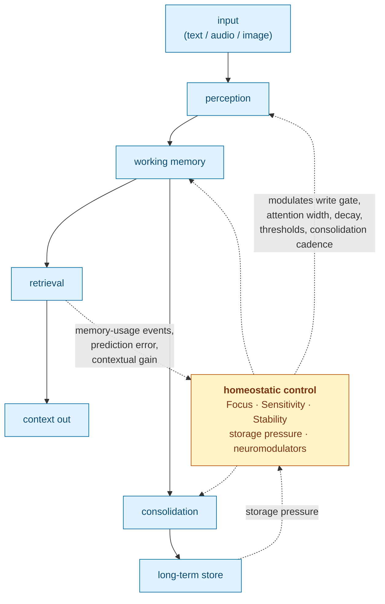

# Cortext

**A closed-loop context and memory engine for streaming AI.**

Most memory systems for LLMs are open-loop: text flows in, gets chunked, embedded, summarized, and retrieved, and the parameters that govern those stages never change based on what retrieval or consolidation actually produced. Cortext is different. Retrieval outcomes, prediction error, and consolidation results feed back into three continuous control parameters: **Focus (F)**, **Sensitivity (S)**, and **Stability (T)**. Those parameters modulate write gating, attention width, decay, thresholds, and consolidation cadence for the next input.

The architecture is specified formally in the accompanying paper. The design borrows ideas from the cognitive-science literature (working-memory capacity limits, reconsolidation, serial-position effects, emotional modulation of memory) as engineering heuristics. Cortext doesn't claim to model human memory. The claim is narrower: these borrowed mechanisms measurably improve machine memory, and the benchmarks to check that ship in this repo.

## Why Cortext Exists

Cortext began for a personal reason. In 2022, my father-in-law was diagnosed with dementia. I'm a software engineer, and since then I have been focused on building systems that help people with memory loss preserve continuity, confidence, and independence.

The same architecture also happens to be useful for long-horizon LLM memory. But the primary motivation is human: Cortext is designed to process real-time information from a wearable device through a hub that can deliver gentle nudges to help someone remember context, reduce confusion, and avoid the humiliation and frustration that memory loss can create. A care context requires homeostasis. Salience, confusion, and emotional state change through the day, and that is exactly what an open-loop system can't track.

## Who Built This

Cortext is built by one software engineer. I'm not an ML researcher or a psychologist. The cognitive-science references here come from reading the literature while building this. They shaped the design, but don't mistake my reading for expert interpretation. The system's value doesn't rest on it.

What it does rest on is falsifiable. The benchmarks in this repo run blind LLM-judged comparisons against strong baselines, including a full-history arm that Cortext is expected to lose to sometimes, with fixed seeds, repeated judgments, and bootstrap confidence intervals. Where results failed to reproduce under real encoders, the paper says so and marks the old numbers superseded. If you find a spot where the psychology is misapplied, a baseline is unfair, or an eval is flattering the system, open an issue. I want to know.

## The Loop



Concretely, the following operations close the loop (see `src/operations/`):

- `focus_feedback`, `sensitivity_feedback`, `stability_feedback` - adjust the three control knobs from retrieval and usage outcomes
- `storage_pressure` - modulates write gating and consolidation urgency from store state
- `embedding_prediction_error` - surprise signal into the feedback path
- `neuromodulators` - emotional / arousal modulation of encoding strength
- `reconsolidation` - updates existing memories on re-exposure rather than writing duplicates
- `synaptic_tagging`, `metacognitive`, `constructive_recall_internal` - higher-order regulation

Ablation benchmarks for the loop live under `examples/benchmark/` (resurfacing pressure, resurfacing horizon, preference update, and the full operation-family sweeps described below).

## Does The Loop Actually Matter?

Short answer: yes, and we have tried to be honest about where it does and does not.

A few load-bearing results from [docs/paper/sections/9_experimental.qmd](docs/paper/sections/9_experimental.qmd), all run against a real encoder path (EmbeddingGemma, the default at the time of those runs) rather than synthetic embeddings:

- **Retrieval-reinforcement feedback is controlled, not runaway.** With the fact layer enabled, fact-linked memories accumulate a strength gap of **+0.30** over unlinked memories and take **100%** of top-5 retrieval positions. Disabling the fact layer cleanly **reverses** the gap to **−0.30** and flips top-5 fact fraction to **0.0**. The loop is driven by the fact layer; toggling it inverts the outcome rather than destabilizing it.
- **Exhaustive operation-family ablation.** A deterministic `2^12 = 4096`-combination sweep over the major operation families (`examples/benchmark/cortext_full_operation_ablation_bench`) is used to identify minimal best-disabled sets rather than cherry-picked configurations.
- **Bitemporal fact handling is required, not decorative.** Ablations on a `3 × 3 × 3` F/S/T sweep confirm that bitemporal history is required for historical and belief-at-time queries, and that stale penalties materially reduce present-oriented intrusion.

Where earlier synthetic-encoder claims did **not** survive the switch to real embeddings (notably parts of the provenance, stale, and routine-vs-recency separations), the paper says so explicitly and marks those older numbers as superseded. The repo's claim about the loop rests on what reproduces under real encoders, not on what was convenient in synthetic ablations.

## Evaluation Results (Alpha)

The main end-to-end eval is the chat-replay protocol
(`tools/run_chat_replay_release_protocol.py`). It replays a real chat export
(text plus media) through the full pipeline, then a local LLM blind-judges
three context arms on held-out probes: Cortext's compressed packet, standard
embedding RAG, and the full history as an upper bound. Fixed seed, 3
judgments per probe, bootstrap confidence intervals, fairness checks. The
corpus format is just a directory with one timestamped `.txt` transcript plus
media, so it runs on any export that matches the format, not just mine.

Latest runs (June 2026, a private 1,200-message corpus, 39 probes × 3
repetitions, local `gemma4:12b` judge):

| Run | Cortext wins | Full-history wins | RAG wins | Ties | Cortext sufficiency | Context tokens |
|---|---|---|---|---|---|---|
| Working memory 7±2 | **42**/117 | 32 | 25 | 18 | 2.72 | ~262 |
| Working memory 4 (control) | **39**/117 | 35 | 20 | 23 | 2.43 | ~222 |

Both baseline arms used ~6,100 context tokens per probe, so Cortext's packet
is roughly 96% smaller and still wins the most judgments.

The honest caveats:

- Judged sufficiency trails the fat-context arms (~2.4-2.7 vs ~3.1). That's
  the cost of the compression, and raising working-memory capacity didn't
  close it.
- An earlier run in this series was invalid: stale vectors from an older
  encoder were silently compared against the new embedding space. That
  failure is why the engine now pins every database and precomputed artifact
  to the encoder's fingerprint and refuses to start on a mismatch, with no
  override. The paper documents both the failure and the rerun.
- This is one private corpus and one judge model. I'm publishing the numbers
  for transparency, not claiming benchmarks. The whole protocol ships in this
  repo. Run it on your own data and tell me where it breaks.

## What Cortext Provides

- streaming ingest for text, audio, and image signals
- working-memory tracking plus long-term retrieval state, persisted in SQLite
- storage abstraction seams for caller-owned databases and object stores
- explicit consolidation passes for summary, label, and relation generation
- graph-augmented retrieval combining embedding similarity with extracted semantics
- native C++20 API plus a C ABI for bindings
- a first-party multimodal embedding model (AIST-87M) as the default encoder, with optional local backends for embeddings and deep consolidation

## Embedding Models

Cortext's default encoder is
[`augmem/AIST-87M`](https://huggingface.co/augmem/AIST-87M), a custom
87M-parameter multimodal embedding model that places audio, image, speech, and
text in a single retrieval space (unified 1280-d embeddings with Matryoshka
slices at 1280/768/512/256/128, merged native audio tower). The repo also
ships **AAIT-86M**, which bundles a preserved trimodal retrieval checkpoint
with an ingress-anchor head that emits anchor decisions
(`CREATE / UPDATE / SPLIT / CLOSE / ABSTAIN`) at ingest time without changing
the underlying retrieval behavior.

Both models are distributed as custom `triembed` GGUF exports that generic
`llama.cpp` cannot load; Cortext includes its own native GGUF tensor runtime
(`src/models/aist_gguf_encoder.cpp`) that parses the files, dequantizes the
needed tensors, and executes the encoder (and anchor head) in C++.

Text-encoder selection order (`CreatePreferredTextEncoder`):

1. **AAIT-86M-GGUF** - opt-in: set `CORTEXT_AAIT_ENABLE=1` (model under
   `models/AAIT-86M-GGUF/`)
2. **AIST-87M-GGUF** - the default: auto-discovered under
   `models/AIST-87M-GGUF/` (q8_0 preferred over q5_1), or pinned explicitly
   with `CORTEXT_AIST_MODEL_PATH`
3. **EmbeddingGemma** - fallback via llama.cpp GGUF, LiteRT `.tflite`, or ONNX
   (`CORTEXT_EMBEDDINGGEMMA_MODEL_PATH`, `CORTEXT_EMBEDDINGGEMMA_BACKEND`)

## Storage Abstractions

Cortext separates metadata/database storage from payload/object storage. SQLite
remains the supported default, but the engine no longer has to be the only owner
of the database connection or blob backend.

- `cortext::Store` and `cortext::Transaction` define the database boundary for
  schema, query, and transactional work. `SQLiteStore` is the built-in
  implementation; adapters for libSQL/Turso or another SQL-compatible provider
  can be added behind the same interface.
- `cortext::ObjectStore` and `cortext::ObjectTransaction` define
  content-addressed payload storage. `SqlObjectStore` is the current
  sqlite-objstore-backed implementation over a `Store`; filesystem, R2, S3, or
  remote object-store providers can be introduced without changing the memory
  operations.
- `Cortext::Create()` has overloads for the default SQLite path, a
  caller-supplied database store, a caller-supplied object store, or both. This
  lets embedders control persistence topology while keeping the memory pipeline
  stable.

Alternate providers are extension points today, not bundled backends. The
supported out-of-the-box path is SQLite metadata plus sqlite-objstore payloads.

## Repository Layout

- `src/`, `include/` - core engine and public headers
- `src/operations/` - the control-loop and memory operations
- `tests/` - Catch2 suite (built as `cortext_tests`)
- `examples/` - ImGui chat demo, benchmarks, telemetry smoke tests, topical-chat analysis
- `bindings/` - Python, Go, JavaScript/TypeScript, and Dart bindings over the C ABI
- `scripts/`, `tools/` - experiment harnesses and offline utilities
- `docs/paper/` - manuscript source; generated output at `docs/paper/_manuscript/index.md`
- `models/`, `third_party/` - local runtime assets and vendored dependencies

## Paper

The formal specification of the architecture is in [docs/paper/\_manuscript/index.md](docs/paper/_manuscript/index.md). If you want to understand *why* the loop is shaped the way it is (the derivations from the three knobs, the stability/plasticity analysis, the homeostatic threshold control), read the paper first.

## Quickstart Build

Core native builds require a C++20 toolchain, CMake, `pkg-config`, and SQLite development headers.

```bash
cmake -S . -B build -DCMAKE_BUILD_TYPE=Debug
cmake --build build -j8
ctest --test-dir build -R cortext_tests --output-on-failure
```

Examples are off by default. To build them:

```bash
cmake -S . -B build -DCMAKE_BUILD_TYPE=Debug -DCORTEXT_BUILD_EXAMPLES=ON
cmake --build build -j8
./build/examples/topical_chat_analysis/cortext_topical_chat_analysis --help
```

The ImGui chat example also requires desktop dependencies such as `glfw3`, OpenGL, and `CURL`.

## Minimal C++ Example

```cpp
#include <cortext/cortext.hpp>
#include <iostream>

int main() {
  cortext::Cortext::Config cfg;
  cfg.focus = 0.7;        // F - attentional precision
  cfg.sensitivity = 0.5;  // S - reactivity to surprise
  cfg.stability = 0.8;    // T - plasticity vs. retention

  auto engine = cortext::Cortext::Create(cfg, ":memory:", "models");

  auto ctx = engine->ProcessText("Hello from Cortext", "chat/user");
  if (ctx.should_interrupt) {
    for (const auto& memory : ctx.retrieved_memory) {
      std::cout << memory.id << " " << memory.source_id << "\n";
    }
  }

  engine->Consolidate();
  engine->Flush();
}
```

The three `Config` fields are the primary control knobs; most other tuneable parameters are derived from them through the transformations specified in the paper. The loop drives them at runtime.

Primary public entrypoints:
- C++ API: `include/cortext/cortext.hpp`
- C API: `include/cortext/capi.h`

## Foreign-Language Integration

For Python, Go, JavaScript/TypeScript, and Dart consumers, use the dedicated FFI release preset. It builds a shared library and disables the heaviest optional backends by default so bindings do not need the full research stack on every install.

Zig is the transitional cross-platform FFI entrypoint:

```bash
zig build -Dshared=true -Dllama=false
```

That installs the shared library under `zig-out/lib` and public headers under `zig-out/include`. To enable llama.cpp with Zig, pass target-compatible prebuilt artifacts explicitly:

```bash
zig build -Dshared=true -Dllama=true \
  -Dllama_include=/path/to/llama/include \
  -Dllama_lib=/path/to/libllama \
  -Dggml_include=/path/to/ggml/include \
  -Dggml_lib=/path/to/libggml
```

Cross-compiling with llama enabled requires llama/ggml libraries built for that target. Cross smoke builds without target SQLite artifacts can leave SQLite unlinked with the default non-native behavior; pass `-Dlink-sqlite=true` when a target SQLite library is available.

The CMake FFI path is also supported:

```bash
cmake --preset ffi-release
cmake --build --preset ffi-release --target cortext
```

The C API includes:
- `cortext_config_init()` and `cortext_create_with_config()` for binding-safe configuration
- `cortext_version()` for runtime version checks
- `cortext_last_error()` for per-thread error reporting
- `cortext_*_json()` helpers that return the full `Context` as UTF-8 JSON
- `cortext_string_free()` to release JSON strings returned by the library

Repository-local bindings live under `bindings/`:
- `bindings/python` - pure `ctypes` wrapper over the JSON C ABI
- `bindings/go` - `cgo` wrapper with raw JSON and decoded `map[string]any` helpers
- `bindings/javascript` - Node.js addon plus TypeScript declarations
- `bindings/dart` - `dart:ffi` wrapper with generated bindings and JSON helpers

Smoke commands after a Zig build:

```bash
PYTHONPATH=bindings/python python3 -c "import cortext; print(cortext.version())"
zig build -Dtarget=x86_64-linux-gnu -Dshared=true -Dllama=false

# Legacy CMake/binding smoke path:
cmake --preset ffi-release
cmake --build --preset ffi-release --target cortext
PYTHONPATH=bindings/python python3 -c "import cortext; print(cortext.version())"
(cd bindings/go && go test .)
(cd bindings/javascript && npm run build && node -e "const { version } = require('./'); console.log(version())")
(cd bindings/dart && dart pub get && dart test)
```

## Important CMake Options

- `BUILD_TESTING=ON|OFF` - build the Catch2 suite
- `CORTEXT_BUILD_EXAMPLES=ON|OFF` - build binaries under `examples/`
- `CORTEXT_BUILD_NODE_BINDINGS=ON|OFF` - build the Node.js addon under `bindings/javascript`
- `BUILD_WASM=ON|OFF` - configure the WebAssembly build
- `CORTEXT_ENABLE_AAIT_GGUF=ON|OFF` - build the native GGUF runtime for the AIST/AAIT custom encoders (default ON)
- `CORTEXT_ENABLE_EMBEDDINGGEMMA=ON|OFF` - enable the EmbeddingGemma fallback encoder path
- `CORTEXT_DISABLE_LITERT=ON|OFF` - disable LiteRT-LM-backed extractor/summarizer paths
- `CORTEXT_DISABLE_OGA=ON|OFF` - disable onnxruntime-genai-backed Phi-4 paths
- `CORTEXT_DISABLE_SHERPA_ONNX=ON|OFF` - disable sherpa-onnx audio integration

## Optional Local Runtimes

Some features rely on optional local runtimes or model assets under `models/` and `third_party/`:
- ONNX Runtime
- LiteRT-LM
- onnxruntime-genai
- sherpa-onnx
- `llama.cpp` GGUF support for EmbeddingGemma and Liquid deep-consolidation backends
- the AIST/AAIT encoders need no external runtime - their `triembed` GGUF exports run on Cortext's built-in GGUF tensor runtime

## Deep Consolidation Backends

Deep consolidation backend selection stays internal, but you can override it with environment variables:

- `CORTEXT_DEEP_LLM_BACKEND=auto|gemma|lfm2|mixed`
- `CORTEXT_LFM2_SUMMARIZER_MODEL=/abs/path/LFM2.5-1.2B-Instruct-Q4_K_M.gguf`
- `CORTEXT_LFM2_EXTRACT_MODEL=/abs/path/LFM2.5-350M-Q4_K_M.gguf`
- `CORTEXT_LLAMA_CPP_LOG_LEVEL=none|error|warn|info|debug`

Current behavior:
- `auto` prefers the mixed path when both stacks are available
- the Liquid `llama.cpp` summarizer path now prefers `LFM2.5-1.2B-Instruct-GGUF`
- the Liquid extractor path continues to prefer `LFM2.5-350M-GGUF`
- if the preferred Liquid summarizer is not present, the resolver falls back to `LFM2.5-350M-GGUF`, then the older pinned `LFM2-2.6B-Transcript` summarizer
- the mixed path uses Gemma/LiteRT-LM for summarization and Liquid/`llama.cpp` for extraction

## Experiments And Docs

Run the long-horizon harness with:

```bash
python scripts/run_memory_harness.py --max-conversations 2 --max-turns 360 --max-total 720 --no-multi
```

When algorithms or results change, update the paper sources under `docs/paper/sections/` and regenerate the manuscript:

```bash
QUARTO_DISABLE_GIT=1 QUARTO_DISABLE_GITHUB=1 quarto render docs/paper
```

`docs/paper/_manuscript/index.md` is the generated manuscript source of truth used by the paper build.

## Release Status

Cortext is currently released as **alpha**.

The alpha focuses on proving the core closed-loop memory architecture, retrieval behavior, consolidation pipeline, and local inference stack well enough to ship publicly and iterate with users. Expect API changes between alpha and v1.

## v1 Direction

The planned `v1` direction is to harden the runtime and inference stack:

- move the event-driven system to `stateforward/sml.cpp`
- use that transition to improve runtime structure and memory safety
- move inference onto `stateforward/emel.cpp` when that library is complete and ready for production use

Those changes are intentionally deferred until `v1`. The current alpha remains focused on shipping, stabilizing behavior, and collecting real-world feedback before making that architectural transition.

## License

Cortext is licensed under the Apache License, Version 2.0. See `LICENSE`.

## Third-Party Licensing

This repository includes or depends on third-party code, model assets, and runtime components that may be licensed under terms other than Apache-2.0.

The Apache-2.0 license applies to Cortext source code in this repository unless otherwise noted. Third-party components retain their own licenses, including material under `third_party/`, `models/`, and any bundled external assets.

Before redistributing binaries, model bundles, or packaged releases, verify the license terms for every included dependency and model artifact.
