# Cortext Database Schema v2

Entity Relationship Diagram for signal storage and retrieval. Hierarchical top-down structure:

**EPISODES → MEMORIES → SIGNALS → (EMBEDDINGS, BLOBS)**

## Key Changes from v1

| Aspect | v1 | v2 |
|--------|----|----|
| Hierarchy | EMBEDDINGS at top | EPISODES → MEMORIES → SIGNALS → (EMBEDDINGS, BLOBS) |
| Embedding ownership | EMBEDDINGS table owns all | SIGNALS owns its EMBEDDING |
| Metrics | SIGNAL_METRICS separate table | Metrics inline on SIGNALS |
| WM slots | Separate WORKING_MEMORY_SLOTS table | MEMORIES.kind = 'WORKING' |
| Blob tracking | Split across tables | SIGNALS owns both embedding_id and blob_id |

## Overview

```mermaid
---
title: Cortext Signal Storage & Retrieval Schema v2
config:
  layout: elk
---
erDiagram
    direction TB

    %% =======================================================================
    %% CORE HIERARCHY: EPISODES → MEMORIES → SIGNALS → (EMBEDDINGS, BLOBS)
    %% =======================================================================

    EPISODES ||--o{ MEMORIES : "contains"
    MEMORIES ||--o{ SIGNALS : "contains"
    SIGNALS ||--|| EMBEDDINGS : "has"
    SIGNALS ||--|| BLOBS : "stores"

    %% Episodes: Temporal/semantic context boundaries (Section 3.1.3)
    EPISODES {
        int episode_id PK
        int start_ts "timestamp (ms)"
        int end_ts "timestamp (ms), IDX partial NULL"
        text boundary_type "drift|explicit|timeout"
        blob centroid "256d aggregate vector"
        int created_at "timestamp (ms)"
    }

    %% Memories: Grouped signals with decay metrics
    MEMORIES ||--|| EMBEDDINGS : "has"
    MEMORIES ||--o| BLOBS : "stores"

    MEMORIES {
        int memory_id PK
        int episode_id FK "IDX with start_ts"
        int embedding_id FK "aggregate embedding (centroid)"
        blob blob_id FK "optional summary content"
        text source_id "chat/user, chat/assistant"
        text kind "WORKING|LONG_TERM|ASSOCIATION|LABEL, IDX"
        text label "human readable name (for LABEL kind)"
        int start_ts "timestamp (ms)"
        int end_ts "timestamp (ms), IDX partial WORKING"
        int n_signals "count of signals"
        text modality "text|audio|image"
        real s_max "max signal score"
        real s_avg "average signal score"
        blob emotion "6d vector - Section 2.2.2"
        blob ambient_mood "6d vector - Section 2.2.4"
        real strength "Section 5.1, IDX with last_access"
        real use_frequency "Section 5.1 EWMA"
        real stability "Section 5.3.3"
        real connectivity "Section 7.2 graph metric"
        real drift_mag "Section 3.1.3"
        real influence "Section 5.4 composite"
        real sustained_influence "Section 5.4 EWMA"
        real contextual_gain "Section 5.2"
        real redundancy "Section 7.2"
        real pre_activation "Section 6.5"
        real lability_state "Section 6.3"
        int suppression_count "Section 6.4 RIF"
        int cluster_id FK "Section 7.3, IDX partial NOT NULL"
        int last_access "timestamp (ms)"
        int created_at "timestamp (ms)"
        int retrieved_count "Section 5.2"
        int used_count "Section 5.2"
        real influence_factor "Section 5.2"
        real mean_influence "Section 5.4"
        int last_used "timestamp (ms)"
        blob original_centroid "Section 6.3 reconsolidation"
        int lability_ts "Section 6.3 (ms)"
        int recovery_time_start "Section 6.4 (ms)"
        real suppression "Section 8.4 - competing memory inhibition"
        int suppression_ts "timestamp (ms)"
        int flashbulb "Section 8.7 - boolean"
        real emotional_intensity "Section 8.7"
        real half_life_bonus "Section 8.7"
        real detail_suppression "Section 8.7"
        int gist_components "Section 8.7"
        int cascade_radius "Section 8.7"
        real cascade_decay "Section 8.7"
    }

    %% Signals: Discrete inputs with per-signal metrics
    SIGNALS {
        int signal_id PK
        int memory_id FK "NULL until flush, IDX with serial_position"
        text source_id FK "accumulator, IDX partial NULL memory_id"
        int embedding_id FK
        blob blob_id FK "content hash"
        int timestamp "signal arrival (ms), IDX DESC"
        text modality "text|audio|image"
        text mime
        int serial_position "order within memory"
        real score "composite score"
        real relevance "Section 3.1"
        real mismatch "Section 3.2"
        real surprise "Section 3.2"
        real rarity "Section 3.2"
        real drift "Section 3.1.3"
        real contradiction "Section 3.2"
        real utility "Section 3.3"
        real periphery "Section 3.3"
        real coverage "Section 3.3"
        real salience "Section 2.2"
        real valence "Section 2.2.2"
        real arousal "Section 2.2.2"
        real threshold_t "Section 4.2"
        int write_decision "0|1"
        real coherence "Section 3.1.1"
        real focus_spread "Section 3.1.2"
        real f_effective "Section 3.1.1"
        int created_at "timestamp (ms)"
    }

    %% Embeddings: Vector representations (sqlite-vec virtual table)
    EMBEDDINGS {
        int embedding_id PK "rowid"
        blob embedding "float[256] - sqlite-vec"
        int created_at "timestamp (ms)"
    }

    %% Blobs: Raw content storage (sqlite-objstore virtual table)
    BLOBS {
        blob blob_id PK "SHA256 content hash"
        blob data "raw content: text, audio PCM, image bytes"
    }

    %% =======================================================================
    %% ASSOCIATIONS - All relationships between memories
    %% =======================================================================

    MEMORIES ||--o{ ASSOCIATIONS : "connects"

    %% Associations: Relationships between memories (including features)
    ASSOCIATIONS {
        int source_memory_id PK,FK "IDX with edge_type"
        int target_memory_id PK,FK "IDX with edge_type"
        text edge_type PK "derived_from|similar_to|co_occurs|implies|contradicts|reinforces|causes|has_label"
        real weight
        real decay_rate
        int last_reinforced "timestamp (ms)"
    }

    %% =======================================================================
    %% ACCUMULATORS (Section 4.4) - Pending memories being built
    %% =======================================================================

    EPISODES ||--o{ ACCUMULATORS : "building"
    ACCUMULATORS ||--o{ SIGNALS : "produces"
    ACCUMULATORS {
        text source_id PK "per-signal accumulator"
        int episode_id FK "current episode, IDX"
        blob mu_acc "256d running mean"
        real drift_acc "accumulated drift"
        real s_sum "score sum"
        real s_max "max score"
        blob e_peak "256d peak embedding"
        int t_start "memory start timestamp (ms)"
        int last_write_ts "for write refractory (ms)"
        int last_signal_ts "for gap detection (ms)"
        real eta_acc "drift EWMA"
        real coherence_prev "previous coherence"
    }

    %% =======================================================================
    %% STATE - Global processor parameters (singleton)
    %% =======================================================================

    STATE {
        int id PK "singleton (id=1)"
        int signals_processed
        real theta_dynamic "Section 4.2"
        real theta_target "Section 4.2"
        real hysteresis "Section 4.2"
        real half_life
        real weight_relevance "Section 2.1"
        real attention_width "Section 2.1"
        real coverage_gain_floor "Section 2.1"
        real mismatch_weight "Section 2.1"
        real weight_novelty "Section 2.2"
        real weight_surprise "Section 2.2"
        real weight_valence "Section 2.2"
        real weight_arousal "Section 2.2"
        real emotion_gain "Section 2.2"
        real score_gain "Section 2.2"
        real rate_target "Section 2.2"
        real emotion_intensity "Section 2.2.2"
        real valence "Section 2.2.2"
        real arousal "Section 2.2.2"
        blob mood_vector "6d vector"
        real rate_decay "Section 2.3"
        real periphery_half_life "Section 2.3"
        real salience_half_life "Section 2.3"
        real drift_weight "Section 2.3"
        real retention_ema "Section 2.3"
        real m_rate "Section 4.2"
        real dt_ema "Section 4.2"
        int rate_ticks "Section 4.2"
        int last_rate_timestamp "Section 4.2"
        real reliability "Section 4.2"
        real u_uncertainty "Section 1.4"
        blob last_embedding "Section 3.1.4"
        blob delta_x_trend "Section 3.1.4"
        real delta_half_life_adj "Section 3.1.4"
        real sustained_influence "Section 3.1.4"
        real wm_maintenance_cost "Section 6.1"
        int wm_slot_count "Section 6.1"
        int wm_last_accepted "Section 6.1"
        int wm_last_chunked "Section 6.1"
        real fok_state "Section 6.2"
        real retrieval_strength "Section 6.2"
        real metacognitive_confidence "Section 6.2"
        int last_consolidation_ts "Section 7.1"
        int consolidation_count "Section 7.1"
        int is_processing_signal
        int last_retrieval_ts
        real drift_accum "Section 10"
        real drift_at_last_interrupt "Section 10"
        int episode_start_ts "Section 3.1.3"
        int last_interrupt_tick
        int last_signal_timestamp
        int updated_at "timestamp (ms)"
        blob write_rate_timestamps "Section 2.2"
        real w_relevance "Section 3.2 blender"
        real w_mismatch "Section 3.2 blender"
        real w_surprise "Section 3.2 blender"
        real w_rarity "Section 3.2 blender"
        real w_drift "Section 3.2 blender"
        real w_contradiction "Section 3.2 blender"
        real w_utility "Section 3.2 blender"
        real w_periphery "Section 3.2 blender"
        real w_coverage "Section 3.2 blender"
        real w_salience "Section 3.2 blender"
        real w_valence "Section 3.2 blender"
        real w_arousal "Section 3.2 blender"
        int blender_ready "Section 3.2"
        int blender_update_count "Section 3.2"
        blob blender_P_matrix "Section 3.2 - 12x12 covariance"
        blob blender_coefficients "Section 3.2 - learned coefficients"
        blob blender_coeff_P_matrix "Section 3.2 - 48x48 covariance"
    }

```



## Timestamp Units Convention

**All timestamp columns in the database are stored in milliseconds since Unix epoch.**

| Column Pattern | Unit | Examples |
|----------------|------|----------|
| `timestamp` | milliseconds | `signals.timestamp` |
| `created_at` | milliseconds | `signals.created_at`, `memories.created_at` |
| `last_access` | milliseconds | `memories.last_access` |
| `*_ts` suffix | milliseconds | `start_ts`, `end_ts`, `lability_ts` |

**Internal calculations:** Decay and rate formulas convert to seconds: `t_seconds = t_milliseconds / 1000.0`

## SQLite Extensions

| Extension | Virtual Table | Purpose |
|-----------|--------------|---------|
| **sqlite-vec** | `EMBEDDINGS` | 256d float vector storage + KNN search |
| **sqlite-objstore** | `BLOBS` | Content-addressed blob storage |
| **sqlite-graph** | `GRAPH_NODES`, `GRAPH_EDGES` | Cypher-compatible knowledge graph |

### sqlite-vec Usage (on EMBEDDINGS)

```sql
-- Create embeddings table with 256d float vectors
CREATE VIRTUAL TABLE embeddings USING vec0(
    embedding_id INTEGER PRIMARY KEY,
    embedding float[256],
    blob_id blob,
    +created_at integer
);

-- KNN search for k nearest neighbors
SELECT embedding_id, distance
FROM embeddings
WHERE embedding MATCH ?query_vector
  AND k = 10;

-- Join to get signals with their embeddings and content
SELECT s.*, e.embedding, b.data as content
FROM signals s
JOIN embeddings e ON s.embedding_id = e.embedding_id
JOIN blobs b ON s.blob_id = b.blob_id
WHERE s.source_id = 'chat/user';
```

## Working Memory Queries

Working memory is now a `kind` enum on MEMORIES rather than a separate table:

```sql
-- Get working memories (active conversation context)
SELECT * FROM memories
WHERE kind = 'WORKING'
ORDER BY end_ts DESC;

-- Get all signals in working memory with content
SELECT m.memory_id, m.source_id as memory_source,
       s.signal_id, s.source_id, s.timestamp, s.modality,
       b.data as content
FROM memories m
JOIN signals s ON s.memory_id = m.memory_id
JOIN blobs b ON s.blob_id = b.blob_id
WHERE m.kind = 'WORKING'
ORDER BY m.memory_id, s.serial_position;

-- Get labels associated with a memory
SELECT target.label, a.weight
FROM associations a
JOIN memories target ON a.target_memory_id = target.memory_id
WHERE a.source_memory_id = ?
  AND a.edge_type = 'has_label'
  AND target.kind = 'LABEL';

-- Count memories by kind
SELECT kind, COUNT(*) as count
FROM memories
GROUP BY kind;
```

## Entity Descriptions

### Core Hierarchy

| Entity | Algorithm | Purpose |
|--------|-----------|---------|
| `EPISODES` | 3.1.3 | Temporal/semantic context boundaries |
| `MEMORIES` | 4.4, 5.1-5.4, 6.1-6.5 | Grouped signals with decay metrics |
| `SIGNALS` | 2.2, 3.1-3.3 | Discrete inputs with per-signal metrics |
| `EMBEDDINGS` | - | Vector representations (sqlite-vec) |
| `BLOBS` | - | Raw binary content (sqlite-objstore) |

### Supporting Tables

| Entity | Algorithm | Purpose |
|--------|-----------|---------|
| `ASSOCIATIONS` | 7.4-7.6 | All relationships between memories (including labels) |
| `ACCUMULATORS` | 4.4 | Pending memories being built |
| `STATE` | 1.4-8.4, 3.2 | Global processor parameters (knobs, thresholds, blender weights) |

### Computed as Views (not persisted)

These are derived from SIGNALS/MEMORIES via SQL views:

| View | Source | Purpose |
|------|--------|---------|
| `recent_context` | SIGNALS → EMBEDDINGS | Recent embeddings for relevance |
| `recent_scores` | SIGNALS | Recent composite scores for threshold adaptation |
| `recent_ids` | SIGNALS | LRU tracking for novelty detection |
| `recent_retrievals` | MEMORIES | Implicit feedback cache |

### Removed from v1

| Entity | Replacement |
|--------|-------------|
| `SIGNAL_METRICS` | Inline columns on `SIGNALS` |
| `WORKING_MEMORY_SLOTS` | `MEMORIES.kind = 'WORKING'` |
| `OBJSTORE` | Renamed to `BLOBS` |
| `CONSOLIDATION_SUMMARIES` | `MEMORIES.kind = 'ASSOCIATION'` |
| `CONSOLIDATION_SOURCES` | Use `ASSOCIATIONS` with `edge_type = 'derived_from'` |
| `GRAPH_EDGES` | Renamed to `ASSOCIATIONS` |
| `GRAPH_NODES` | `MEMORIES` with `kind = 'LABEL'` |
| `GOAL_NODES` | Application concern, not memory storage |
| `ENTITY_INDEX` | Use `MEMORIES.label` field |
| `EXTRACTION_ENTITIES` | Labels emerge from clustering, no LLM extraction needed |
| `EXTRACTION_RELATIONS` | Relationships via `ASSOCIATIONS` |
| `MEMORY_FEEDBACK` | Merged into `MEMORIES` |
| `RIF_STATE` | Merged into `MEMORIES` (suppression fields) |
| `EMOTIONAL_TAGS` | Merged into `MEMORIES` (flashbulb fields) |
| `CONSOLIDATION_CANDIDATES` | Computed on-demand during consolidation |
| `RECENT_CONTEXT` | Computed as view |
| `RECENT_SCORES` | Computed as view |
| `RECENT_IDS` | Computed as view |
| `RECENT_RETRIEVALS` | Computed as view |
| `OBSERVED_RETENTION_HISTORY` | Computed as view |
| `BLENDER` | Merged into `STATE` |
| `BLENDER_WEIGHTS` | Merged into `STATE` |
| `BLENDER_COVARIANCE` | Merged into `STATE` |
| `BLENDER_COEFFICIENTS` | Merged into `STATE` |
| `BLENDER_COEFF_COVARIANCE` | Merged into `STATE` |

## Relationship Cardinalities

| Relationship | Cardinality | Description |
|--------------|-------------|-------------|
| EPISODES → MEMORIES | 1:N | One episode contains many memories |
| EPISODES → ACCUMULATORS | 1:N | One episode has multiple active accumulators (per source) |
| MEMORIES → SIGNALS | 1:N | One memory contains many signals |
| SIGNALS → EMBEDDINGS | 1:1 | Each signal has one embedding |
| SIGNALS → BLOBS | 1:1 | Each signal has one content blob |
| ACCUMULATORS → SIGNALS | 1:N | Accumulator produces signals (memory_id NULL until flush) |
| ASSOCIATIONS | N:N | Links memories together (including labels) |

## Indexes

Indexes for common query patterns:

```sql
-- SIGNALS: Pending signals for accumulator (hot path)
CREATE INDEX idx_signals_pending
    ON signals(source_id) WHERE memory_id IS NULL;

-- SIGNALS: Lookup by memory for hydration
CREATE INDEX idx_signals_memory
    ON signals(memory_id, serial_position) WHERE memory_id IS NOT NULL;

-- SIGNALS: Recent signals for context window
CREATE INDEX idx_signals_timestamp
    ON signals(timestamp DESC);

-- MEMORIES: Working memory lookup (hot path)
CREATE INDEX idx_memories_working
    ON memories(end_ts DESC) WHERE kind = 'WORKING';

-- MEMORIES: By episode for episode queries
CREATE INDEX idx_memories_episode
    ON memories(episode_id, start_ts);

-- MEMORIES: By kind for type-specific queries
CREATE INDEX idx_memories_kind
    ON memories(kind);

-- MEMORIES: Decay candidates (strength below threshold)
CREATE INDEX idx_memories_strength
    ON memories(strength, last_access);

-- MEMORIES: Cluster membership for consolidation
CREATE INDEX idx_memories_cluster
    ON memories(cluster_id) WHERE cluster_id IS NOT NULL;

-- ASSOCIATIONS: Outgoing edges from a memory
CREATE INDEX idx_associations_source
    ON associations(source_memory_id, edge_type);

-- ASSOCIATIONS: Incoming edges to a memory
CREATE INDEX idx_associations_target
    ON associations(target_memory_id, edge_type);

-- EPISODES: Active episode lookup
CREATE INDEX idx_episodes_active
    ON episodes(end_ts DESC) WHERE end_ts IS NULL;

-- ACCUMULATORS: By episode for cleanup
CREATE INDEX idx_accumulators_episode
    ON accumulators(episode_id);
```

Note: EMBEDDINGS and BLOBS are virtual tables (sqlite-vec, sqlite-objstore) with their own internal indexing.

## State Resumption

On startup, the processor loads persisted state:

1. **`accumulators`**: Rebuilds ongoing memories from unfinished streams
2. **`memories` WHERE kind='WORKING'**: Re-populates active working memory
3. **`signals` → `embeddings`, `blobs`**: Retrieves signal content for working memories
