# Cortext Database Schema

Entity Relationship Diagram for signal storage and retrieval based on `docs/research/algorithms.md` and `docs/design.md`.

## Overview

```mermaid
---
title: Cortext Signal Storage & Retrieval Schema
config:
  layout: elk
---
erDiagram
    direction LR

    %% Core Vector Storage (sqlite-vec virtual table)
    EMBEDDINGS ||--o| MEMORIES : "has_metadata"
    EMBEDDINGS ||--o| MEMORY_FEEDBACK : "has_feedback"
    EMBEDDINGS ||--o{ SIGNAL_METRICS : "wrote_signal"
    EMBEDDINGS ||--o{ GRAPH_NODES : "vectorizes"
    EMBEDDINGS }|--o| EPISODES : "belongs_to"
    EMBEDDINGS {
        int embedding_id PK "rowid"
        blob embedding "float[256] - sqlite-vec"
        text type "memory|summary|concept|generation"
        real strength "Section 5.1 decay model"
        real use_frequency "Section 5.1 EWMA"
        real stability "Section 5.3.3 per-memory"
        real connectivity "Section 7.2 graph metric"
        real drift_mag "Section 3.1.3"
        real influence "Section 5.4 composite"
        real sustained_influence "Section 5.4 EWMA"
        real contextual_gain "Section 5.2"
        real redundancy "Section 7.2"
        real pre_activation "Section 6.5"
        real lability_state "Section 6.3"
        int suppression_count "Section 6.4 RIF"
        int cluster_id FK "Section 7.3"
        int last_access "timestamp"
        int created_at "timestamp"
    }

    %% Memory Metadata + Payload Reference
    MEMORIES ||--o| OBJSTORE : "stores_blob"
    MEMORIES }|--|| EPISODES : "belongs_to"
    MEMORIES {
        int embedding_id PK,FK
        text source_id
        text modality "text|audio|image"
        text mime
        int timestamp
        blob blob_id FK "objstore reference"
        blob event_emotion "6d vector - Section 2.2.2"
        blob ambient_mood "6d vector - Section 2.2.4"
        int episode_id FK
        int serial_position "Section 6.6"
        int width "image metadata"
        int height
        int channels
        int sample_rate "audio metadata"
        int num_samples
    }

    %% Memory Feedback (retrieval/usage tracking)
    MEMORY_FEEDBACK {
        int embedding_id PK,FK
        int retrieved_count "Section 5.2"
        int used_count "Section 5.2"
        real influence_factor "Section 5.2"
        real mean_influence "Section 5.4"
        int last_used "timestamp"
        blob original_embedding "Section 6.3 reconsolidation"
        real lability_ts "Section 6.3"
        real recovery_time_start "Section 6.4 RIF"
    }

    %% Graph Nodes (Section 12.4 - sqlite-graph)
    GRAPH_NODES ||--o{ GRAPH_EDGES : "connects"
    GRAPH_NODES {
        text node_id PK
        text type "entity|goal|concept"
        text label
        int embedding_id FK "nullable"
        json metadata
        int created_at
    }

    %% Graph Edges (Section 12.4 - sqlite-graph)
    GRAPH_EDGES {
        text source_id PK,FK
        text target_id PK,FK
        text edge_type PK "co_occurs|implies|contradicts|reinforces|derived_from|causes"
        real weight
        real decay_rate
        int last_reinforced
    }

    %% Generation Trace (Section 5.4)
    EPISODES ||--o{ GENERATION_TRACE : "tracks_output"
    GENERATION_TRACE {
        int id PK
        blob embedding "256d vector"
        int timestamp
        int topic_id FK
        real semantic_drift
    }

    %% Binary Object Store (sqlite-objstore virtual table)
    OBJSTORE {
        blob id PK "SHA256 content hash"
        blob data "raw content: text, audio PCM, image bytes"
    }

    %% Episodes (Section 3.1.3)
    EPISODES {
        int id PK
        int start_ts
        int end_ts
        text boundary_type "drift|explicit|timeout"
        blob centroid "256d vector"
    }

    %% Signal Metrics (Section 3.1-3.3 - Composite Scoring)
    SIGNAL_METRICS {
        int id PK
        int timestamp
        int embedding_id FK "nullable - set if wrote"
        real relevance
        real mismatch
        real surprise
        real rarity
        real drift
        real contradiction
        real utility
        real periphery
        real coverage
        real salience
        real valence
        real arousal
        real composite_score
        real threshold_t
        int write_decision
        real coherence "Section 3.1.1"
        real focus_spread "Section 3.1.2"
        real f_effective "Section 3.1.1"
    }

    %% Processor State (singleton - full algorithm state)
    PROCESSOR_STATE ||--|| BLENDER_WEIGHTS : "uses_weights"
    PROCESSOR_STATE ||--|| BLENDER_COVARIANCE : "uses_covariance"
    PROCESSOR_STATE ||--|| BLENDER_COEFFICIENTS : "uses_coefficients"
    PROCESSOR_STATE {
        int id PK "always 1"
        int signals_processed

        real theta_dynamic "Section 4 T_dynamic"
        real theta_target
        real hysteresis
        real half_life

        real weight_relevance "Section 2.1"
        real weight_relevance_prior
        real attention_width
        real coverage_gain_floor
        real mismatch_weight

        real weight_novelty "Section 2.2"
        real weight_surprise
        real weight_valence
        real weight_arousal
        real emotion_gain
        real score_gain
        real rate_target

        real emotion_intensity "Section 2.2.2-4"
        real valence
        real arousal
        blob mood_vector "6d"

        real rate_decay "Section 2.3"
        real periphery_half_life
        real drift_weight
        real retention_ema

        real m_rate "Section 4.2 writes/min EWMA"
        real dt_ema "inter-arrival EWMA"
        int rate_ticks
        real reliability "ESS-based"

        real u_uncertainty "Section 1.4"

        blob last_embedding "Section 3.1.4 256d"
        blob delta_x_trend "256d"

        blob generation_centroid "Section 5.4 256d"
        real drift_mag_generation
        real delta_half_life_adj

        blob working_memory_slots "Section 6.1 JSON array"
        real wm_maintenance_cost
        int wm_slot_count

        real fok_state "Section 6.2 feeling of knowing"
        real retrieval_strength
        real metacognitive_confidence

        int last_consolidation_ts "Section 7.1"
        int consolidation_count
        int is_processing_signal
        int last_retrieval_ts
        real drift_accum "Section 8.4"

        int last_signal_timestamp
        int updated_at
    }

    %% Blender Weights (Section 3.2 RLS)
    BLENDER_WEIGHTS {
        int id PK "always 1"
        real w_relevance
        real w_mismatch
        real w_surprise
        real w_rarity
        real w_drift
        real w_contradiction
        real w_utility
        real w_periphery
        real w_coverage
        real w_salience
        real w_valence
        real w_arousal
        int blender_ready
        int update_count
    }

    %% Blender Covariance (Section 3.2 RLS P matrix)
    BLENDER_COVARIANCE {
        int id PK "always 1"
        blob P_matrix "12x12 matrix"
    }

    %% Blender Coefficients (Section 3.2 RLS learned coefficients)
    BLENDER_COEFFICIENTS {
        int id PK "always 1"
        blob coefficients "12 metrics x 4 knob coefficients"
        int update_count
    }

    %% Recent Context Window
    RECENT_CONTEXT {
        int id PK
        blob embedding "256d vector"
        int timestamp
        int seq_order
    }

    %% Recent Scores Window
    RECENT_SCORES {
        int id PK
        real score
        int timestamp
    }

    %% Observed Retention History (Section 2.3.2)
    OBSERVED_RETENTION_HISTORY {
        int id PK
        real retention_value
        int timestamp
    }
```



## SQLite Extensions

The schema relies on three embedded SQLite extensions:

| Extension | Virtual Table | Purpose | Used By |
|-----------|--------------|---------|---------|
| **sqlite-vec** | `EMBEDDINGS` | 256d float vector storage + KNN search | Vector retrieval, similarity |
| **sqlite-objstore** | `OBJSTORE` | Content-addressed blob storage | Raw payload (text, audio, images) |
| **sqlite-graph** | `GRAPH_NODES`, `GRAPH_EDGES` | Cypher-compatible knowledge graph | Semantic relationships |

### sqlite-vec Usage

```sql
-- Create embeddings table with 256d float vectors
CREATE VIRTUAL TABLE embeddings USING vec0(
    embedding_id INTEGER PRIMARY KEY,
    embedding float[256]
);

-- KNN search for k nearest neighbors
SELECT embedding_id, distance
FROM embeddings
WHERE embedding MATCH ?query_vector
  AND k = 10;
```

### sqlite-objstore Usage

```sql
-- Create objstore virtual table
CREATE VIRTUAL TABLE IF NOT EXISTS objstore USING objstore();

-- Store payload, returns SHA256 hash
SELECT objstore_put(?payload) AS blob_id;

-- Retrieve payload by hash
SELECT objstore_get(?blob_id) AS data;
```

## Entity Descriptions

### Core Tables

| Entity | Algorithm Sections | Purpose |
|--------|-------------------|---------|
| `EMBEDDINGS` | 3.1, 5.1-5.4, 6.3-6.5, 7.2-7.3 | Vector storage with decay/influence state (sqlite-vec) |
| `MEMORIES` | 2.2.2, 2.2.4, 6.6 | Metadata, emotion, serial position |
| `MEMORY_FEEDBACK` | 5.2, 5.4, 6.3, 6.4 | Usage tracking, reconsolidation, RIF |
| `OBJSTORE` | design.md | Raw multimodal payload storage (sqlite-objstore) |
| `SIGNAL_METRICS` | 3.1-3.3, 4.1 | Per-signal composite scoring |
| `PROCESSOR_STATE` | 1.4, 2.1-2.3, 4.1-4.3, 5.4, 6.1-6.2, 7.1, 8.4 | Full algorithm state |
| `BLENDER_WEIGHTS` | 3.2 | RLS-fitted metric weights |
| `BLENDER_COVARIANCE` | 3.2 | RLS covariance matrix P |
| `BLENDER_COEFFICIENTS` | 3.2 | RLS learned knob coefficients |
| `GRAPH_NODES` | 7.4-7.6, 12.4 | Entity nodes (sqlite-graph) |
| `GRAPH_EDGES` | 7.4-7.6, 12.4 | Semantic relationships (sqlite-graph) |
| `EPISODES` | 3.1.3 | Episodic boundaries |
| `GENERATION_TRACE` | 5.4 | Output influence tracking |
| `RECENT_CONTEXT` | 2.1.2, 4.1 | Sliding window of context embeddings |
| `RECENT_SCORES` | 4.1 | Sliding window of composite scores |
| `OBSERVED_RETENTION_HISTORY` | 2.3.2 | Retention observations for stability adaptation |

### Relationship Cardinalities

| Relationship | Cardinality | Description |
|--------------|-------------|-------------|
| EMBEDDINGS → MEMORIES | 1:0..1 | Embedding optionally has memory metadata |
| EMBEDDINGS → MEMORY_FEEDBACK | 1:0..1 | Embedding optionally has feedback state |
| EMBEDDINGS → SIGNAL_METRICS | 1:N | Embedding referenced by signals that wrote it |
| EMBEDDINGS → EPISODES | N:0..1 | Embeddings optionally belong to an episode |
| MEMORIES → OBJSTORE | 1:0..1 | Memory optionally references a blob via blob_id |
| MEMORIES → EPISODES | N:1 | Many memories belong to one episode |
| GRAPH_NODES → EMBEDDINGS | N:0..1 | Frequent entities get vectorized |
| GRAPH_NODES → GRAPH_EDGES | 1:N | Nodes connect via edges |
| EPISODES → GENERATION_TRACE | 1:N | Episode tracks multiple generation outputs |
| PROCESSOR_STATE → BLENDER_WEIGHTS | 1:1 | State references current metric weights |
| PROCESSOR_STATE → BLENDER_COVARIANCE | 1:1 | State references RLS covariance matrix |
| PROCESSOR_STATE → BLENDER_COEFFICIENTS | 1:1 | State references RLS learned coefficients |

## Algorithm Coverage

| Entity | Algorithm Sections | Purpose |
|--------|-------------------|---------|
| EMBEDDINGS | 3.1, 5.1-5.4, 6.3-6.5, 7.2-7.3 | Vector storage with decay/influence state (sqlite-vec) |
| MEMORIES | 2.2.2, 2.2.4, 6.6 | Metadata, emotion, serial position |
| MEMORY_FEEDBACK | 5.2, 5.4, 6.3, 6.4 | Usage tracking, reconsolidation, RIF |
| OBJSTORE | design.md | Raw multimodal payload storage (sqlite-objstore) |
| SIGNAL_METRICS | 3.1-3.3, 4.1 | Per-signal composite scoring |
| PROCESSOR_STATE | 1.4, 2.1-2.3, 4.1-4.3, 5.4, 6.1-6.2, 7.1, 8.4 | Full algorithm state |
| BLENDER_* | 3.2 | RLS weight fitting |
| GRAPH_* | 7.4-7.6, 12.4 | Knowledge graph (sqlite-graph) |
| EPISODES | 3.1.3 | Episodic boundaries |
| GENERATION_TRACE | 5.4 | Output influence tracking |
| RECENT_* | 2.1.2, 4.1 | Sliding windows |
| OBSERVED_RETENTION_HISTORY | 2.3.2 | Retention for stability adaptation |

## State Resumption

On startup, the processor loads persisted state to continue algorithm evolution:

1. **`processor_state`**: All scalar adaptive parameters (~40 fields covering knobs, thresholds, EWMA values, working memory, metacognition)
2. **`blender_weights`**: Current RLS-fitted metric weights for composite scoring
3. **`blender_covariance`**: 12×12 RLS covariance matrix P for online learning
4. **`blender_coefficients`**: Learned knob-to-metric coefficient mappings
5. **`recent_context`**: Last N context embeddings (N = `n_ctx(T)` from Section 2.1.2)
6. **`recent_scores`**: Last M composite scores (M = `w_score(T)` from Section 4.1)
7. **`observed_retention_history`**: Retention observations for stability adaptation

If tables are empty or missing, initialize from knob priors (Sections 2.1, 2.2, 2.3).
