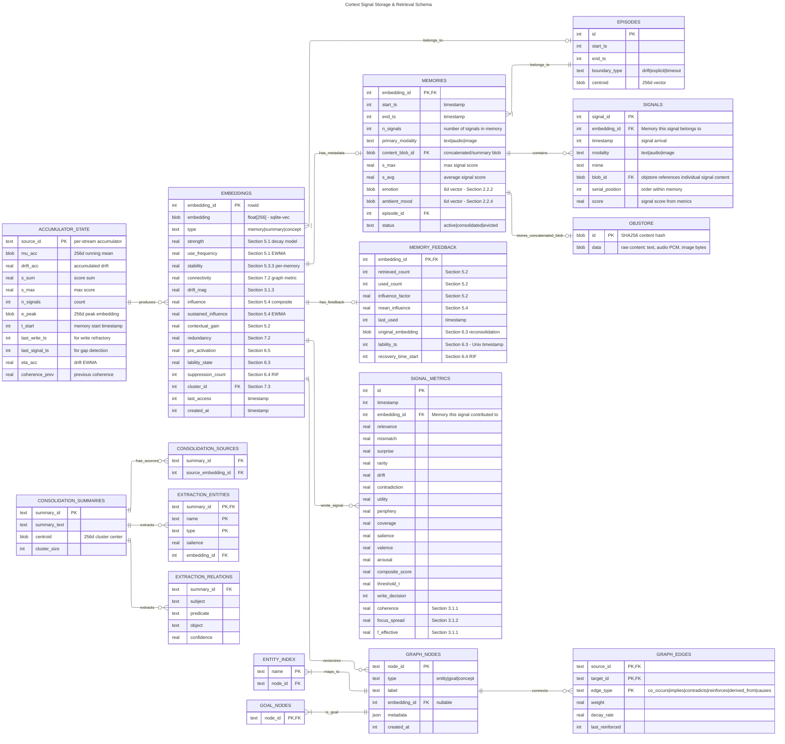

# Cortext Database Schema

Entity Relationship Diagram for signal storage and retrieval based on `docs/research/algorithms.md` and `docs/design.md`.

## Overview



## Timestamp Units Convention

**All timestamp columns in the database are stored in milliseconds since Unix epoch.** This ensures consistency with the Signal API (`signal.timestamp`) and standard system time conventions.

| Column Pattern | Unit | Examples |
|----------------|------|----------|
| `timestamp` | milliseconds | `signals.timestamp`, `signal_metrics.timestamp` |
| `created_at` | milliseconds | `embeddings.created_at` |
| `last_access` | milliseconds | `embeddings.last_access` |
| `t_start` | milliseconds | `accumulator_state.t_start` |
| `*_ts` suffix | milliseconds | `last_write_ts`, `end_ts`, `episode_start_ts` |
| `updated_at` | milliseconds | `processor_state.updated_at` |

**API convention:** All timestamps in the Signal API (`signal.timestamp`) are in **milliseconds** since Unix epoch.

**Internal calculations:** Decay and rate formulas convert to seconds before computation: `t_seconds = t_milliseconds / 1000.0`

## SQLite Extensions

The schema relies on three embedded SQLite extensions:

| Extension | Virtual Table | Purpose | Used By |
|-----------|--------------|---------|---------|
| **sqlite-vec** | `EMBEDDINGS` | 256d float vector storage + KNN search | Vector retrieval, similarity |
| **sqlite-objstore** | `OBJSTORE` | Content-addressed blob storage | Raw payload (text, audio, images) |
| **sqlite-graph** | `GRAPH_NODES`, `GRAPH_EDGES` | Cypher-compatible knowledge graph | Semantic relationships |

### sqlite-vec Usage

```sql
-- Create embeddings table with 256d float vectors and metadata
CREATE VIRTUAL TABLE embeddings USING vec0(
    embedding_id INTEGER PRIMARY KEY,
    embedding float[256],
    type text,
    strength float,
    use_frequency float,
    stability float,
    connectivity float,
    drift_mag float,
    influence float,
    sustained_influence float,
    contextual_gain float,
    redundancy float,
    pre_activation float,
    lability_state float,
    suppression_count integer,
    cluster_id integer,
    last_access integer,
    +created_at integer
);

-- KNN search for k nearest neighbors
SELECT embedding_id, distance
FROM embeddings
WHERE embedding MATCH ?query_vector
  AND k = 10;
```

### sqlite-objstore Usage

```sql
-- Create objstore virtual table
CREATE VIRTUAL TABLE IF NOT EXISTS objstore USING objstore();

-- Store payload, returns SHA256 hash
SELECT objstore_put(?payload) AS blob_id;

-- Retrieve payload by hash
SELECT objstore_get(?blob_id) AS data;
```

## Entity Descriptions

### Core Tables

| Entity | Algorithm | Purpose |
|--------|-----------|---------|
| `EMBEDDINGS` | 5.1-5.4 | Vector storage with decay (sqlite-vec) |
| `MEMORIES` | 4.4, 6.1 | Groups of coherent signals (the unit of retrieval) |
| `SIGNALS` | 2.2 | Individual momentary inputs |
| `MEMORY_FEEDBACK` | 5.2 | Usage tracking and reconsolidation |
| `OBJSTORE` | - | Raw binary storage (sqlite-objstore) |
| `SIGNAL_METRICS` | 3.1-3.3 | Per-signal algorithmic telemetry |
| `ACCUMULATOR_STATE` | 4.4 | Real-time state for building memories |
| `PROCESSOR_STATE` | 1.4-8.4 | Global algorithmic parameters |
| `GRAPH_NODES`, `GRAPH_EDGES` | 7.4-7.6 | Semantic Knowledge Graph |
| `EPISODES` | 3.1.3 | Temporal episodic boundaries |
| `RECENT_CONTEXT`, `RECENT_SCORES` | 2.1, 4.1 | Sliding memory windows |
| `WORKING_MEMORY_SLOTS` | 6.1 | Active thought maintenance |

### Consolidation & Extraction Tables (Section 7)

| Entity | Algorithm | Purpose |
|--------|-----------|---------|
| `CONSOLIDATION_SUMMARIES` | 7.3 | Cluster summaries from consolidation |
| `CONSOLIDATION_SOURCES` | 7.3 | Source signal tracking |
| `EXTRACTION_ENTITIES` | 7.4 | Named entities extracted from memories |
| `EXTRACTION_RELATIONS` | 7.5 | Semantic relations |

### Relationship Cardinalities

| Relationship | Cardinality | Description |
|--------------|-------------|-------------|
| EMBEDDINGS → MEMORIES | 1:1 | Every embedding corresponds to one Memory |
| MEMORIES → SIGNALS | 1:N | One Memory groups multiple Signals |
| SIGNALS → OBJSTORE | 1:1 | Each Signal has a physical blob |
| MEMORIES → OBJSTORE | 1:0..1 | Memories can have a combined summary blob |
| EMBEDDINGS → SIGNAL_METRICS | 1:N | Tracking which signals built the embedding |
| PROCESSOR_STATE → WORKING_MEMORY_SLOTS | 1:N | Working Memory persistence |

## State Resumption

On startup, the processor loads persisted state:

1. **`processor_state`**: All scalar adaptive parameters.
2. **`accumulator_state`**: Rebuilds ongoing memories from unfinished streams.
3. **`blender_weights`**: RLS-fitted metric weights.
4. **`working_memory_slots`**: Re-populates active thoughts.
5. **`recent_context`**: Last N context embeddings for immediate relevance.
