# Cortext Database Schema

Entity Relationship Diagram for signal storage and retrieval based on `docs/research/algorithms.md` and `docs/design.md`.

## Overview

```mermaid
---
title: Cortext Signal Storage & Retrieval Schema
config:
  layout: elk
---
erDiagram
    direction LR

    %% Core Vector Storage (sqlite-vec virtual table)
    EMBEDDINGS ||--o| MEMORIES : "has_metadata"
    EMBEDDINGS ||--o| MEMORY_FEEDBACK : "has_feedback"
    EMBEDDINGS ||--o{ SIGNAL_METRICS : "wrote_signal"
    EMBEDDINGS ||--o{ GRAPH_NODES : "vectorizes"
    EMBEDDINGS }|--o| EPISODES : "belongs_to"
    EMBEDDINGS {
        int embedding_id PK "rowid"
        blob embedding "float[256] - sqlite-vec"
        text type "memory|summary|concept"
        real strength "Section 5.1 decay model"
        real use_frequency "Section 5.1 EWMA"
        real stability "Section 5.3.3 per-memory"
        real connectivity "Section 7.2 graph metric"
        real drift_mag "Section 3.1.3"
        real influence "Section 5.4 composite"
        real sustained_influence "Section 5.4 EWMA"
        real contextual_gain "Section 5.2"
        real redundancy "Section 7.2"
        real pre_activation "Section 6.5"
        real lability_state "Section 6.3"
        int suppression_count "Section 6.4 RIF"
        int cluster_id FK "Section 7.3"
        int last_access "timestamp"
        int created_at "timestamp"
    }

    %% Memory Metadata + Payload Reference
    MEMORIES ||--o| OBJSTORE : "stores_blob"
    MEMORIES }|--|| EPISODES : "belongs_to"
    MEMORIES {
        int embedding_id PK,FK
        text source_id
        text modality "text|audio|image"
        text mime
        int timestamp
        blob blob_id FK "objstore reference"
        blob event_emotion "6d vector - Section 2.2.2"
        blob ambient_mood "6d vector - Section 2.2.4"
        int episode_id FK
        int serial_position "Section 6.6"
        int width "image metadata"
        int height
        int channels
        int sample_rate "audio metadata"
        int num_samples
    }

    %% Memory Feedback (retrieval/usage tracking)
    MEMORY_FEEDBACK {
        int embedding_id PK,FK
        int retrieved_count "Section 5.2"
        int used_count "Section 5.2"
        real influence_factor "Section 5.2"
        real mean_influence "Section 5.4"
        int last_used "timestamp"
        blob original_embedding "Section 6.3 reconsolidation"
        int lability_ts "Section 6.3 - Unix timestamp"
        int recovery_time_start "Section 6.4 RIF"
    }

    %% Graph Nodes (Section 12.4 - sqlite-graph)
    GRAPH_NODES ||--o{ GRAPH_EDGES : "connects"
    GRAPH_NODES {
        text node_id PK
        text type "entity|goal|concept"
        text label
        int embedding_id FK "nullable"
        json metadata
        int created_at
    }

    %% Graph Edges (Section 12.4 - sqlite-graph)
    GRAPH_EDGES {
        text source_id PK,FK
        text target_id PK,FK
        text edge_type PK "co_occurs|implies|contradicts|reinforces|derived_from|causes"
        real weight
        real decay_rate
        int last_reinforced
    }

    %% =======================================================================
    %% CONSOLIDATION & EXTRACTION TABLES (Section 7)
    %% =======================================================================

    %% Consolidation Summaries (Section 7.3 Clustering)
    CONSOLIDATION_SUMMARIES ||--o{ CONSOLIDATION_SOURCES : "has_sources"
    CONSOLIDATION_SUMMARIES ||--o{ EXTRACTION_ENTITIES : "extracts"
    CONSOLIDATION_SUMMARIES ||--o{ EXTRACTION_RELATIONS : "extracts"
    CONSOLIDATION_SUMMARIES {
        text summary_id PK
        text summary_text
        blob centroid "256d cluster center"
        int cluster_size
    }

    %% Consolidation Sources (Section 7.3 - source tracking)
    CONSOLIDATION_SOURCES {
        text summary_id FK
        int source_embedding_id FK
    }

    %% Extraction Entities (Section 7.4 Semantic Extraction)
    EXTRACTION_ENTITIES {
        text summary_id PK,FK
        text name PK
        text type PK
        real salience
        int embedding_id FK
    }

    %% Extraction Relations (Section 7.5 Knowledge Graph)
    EXTRACTION_RELATIONS {
        text summary_id FK
        text subject
        text predicate
        text object
        real confidence
    }

    %% Entity Index (Section 7.5 - name to node mapping)
    ENTITY_INDEX }|--|| GRAPH_NODES : "maps_to"
    ENTITY_INDEX {
        text name PK
        text node_id FK
    }

    %% Goal Nodes (Goal Alignment algorithm)
    GOAL_NODES }|--|| GRAPH_NODES : "is_goal"
    GOAL_NODES {
        text node_id PK,FK
    }

    %% Binary Object Store (sqlite-objstore virtual table)
    OBJSTORE {
        blob id PK "SHA256 content hash"
        blob data "raw content: text, audio PCM, image bytes"
    }

    %% Episodes (Section 3.1.3)
    EPISODES {
        int id PK
        int start_ts
        int end_ts
        text boundary_type "drift|explicit|timeout"
        blob centroid "256d vector"
    }

    %% Signal Metrics (Section 3.1-3.3 - Composite Scoring)
    SIGNAL_METRICS {
        int id PK
        int timestamp
        int embedding_id FK "nullable - set if wrote"
        real relevance
        real mismatch
        real surprise
        real rarity
        real drift
        real contradiction
        real utility
        real periphery
        real coverage
        real salience
        real valence
        real arousal
        real composite_score
        real threshold_t
        int write_decision
        real coherence "Section 3.1.1"
        real focus_spread "Section 3.1.2"
        real f_effective "Section 3.1.1"
    }

    %% =======================================================================
    %% RETRIEVAL & COMPETITION TABLES (Section 8.4)
    %% =======================================================================

    %% RIF State (Section 8.4 - Retrieval-Induced Forgetting)
    EMBEDDINGS ||--o| RIF_STATE : "has_rif"
    RIF_STATE {
        int embedding_id PK,FK
        real suppression "accumulated suppression"
        int ts "last update timestamp"
    }

    %% =======================================================================
    %% EMOTIONAL PROCESSING TABLES (Section 8.7)
    %% =======================================================================

    %% Emotional Tags (Section 8.7 - Emotional Consolidation)
    EMBEDDINGS ||--o| EMOTIONAL_TAGS : "has_emotion"
    EMOTIONAL_TAGS {
        int embedding_id PK,FK
        int flashbulb "flashbulb memory flag"
        real intensity "emotion intensity"
        real arousal "arousal level"
        real valence "valence level"
        real half_life_bonus "extended retention"
        real detail_suppression "gist vs detail"
        int gist_components "number of gist components"
        int cascade_radius "semantic cascade hops"
        real cascade_decay "cascade decay rate"
        real flashbulb_threshold_eff "effective threshold"
        int ts "timestamp"
    }

    %% =======================================================================
    %% CONSOLIDATION PIPELINE TABLES (Section 9.2)
    %% =======================================================================

    %% Consolidation Candidates (Section 9.2 - Scoring)
    EMBEDDINGS ||--o| CONSOLIDATION_CANDIDATES : "candidate_for"
    CONSOLIDATION_CANDIDATES {
        int embedding_id PK,FK
        real score "consolidation priority"
        int created_at "timestamp"
        text reason "score_below_floor|..."
    }

    %% Processor State (singleton - full algorithm state)
    PROCESSOR_STATE ||--|| BLENDER_WEIGHTS : "uses_weights"
    PROCESSOR_STATE ||--|| BLENDER_COVARIANCE : "uses_covariance"
    PROCESSOR_STATE ||--|| BLENDER_COEFFICIENTS : "uses_coefficients"
    PROCESSOR_STATE ||--o{ WORKING_MEMORY_SLOTS : "has_wm_slots"
    PROCESSOR_STATE {
        int id PK "always 1"
        int signals_processed

        real theta_dynamic "Section 4 T_dynamic"
        real theta_target
        real hysteresis
        real half_life

        real weight_relevance "Section 2.1"
        real weight_relevance_prior
        real attention_width
        real attention_width_prior
        real coverage_gain_floor
        real coverage_gain_floor_prior
        real mismatch_weight
        real mismatch_weight_prior

        real weight_novelty "Section 2.2"
        real weight_novelty_prior
        real weight_surprise
        real weight_surprise_prior
        real weight_valence
        real weight_valence_prior
        real weight_arousal
        real weight_arousal_prior
        real emotion_gain
        real emotion_gain_prior
        real score_gain
        real score_gain_prior
        real rate_target
        real rate_target_prior
        real base_rate_prior
        real weight_emotion_prior

        real emotion_intensity "Section 2.2.2-4"
        real valence
        real arousal
        blob mood_vector "6d"

        real rate_decay "Section 2.3"
        real rate_decay_prior
        real periphery_half_life
        real periphery_half_life_prior
        real salience_half_life
        real salience_half_life_prior
        real drift_weight
        real drift_weight_prior
        real retention_ema
        real hysteresis_band_prior
        real half_life_prior

        real m_rate "Section 4.2 writes/min EWMA"
        real dt_ema "inter-arrival EWMA"
        int rate_ticks
        int last_rate_timestamp
        real reliability "ESS-based"

        real u_uncertainty "Section 1.4"

        blob last_embedding "Section 3.1.4 256d"
        blob delta_x_trend "256d"

        real delta_half_life_adj
        real sustained_influence

        real wm_maintenance_cost
        int wm_slot_count
        int wm_last_accepted "WM gate decision"
        int wm_last_chunked "WM chunking flag"

        real fok_state "Section 6.2 feeling of knowing"
        real retrieval_strength
        real metacognitive_confidence

        int last_consolidation_ts "Section 7.1"
        int consolidation_count
        int is_processing_signal
        int last_retrieval_ts
        real drift_accum "Section 10 streaming pacing"
        real drift_at_last_interrupt "Section 10 refractory baseline"

        int episode_start_ts "Section 3.1.3 episode boundary"
        int last_interrupt_tick "Section 10 interrupt rate limiting"
        int focus_priors_initialized
        int sensitivity_priors_initialized
        int stability_priors_initialized

        int last_signal_timestamp
        int updated_at
        blob write_rate_timestamps "Section 2.2 rate window"
    }

    %% Blender Weights (Section 3.2 RLS)
    BLENDER_WEIGHTS {
        int id PK "always 1"
        real w_relevance
        real w_mismatch
        real w_surprise
        real w_rarity
        real w_drift
        real w_contradiction
        real w_utility
        real w_periphery
        real w_coverage
        real w_salience
        real w_valence
        real w_arousal
        int blender_ready
        int update_count
    }

    %% Blender Covariance (Section 3.2 RLS P matrix)
    BLENDER_COVARIANCE {
        int id PK "always 1"
        blob P_matrix "12x12 matrix"
    }

    %% Blender Coefficients (Section 3.2 RLS learned coefficients)
    BLENDER_COEFFICIENTS {
        int id PK "always 1"
        blob coefficients "12 metrics x 4 knob coefficients"
        int update_count
    }

    %% Blender Coefficient Covariance (Section 3.2 RLS P matrix for coefficients)
    PROCESSOR_STATE ||--|| BLENDER_COEFF_COVARIANCE : "uses_coeff_cov"
    BLENDER_COEFF_COVARIANCE {
        int id PK "always 1"
        blob P_matrix "48x48 matrix"
    }

    %% Recent Context Window
    RECENT_CONTEXT {
        int id PK
        blob embedding "256d vector"
        int timestamp
        int seq_order
    }

    %% Recent Scores Window
    RECENT_SCORES {
        int id PK
        real score
        int timestamp
    }

    %% Observed Retention History (Section 2.3.2)
    OBSERVED_RETENTION_HISTORY {
        int id PK
        real retention_value
        int timestamp
    }

    %% Working Memory Slots (Section 6.1 - session persistence)
    WORKING_MEMORY_SLOTS {
        int id PK
        int slot_index
        int embedding_id FK
        real strength
        int timestamp
        blob embedding "256d vector"
    }

    %% Recent IDs LRU (Section 8.6 Algorithm 27 - novelty detection)
    EMBEDDINGS ||--o{ RECENT_IDS : "tracked_in"
    RECENT_IDS {
        int id PK
        int embedding_id FK
        int access_type "0=inserted, 1=retrieved"
        int timestamp
        int seq_order
    }

    %% Recent Retrievals Cache (Section 5.2 - implicit feedback detection)
    EMBEDDINGS ||--o{ RECENT_RETRIEVALS : "cached_for_feedback"
    RECENT_RETRIEVALS {
        int id PK
        int embedding_id FK
        int timestamp
        int seq_order
    }
```



## SQLite Extensions

The schema relies on three embedded SQLite extensions:

| Extension | Virtual Table | Purpose | Used By |
|-----------|--------------|---------|---------|
| **sqlite-vec** | `EMBEDDINGS` | 256d float vector storage + KNN search | Vector retrieval, similarity |
| **sqlite-objstore** | `OBJSTORE` | Content-addressed blob storage | Raw payload (text, audio, images) |
| **sqlite-graph** | `GRAPH_NODES`, `GRAPH_EDGES` | Cypher-compatible knowledge graph | Semantic relationships |

### sqlite-vec Usage

```sql
-- Create embeddings table with 256d float vectors and metadata
CREATE VIRTUAL TABLE embeddings USING vec0(
    embedding_id INTEGER PRIMARY KEY,
    embedding float[256],
    type text,
    strength float,
    use_frequency float,
    stability float,
    connectivity float,
    drift_mag float,
    influence float,
    sustained_influence float,
    contextual_gain float,
    redundancy float,
    pre_activation float,
    lability_state float,
    suppression_count integer,
    cluster_id integer,
    last_access integer,
    +created_at integer
);

-- KNN search for k nearest neighbors
SELECT embedding_id, distance
FROM embeddings
WHERE embedding MATCH ?query_vector
  AND k = 10;
```

### sqlite-objstore Usage

```sql
-- Create objstore virtual table
CREATE VIRTUAL TABLE IF NOT EXISTS objstore USING objstore();

-- Store payload, returns SHA256 hash
SELECT objstore_put(?payload) AS blob_id;

-- Retrieve payload by hash
SELECT objstore_get(?blob_id) AS data;
```

## Entity Descriptions

### Core Tables

| Entity | Algorithm Sections | Purpose |
|--------|-------------------|---------|
| `EMBEDDINGS` | 3.1, 5.1-5.4, 6.3-6.5, 7.2-7.3 | Vector storage with decay/influence state (sqlite-vec) |
| `MEMORIES` | 2.2.2, 2.2.4, 6.6 | Metadata, emotion, serial position |
| `MEMORY_FEEDBACK` | 5.2, 5.4, 6.3, 6.4 | Usage tracking, reconsolidation, RIF |
| `OBJSTORE` | design.md | Raw multimodal payload storage (sqlite-objstore) |
| `SIGNAL_METRICS` | 3.1-3.3, 4.1 | Per-signal composite scoring |
| `PROCESSOR_STATE` | 1.4, 2.1-2.3, 4.1-4.3, 5.4, 6.1-6.2, 7.1, 8.4 | Full algorithm state |
| `BLENDER_WEIGHTS` | 3.2 | RLS-fitted metric weights |
| `BLENDER_COVARIANCE` | 3.2 | RLS covariance matrix P (12x12) |
| `BLENDER_COEFFICIENTS` | 3.2 | RLS learned knob coefficients |
| `BLENDER_COEFF_COVARIANCE` | 3.2 | RLS covariance matrix P for coefficients (48x48) |
| `GRAPH_NODES` | 7.4-7.6 | Entity nodes (sqlite-graph) |
| `GRAPH_EDGES` | 7.4-7.6 | Semantic relationships (sqlite-graph) |
| `EPISODES` | 3.1.3 | Episodic boundaries |
| `RECENT_CONTEXT` | 2.1.2, 4.1 | Sliding window of context embeddings |
| `RECENT_SCORES` | 4.1 | Sliding window of composite scores |
| `OBSERVED_RETENTION_HISTORY` | 2.3.2 | Retention observations for stability adaptation |
| `WORKING_MEMORY_SLOTS` | 6.1 | Working memory slot persistence |
| `RECENT_IDS` | 8.6 (Algorithm 27) | LRU tracking of recently seen IDs for novelty detection |
| `RECENT_RETRIEVALS` | 5.2 | Cached retrievals for implicit feedback detection |

### Consolidation & Extraction Tables (Section 7)

| Entity | Algorithm Sections | Purpose |
|--------|-------------------|---------|
| `CONSOLIDATION_SUMMARIES` | 7.3 | Cluster summaries from consolidation |
| `CONSOLIDATION_SOURCES` | 7.3 | Source→summary traceability |
| `EXTRACTION_ENTITIES` | 7.4 | Named entities extracted from summaries |
| `EXTRACTION_RELATIONS` | 7.5 | Semantic relations between entities |
| `ENTITY_INDEX` | 7.5 | Entity name→node_id mapping |
| `GOAL_NODES` | Goal Alignment | Goal targets for alignment computation |

### Retrieval & Competition Tables (Section 8.4)

| Entity | Algorithm Sections | Purpose |
|--------|-------------------|---------|
| `RIF_STATE` | 8.4 | Retrieval-Induced Forgetting suppression state |

### Emotional Processing Tables (Section 8.7)

| Entity | Algorithm Sections | Purpose |
|--------|-------------------|---------|
| `EMOTIONAL_TAGS` | 8.7 | Flashbulb memory and emotional consolidation metadata |

### Consolidation Pipeline Tables (Section 9.2)

| Entity | Algorithm Sections | Purpose |
|--------|-------------------|---------|
| `CONSOLIDATION_CANDIDATES` | 9.2 | Consolidation scoring candidates |

### Relationship Cardinalities

| Relationship | Cardinality | Description |
|--------------|-------------|-------------|
| EMBEDDINGS → MEMORIES | 1:0..1 | Embedding optionally has memory metadata |
| EMBEDDINGS → MEMORY_FEEDBACK | 1:0..1 | Embedding optionally has feedback state |
| EMBEDDINGS → SIGNAL_METRICS | 1:N | Embedding referenced by signals that wrote it |
| EMBEDDINGS → EPISODES | N:0..1 | Embeddings optionally belong to an episode |
| EMBEDDINGS → GRAPH_NODES | N:0..1 | Frequent entities get vectorized |
| MEMORIES → OBJSTORE | 1:0..1 | Memory optionally references a blob via blob_id |
| MEMORIES → EPISODES | N:1 | Many memories belong to one episode |
| GRAPH_NODES → GRAPH_EDGES | 1:N | Nodes connect via edges |
| PROCESSOR_STATE → BLENDER_WEIGHTS | 1:1 | State references current metric weights |
| PROCESSOR_STATE → BLENDER_COVARIANCE | 1:1 | State references RLS covariance matrix (12x12) |
| PROCESSOR_STATE → BLENDER_COEFFICIENTS | 1:1 | State references RLS learned coefficients |
| PROCESSOR_STATE → BLENDER_COEFF_COVARIANCE | 1:1 | State references RLS coeff covariance (48x48) |
| PROCESSOR_STATE → WORKING_MEMORY_SLOTS | 1:N | State has working memory slots |
| CONSOLIDATION_SUMMARIES → CONSOLIDATION_SOURCES | 1:N | Summary tracks source memories |
| CONSOLIDATION_SUMMARIES → EXTRACTION_ENTITIES | 1:N | Summary yields extracted entities |
| CONSOLIDATION_SUMMARIES → EXTRACTION_RELATIONS | 1:N | Summary yields extracted relations |
| ENTITY_INDEX → GRAPH_NODES | N:1 | Entity names map to graph nodes |
| GOAL_NODES → GRAPH_NODES | N:1 | Goal nodes reference graph nodes |
| EMBEDDINGS → RIF_STATE | 1:0..1 | Embedding optionally has RIF suppression state |
| EMBEDDINGS → EMOTIONAL_TAGS | 1:0..1 | Embedding optionally has emotional consolidation tags |
| EMBEDDINGS → CONSOLIDATION_CANDIDATES | 1:0..1 | Embedding optionally marked as consolidation candidate |
| EMBEDDINGS → RECENT_IDS | 1:N | Embedding tracked in recent IDs LRU cache |
| EMBEDDINGS → RECENT_RETRIEVALS | 1:N | Embedding cached for implicit feedback detection |

## Algorithm Coverage

| Entity | Algorithm Sections | Purpose |
|--------|-------------------|---------|
| EMBEDDINGS | 3.1, 5.1-5.4, 6.3-6.5, 7.2-7.3 | Vector storage with decay/influence state (sqlite-vec) |
| MEMORIES | 2.2.2, 2.2.4, 6.6 | Metadata, emotion, serial position |
| MEMORY_FEEDBACK | 5.2, 5.4, 6.3, 6.4 | Usage tracking, reconsolidation, RIF |
| OBJSTORE | design.md | Raw multimodal payload storage (sqlite-objstore) |
| SIGNAL_METRICS | 3.1-3.3, 4.1 | Per-signal composite scoring |
| PROCESSOR_STATE | 1.4, 2.1-2.3, 4.1-4.3, 5.4, 6.1-6.2, 7.1, 8.4 | Full algorithm state |
| BLENDER_WEIGHTS | 3.2 | RLS-fitted metric weights |
| BLENDER_COVARIANCE | 3.2 | RLS P matrix (12x12) |
| BLENDER_COEFFICIENTS | 3.2 | RLS learned knob coefficients |
| BLENDER_COEFF_COVARIANCE | 3.2 | RLS P matrix for coefficients (48x48) |
| GRAPH_NODES, GRAPH_EDGES | 7.4-7.6 | Knowledge graph (sqlite-graph) |
| EPISODES | 3.1.3 | Episodic boundaries |
| RECENT_CONTEXT, RECENT_SCORES | 2.1.2, 4.1 | Sliding windows |
| OBSERVED_RETENTION_HISTORY | 2.3.2 | Retention for stability adaptation |
| WORKING_MEMORY_SLOTS | 6.1 | Working memory persistence |
| CONSOLIDATION_SUMMARIES | 7.3 | Cluster summaries |
| CONSOLIDATION_SOURCES | 7.3 | Source traceability |
| EXTRACTION_ENTITIES | 7.4 | Named entity extraction |
| EXTRACTION_RELATIONS | 7.5 | Semantic relation extraction |
| ENTITY_INDEX | 7.5 | Entity name lookup |
| GOAL_NODES | Goal Alignment | Goal target tracking |
| RIF_STATE | 8.4 | Retrieval-Induced Forgetting suppression |
| EMOTIONAL_TAGS | 8.7 | Flashbulb/emotional consolidation metadata |
| CONSOLIDATION_CANDIDATES | 9.2 | Consolidation scoring candidates |
| RECENT_IDS | 8.6 | Novelty detection via ID recency (Algorithm 27) |
| RECENT_RETRIEVALS | 5.2 | Implicit feedback from retrieval usage |

## State Resumption

On startup, the processor loads persisted state to continue algorithm evolution:

1. **`processor_state`**: All scalar adaptive parameters (~60 fields covering knobs, thresholds, EWMA values, priors, metacognition, episode tracking)
2. **`blender_weights`**: Current RLS-fitted metric weights for composite scoring
3. **`blender_covariance`**: 12×12 RLS covariance matrix P for online learning
4. **`blender_coefficients`**: Learned knob-to-metric coefficient mappings
5. **`blender_coeff_covariance`**: 48×48 RLS covariance matrix P for coefficient learning
6. **`recent_context`**: Last N context embeddings (N = `n_ctx(T)` from Section 2.1.2)
7. **`recent_scores`**: Last M composite scores (M = `w_score(T)` from Section 4.1)
8. **`observed_retention_history`**: Retention observations for stability adaptation
9. **`working_memory_slots`**: Persisted working memory slots (Section 6.1)
10. **`recent_ids`**: LRU cache of recently accessed embedding IDs (max 1024)
11. **`recent_retrievals`**: Cached retrievals for implicit feedback (max 128)

If tables are empty or missing, initialize from knob priors (Sections 2.1, 2.2, 2.3).
