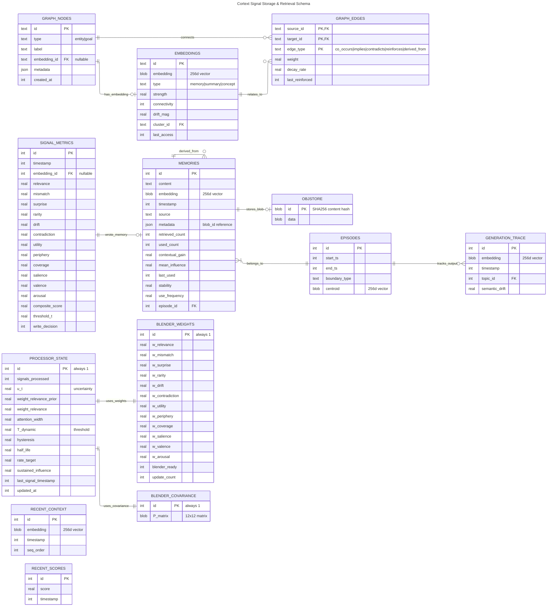

# Cortext Database Schema

Entity Relationship Diagram for signal storage and retrieval based on `docs/algorithms.md` and `docs/design.md`.

## Overview

## Entity Descriptions

### Core Tables

| Entity | Algorithm | Purpose |
|--------|-----------|---------|
| `EMBEDDINGS` | Section 12.4 | Vector-backed nodes (memory, summary, concept types) |
| `MEMORIES` | Alg 14, 18 | Extended memory store with feedback metrics |
| `GRAPH_NODES` | Section 12.4 | Entity nodes with optional vectorization |
| `GRAPH_EDGES` | Section 12.4 | Relationships: co_occurs, implies, contradicts, reinforces, derived_from |
| `GENERATION_TRACE` | Alg 19 | Output embeddings for influence feedback |
| `OBJSTORE` | design.md | Content-addressed blob storage for multimodal payloads |
| `EPISODES` | Alg 12 | Episodic boundaries triggered by trajectory drift |
| `SIGNAL_METRICS` | Alg 7 | Per-signal composite scoring for observability and adaptive learning |
| `PROCESSOR_STATE` | Alg 1-8, 15-17, 19 | Evolving adaptive parameters for algorithm resumption |
| `BLENDER_WEIGHTS` | Alg 7 | RLS-fitted metric weights for composite scoring |
| `BLENDER_COVARIANCE` | Alg 7 | RLS covariance matrix P for online weight learning |
| `RECENT_CONTEXT` | Alg 2, 10, 12 | Rolling window of context embeddings for relevance/drift |
| `RECENT_SCORES` | Alg 8 | Rolling window of composite scores for threshold adaptation |

### Relationship Cardinalities

| Relationship | Cardinality | Description |
|--------------|-------------|-------------|
| MEMORIES → OBJSTORE | 1:0..1 | Memory optionally references a blob via metadata.blob_id |
| MEMORIES → EPISODES | N:1 | Many memories belong to one episode |
| MEMORIES → MEMORIES | N:N | Consolidation: summaries derive from source memories |
| GRAPH_NODES → EMBEDDINGS | 1:0..1 | Frequent entities get vectorized |
| GRAPH_NODES → GRAPH_EDGES | 1:N | Nodes connect via edges |
| EMBEDDINGS → GRAPH_EDGES | N:N | Vector nodes relate via graph edges |
| EPISODES → GENERATION_TRACE | 1:N | Episode tracks multiple generation outputs |
| SIGNAL_METRICS → MEMORIES | N:0..1 | Signal optionally wrote a memory (NULL if gated) |
| PROCESSOR_STATE → BLENDER_WEIGHTS | 1:1 | State references current metric weights |
| PROCESSOR_STATE → BLENDER_COVARIANCE | 1:1 | State references RLS covariance matrix |

## Algorithm Coverage

- **Algorithms 1-3**: Focus, Sensitivity, Stability priors (processor_state persistence)
- **Algorithm 7**: Composite scoring with RLS weight fitting (blender_weights, blender_covariance, signal_metrics)
- **Algorithm 8**: Adaptive threshold evolution (processor_state.T_dynamic, recent_scores)
- **Algorithms 2, 10, 12**: Context tracking (recent_context for relevance, drift, episode boundaries)
- **Algorithm 12**: Episode boundaries via drift threshold (`drift_threshold = lerp(0.10, 0.35, T)`)
- **Algorithm 14**: Memory strength adjustment (`strength_t = strength_{t-1} + S × use_frequency - λ(T)`)
- **Algorithms 15-17**: Dynamic knob updates (processor_state EWMA values)
- **Algorithm 18**: Influence-weighted update (`influence_factor = used_count/retrieved_count × contextual_gain`)
- **Algorithm 19**: Logprob + embedding influence feedback (generation_trace, processor_state.sustained_influence)
- **Algorithm 28-33**: Consolidation and graph integration system

## State Resumption

On startup, the processor loads persisted state to continue algorithm evolution:

1. **`processor_state`**: All scalar adaptive parameters (priors, EWMA values, thresholds, timestamps)
2. **`blender_weights`**: Current RLS-fitted metric weights for composite scoring
3. **`blender_covariance`**: 12×12 RLS covariance matrix P for online learning
4. **`recent_context`**: Last N context embeddings (N = `n_ctx(T)` from Algorithm 2)
5. **`recent_scores`**: Last M composite scores (M = `w_score(T)` from Algorithm 8)

If tables are empty or missing, initialize from knob priors (Algorithms 1, 3, 5).
