# Cortext Operations Pipeline

This state diagram illustrates the lifecycle of a signal through the Cortext Processor, detailing the sequential phases of preprocessing, retrieval, scoring, storage, feedback, and background consolidation.

```mermaid
stateDiagram-v2
    direction TB
    
    %% Input
    [*] --> Signal_Received
    
    state "Preprocessing Phase" as Prep {
        direction LR
        UpdateFocus : Update Focus/Context
        UpdateDrift : Accumulate Drift
        CheckPacing : Check Pacing Gate
        
        [*] --> UpdateFocus
        UpdateFocus --> UpdateDrift
        UpdateDrift --> CheckPacing
        CheckPacing --> [*]
    }
    
    Signal_Received --> Prep
    
    state Pacing_Check <<choice>>
    Prep --> Pacing_Check
    Pacing_Check --> Retrieval_Phase : Drift > Threshold
    Pacing_Check --> Metrics_Phase : Drift <= Threshold
    
    state "Retrieval Phase" as Retrieval_Phase {
        direction TB
        GraphRetrieval : Graph-Augmented Search
        UsageDetection : Detect Memory Usage (Cache)
        Competition : Retrieval Competition (RIF)
        
        [*] --> GraphRetrieval
        GraphRetrieval --> UsageDetection
        UsageDetection --> Competition
        Competition --> [*]
    }
    
    Retrieval_Phase --> Metrics_Phase
    
    state "Metrics & Scoring" as Metrics_Phase {
        direction TB
        ComputeMetrics : Compute 12 Core Metrics
        Uncertainty : Update Uncertainty (u_t)
        Sensitivity : Update Sensitivity/Mood
        CompositeScore : RLS Blending
        DynThreshold : Update Threshold (T_dyn)
        
        [*] --> ComputeMetrics
        ComputeMetrics --> Uncertainty
        Uncertainty --> Sensitivity
        Sensitivity --> CompositeScore
        CompositeScore --> DynThreshold
        DynThreshold --> [*]
    }
    
    Metrics_Phase --> Write_Gate
    
    state Write_Gate <<choice>>
    Write_Gate --> Storage : Score > Threshold
    Write_Gate --> Persistence : Score <= Threshold
    
    state "Storage Operations" as Storage {
        StoreBlob : Object Store Put
        StoreVector : Vector Insert
        StoreMeta : Metadata Insert
        
        [*] --> StoreBlob
        StoreBlob --> StoreVector
        StoreVector --> StoreMeta
        StoreMeta --> [*]
    }
    
    Storage --> Persistence
    
    state "Persistence & Gates" as Persistence {
        SaveMetrics : Log Signal Metrics
        InterruptGate : MNI Gate Decision
        
        [*] --> SaveMetrics
        SaveMetrics --> InterruptGate
        InterruptGate --> [*]
    }
    
    Persistence --> Feedback_Phase
    
    state "Feedback & Adaptation" as Feedback_Phase {
        direction TB
        ParamFeedback : Adjust Focus/Sens/Stab
        StrengthUpdate : Update Memory Strength
        Reconsolidation : Apply Reconsolidation (Ripple)
        EmotionTags : Emotional Tagging
        
        [*] --> ParamFeedback
        ParamFeedback --> StrengthUpdate
        StrengthUpdate --> Reconsolidation
        Reconsolidation --> EmotionTags
        EmotionTags --> [*]
    }
    
    Feedback_Phase --> Consolidation_Check
    
    state Consolidation_Check {
        EvalTriggers : Check Time/Rate/Capacity
        [*] --> EvalTriggers
    }
    
    state Trigger_Choice <<choice>>
    Consolidation_Check --> Trigger_Choice
    Trigger_Choice --> Deep_Consolidation : Triggered
    Trigger_Choice --> [*] : Idle
    
    state "Deep Consolidation" as Deep_Consolidation {
        direction TB
        Clustering : Cluster Memories
        Summarization : Generate Summaries
        Extraction : Extract Entities/Relations
        GraphBuilder : Update Knowledge Graph
        Concepts : Detect Concept Nodes
        
        [*] --> Clustering
        Clustering --> Summarization
        Summarization --> Extraction
        Extraction --> GraphBuilder
        GraphBuilder --> Concepts
        Concepts --> [*]
    }
    
    Deep_Consolidation --> [*]
```

