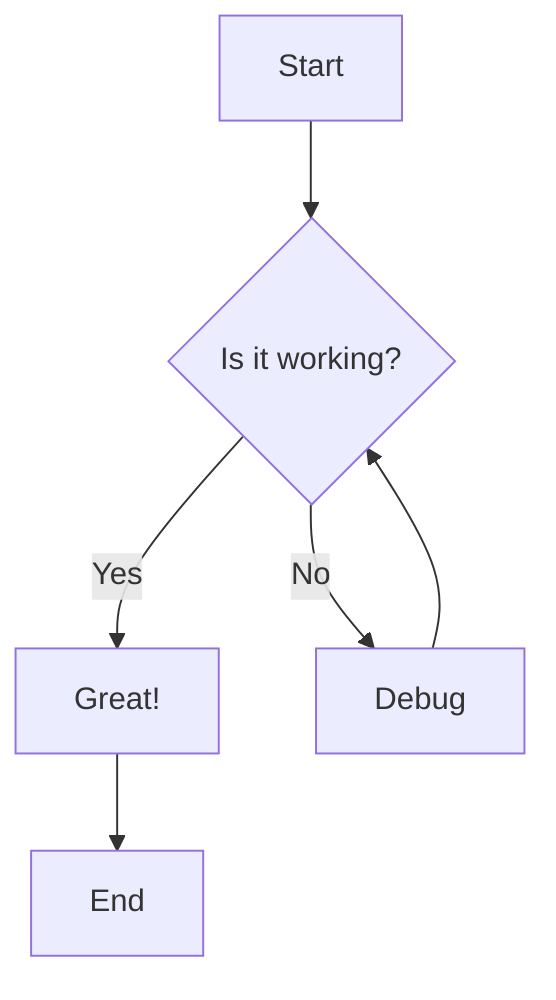
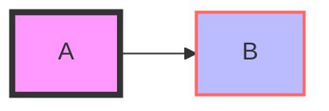
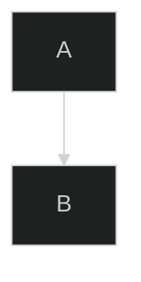

# Mermaid Documentation

Mermaid is a JavaScript-based diagramming and charting tool that uses Markdown-inspired text definitions and a renderer to create and modify complex diagrams. The main purpose of Mermaid is to help documentation catch up with development.

> **Doc-Rot** is a Catch-22 that Mermaid helps to solve.

Diagramming and documentation costs precious developer time and gets outdated quickly. But not having diagrams or docs ruins productivity and hurts organizational learning. Mermaid addresses this problem by enabling users to create easily modifiable diagrams. It can also be made part of production scripts (and other pieces of code).

## 🚀 Quick Start



## 📖 Diagram Types & Syntax

### Core Diagrams

| Diagram Type | Description | Syntax File |
|--------------|-------------|-------------|
| **[Flowcharts](./syntax/flowchart.md)** | Represent workflows, processes, and algorithms | `flowchart.md` |
| **[Sequence Diagrams](./syntax/sequenceDiagram.md)** | Show interactions between different entities over time | `sequenceDiagram.md` |
| **[Class Diagrams](./syntax/classDiagram.md)** | Visualize object-oriented system structure | `classDiagram.md` |
| **[State Diagrams](./syntax/stateDiagram.md)** | Model system behavior and state transitions | `stateDiagram.md` |
| **[Entity Relationship Diagrams](./syntax/entityRelationshipDiagram.md)** | Database schema and relationships | `entityRelationshipDiagram.md` |

### Project Management

| Diagram Type | Description | Syntax File |
|--------------|-------------|-------------|
| **[Gantt Charts](./syntax/gantt.md)** | Project scheduling and timeline visualization | `gantt.md` |
| **[Timeline](./syntax/timeline.md)** | Chronological event visualization | `timeline.md` |
| **[User Journey](./syntax/userJourney.md)** | Map user interactions and experiences | `userJourney.md` |

### Data Visualization

| Diagram Type | Description | Syntax File |
|--------------|-------------|-------------|
| **[Pie Charts](./syntax/pie.md)** | Display proportional data | `pie.md` |
| **[XY Charts](./syntax/xyChart.md)** | Plot data points on coordinate system | `xyChart.md` |
| **[Quadrant Charts](./syntax/quadrantChart.md)** | Four-quadrant analysis visualization | `quadrantChart.md` |
| **[Sankey Diagrams](./syntax/sankey.md)** | Flow and quantity visualization | `sankey.md` |
| **[Treemap](./syntax/treemap.md)** | Hierarchical data visualization | `treemap.md` |

### Specialized Diagrams

| Diagram Type | Description | Syntax File |
|--------------|-------------|-------------|
| **[Git Graph](./syntax/gitgraph.md)** | Visualize Git branching and merging | `gitgraph.md` |
| **[Requirement Diagrams](./syntax/requirementDiagram.md)** | Document system requirements | `requirementDiagram.md` |
| **[C4 Diagrams](./syntax/c4.md)** | Software architecture visualization | `c4.md` |
| **[Mindmaps](./syntax/mindmap.md)** | Hierarchical information structure | `mindmap.md` |

### Network & System Diagrams

| Diagram Type | Description | Syntax File |
|--------------|-------------|-------------|
| **[Block Diagrams](./syntax/block.md)** | System component relationships | `block.md` |
| **[Packet Diagrams](./syntax/packet.md)** | Network packet structure | `packet.md` |
| **[Architecture Diagrams](./syntax/architecture.md)** | System architecture visualization | `architecture.md` |

### Agile & Planning

| Diagram Type | Description | Syntax File |
|--------------|-------------|-------------|
| **[Kanban](./syntax/kanban.md)** | Workflow visualization board | `kanban.md` |
| **[Radar Charts](./syntax/radar.md)** | Multi-variable comparison | `radar.md` |

### Sequence Extensions

| Diagram Type | Description | Syntax File |
|--------------|-------------|-------------|
| **[ZenUML](./syntax/zenuml.md)** | Enhanced sequence diagram syntax | `zenuml.md` |

## 📚 Additional Resources

* **[Examples](./syntax/examples.md)** - Comprehensive collection of diagram examples
* **[Images](./syntax/img/)** - Supporting images and screenshots

## 🎯 Common Use Cases

### Development & Engineering

* **System Architecture**: Use C4, Block, and Architecture diagrams
* **API Documentation**: Sequence diagrams for request/response flows
* **Database Design**: Entity Relationship diagrams
* **Code Structure**: Class diagrams for OOP systems
* **State Management**: State diagrams for complex logic

### Project Management

* **Project Planning**: Gantt charts for timelines
* **Process Flows**: Flowcharts for workflows
* **User Experience**: User journey maps
* **Sprint Planning**: Kanban boards

### Data Analysis

* **Data Relationships**: Sankey diagrams for flow analysis
* **Performance Metrics**: XY charts and radar charts
* **Hierarchical Data**: Treemaps and mindmaps
* **Proportional Analysis**: Pie charts

## 🔧 Syntax Patterns

Most Mermaid diagrams follow these common patterns:

### Basic Structure

```mermaid
diagramType
    %% Comments start with %%
    element1 --> element2
    element2 --> element3
```

### Styling



### Configuration



## 🎨 Themes & Styling

Mermaid supports multiple built-in themes:

* `default` - Clean, professional look
* `dark` - Dark mode friendly
* `forest` - Green color scheme
* `base` - Minimal styling
* `neutral` - Grayscale theme

## 🔗 Integration

Mermaid diagrams can be used in:

* **Markdown files** - GitHub, GitLab, documentation sites
* **Web applications** - Direct JavaScript integration
* **Documentation tools** - Gitiles, Notion, Obsidian
* **Presentation tools** - Reveal.js, Marp
* **IDEs and Editors** - VS Code, IntelliJ, Vim

## 📝 Best Practices

1. **Keep it Simple** - Start with basic diagrams and add complexity gradually
2. **Use Descriptive Names** - Make node and edge labels clear and meaningful
3. **Consistent Styling** - Use themes and classes for uniform appearance
4. **Comment Your Code** - Use `%%` comments to explain complex logic
5. **Version Control** - Track diagram changes alongside code changes
6. **Validate Syntax** - Use Mermaid Live Editor for testing

## 🚀 Getting Started

1. Choose the appropriate diagram type for your use case
2. Refer to the specific syntax documentation
3. Start with examples from the [Examples](./syntax/examples.md) page
4. Test your diagrams using [Mermaid Live Editor](https://mermaid.live)
5. Integrate into your documentation workflow

***

*This documentation covers Mermaid syntax and diagram types. For implementation details, configuration options, and advanced features, refer to the official [Mermaid documentation](https://mermaid.js.org/).*
