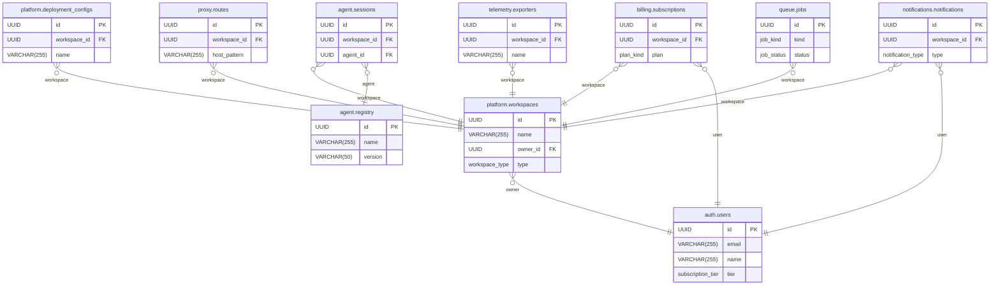

# Database Contract - System Overview

This overview shows the high-level relationships between modules in the AgentFlare database schema.

## Module Breakdown

The database schema has been organized into the following modules:

### Core Modules
- **`auth`** - User authentication, sessions, security
- **`platform`** - Workspaces, deployments, marketplace, integrations

### Feature Modules
- **`billing`** - Subscriptions, payments, usage tracking
- **`agent`** - Agent registry, sessions, tool calls
- **`proxy`** - Route management, API keys, health checks
- **`telemetry`** - Metrics collection and export
- **`queue`** - Job processing and scheduling
- **`notifications`** - User notifications and alerts

### Supporting Modules
- **`model`** - AI model definitions and pricing
- **`tool_server`** - Tool server registry and management
- **`tokenizer`** - Tokenization configurations
- **`json`** - Schema management and routing
- **`workspace`** - Workspace-specific settings
- **`ssl`** - SSL certificate management
- **`two_factor_auth`** - Two-factor authentication
- **`metrics`** - System metrics and snapshots
- **`rule`** - Rule engine and templates

## Navigation

- **[Full Schema](db.contract.md)** - Complete 1797-line diagram (large file)
- **[Auth Module](db.contract.auth.md)** - Authentication and security
- **[Platform Module](db.contract.platform.md)** - Core platform functionality
- **[Billing Module](db.contract.billing.md)** - Payment and subscription management
- **[Agent Module](db.contract.agent.md)** - AI agent management
- **[Proxy Module](db.contract.proxy.md)** - API routing and proxying

Each module contains:
- Table definitions with field types and constraints
- Primary key (PK) and foreign key (FK) indicators
- Relationship mappings between tables within the module
- Cross-references to related tables in other modules

## Usage Tips

1. **Start with Overview** - Use this diagram to understand the high-level architecture
2. **Dive into Modules** - Click on specific modules to see detailed table schemas
3. **Follow Relationships** - Use the relationships to understand data flow
4. **Search by Table** - Use your IDE's search to find specific tables across modules
5. **Focus on Features** - Work with one module at a time based on your current task</contents>
</xai:function_call">The file /Users/gabrielwillen/VSCode/agentflare/.claude/docs/mermaid/syntax/db.contract.overview.md has been created.
