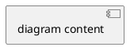

# PlantUML State Diagram Reference for LLMs

## Overview

State diagrams model the dynamic behavior of systems by representing states, transitions, and events. PlantUML provides a text-based language for creating state diagrams with support for composite states, concurrent states, history, stereotypes, and extensive styling options.

## Core Syntax Patterns

### Document Structure



### Basic Elements

#### Start and End Points
- **Start point**: `[*]`
- **End point**: `[*]`
- These markers indicate the entry and exit points of state diagrams

#### Transitions
- **Basic arrow**: `-->`
- **Alternative arrow**: `->`
- **Syntax**: `StateA --> StateB`
- **With label**: `StateA --> StateB : EventName`

#### State Declaration

**Implicit declaration** (automatic):
```plantuml
State1 --> State2
```

**Explicit declaration** (with keyword):
```plantuml
state State1
state "Long State Name" as alias1
state alias2 as "Another Long Name"
```

**State with description**:
```plantuml
State1 : description text
State1 : additional description
```

#### Rendering Modes

**Default rendering**: States shown with internal structure
**Simple box rendering**: 
```plantuml
hide empty description
```

## Composite States

### Basic Composite State

Composite states contain sub-states and are defined using braces:

```plantuml
state ParentState {
  [*] --> SubState1
  SubState1 --> SubState2 : Event
  SubState2 --> [*]
}
```

### Nested Composite States

States can be nested to arbitrary depth:

```plantuml
state OuterState {
  state MiddleState {
    state InnerState {
      [*] --> DeepState
    }
  }
}
```

### Sub-State to Sub-State Transitions

**Method 1**: Direct reference within hierarchy
```plantuml
state A {
  state X {
  }
}
state B {
  state Z {
  }
}
X --> Z
```

**Method 2**: Dot notation
```plantuml
state A.X
state A.Y
state B.Z
X --> Z
```

## State Features

### Long Names and Aliases

**Multi-line state names**:
```plantuml
state "Accumulate Enough Data\nLong State Name" as long1
```

**Alias patterns**:
- `state alias1` - simple name
- `state "display name"` - quoted name
- `state "Display Name" as alias` - display name with alias
- `state alias as "Display Name"` - alias with display name

### State Descriptions

**Single line**:
```plantuml
State1 : description text
```

**Multiple descriptions**:
```plantuml
State1 : first description
State1 : second description
```

**Within composite states**:
```plantuml
state "Composite" as c1 {
  c1: State description
  state s2
  state s3: inline description
}
```

## History States

History states preserve the last active sub-state when re-entering a composite state.

### Shallow History
**Syntax**: `[H]`
**Behavior**: Restores the last active immediate sub-state

### Deep History
**Syntax**: `[H*]`
**Behavior**: Restores the entire state hierarchy

**Example**:
```plantuml
state CompositeState {
  [*] --> SubState1
  SubState1 --> SubState2
  ParentState --> [H]: Resume
}
CompositeState --> ParentState[H*]: DeepResume
```

## Fork and Join

### Fork (Parallel Split)

**Syntax**: `<<fork>>` stereotype

```plantuml
state fork_state <<fork>>
[*] --> fork_state
fork_state --> State2
fork_state --> State3
```

### Join (Parallel Merge)

**Syntax**: `<<join>>` stereotype

```plantuml
state join_state <<join>>
State2 --> join_state
State3 --> join_state
join_state --> State4
```

## Concurrent States

Concurrent states execute in parallel within a composite state.

### Horizontal Separator

**Syntax**: `--` (multiple dashes)

```plantuml
state Active {
  [*] -> NumLockOff
  NumLockOff --> NumLockOn : EvNumLockPressed
  --
  [*] -> CapsLockOff
  CapsLockOff --> CapsLockOn : EvCapsLockPressed
}
```

### Vertical Separator

**Syntax**: `||` (double pipe)

```plantuml
state Active {
  [*] -> NumLockOff
  NumLockOff --> NumLockOn : EvNumLockPressed
  ||
  [*] -> CapsLockOff
  CapsLockOff --> CapsLockOn : EvCapsLockPressed
}
```

## Stereotypes

### Common Stereotypes

| Stereotype | Purpose | Usage |
|------------|---------|-------|
| `<<start>>` | Explicit start point | Alternative to `[*]` for starting |
| `<<end>>` | Explicit end point | Alternative to `[*]` for ending |
| `<<choice>>` | Conditional/decision point | Branch based on conditions |
| `<<fork>>` | Parallel split | Split into concurrent paths |
| `<<join>>` | Parallel merge | Merge concurrent paths |
| `<<history>>` or `[H]` | Shallow history | Restore last sub-state |
| `<<history*>>` or `[H*]` | Deep history | Restore state hierarchy |
| `<<entryPoint>>` | Entry point for composite | Define entry into composite state |
| `<<exitPoint>>` | Exit point for composite | Define exit from composite state |
| `<<inputPin>>` | Input pin | Input connection point |
| `<<outputPin>>` | Output pin | Output connection point |
| `<<expansionInput>>` | Expansion input | Input for expansion regions |
| `<<expansionOutput>>` | Expansion output | Output for expansion regions |
| `<<sdlreceive>>` | SDL receive symbol | Special SDL notation |

### Choice (Conditional) Example

```plantuml
state c <<choice>>
Idle --> ReqId
ReqId --> c
c --> MinorId : [Id <= 10]
c --> MajorId : [Id > 10]
```

### Entry/Exit Points

```plantuml
state Composite {
  state entry1 <<entryPoint>>
  state exitA <<exitPoint>>
  entry1 --> InternalState
  InternalState --> exitA
}
[*] --> entry1
exitA --> NextState
```

## Arrow Styling

### Direction
- `-->` : default direction
- `-up->` or `up->` : upward
- `-down->` or `down->` : downward
- `-left->` or `left->` : leftward
- `-right->` or `right->` : rightward

### Line Style
- `-[bold]->` : bold line
- `-[dashed]->` : dashed line
- `-[dotted]->` : dotted line
- `-[hidden]->` : hidden line (for layout)

### Color
- `-[#color]->` : colored arrow
- `-[#blue,bold]->` : combination of color and style

**Example**:
```plantuml
State1 -up[#red,dashed]-> State2
State3 -[bold]-> State4
State5 -[hidden]-> State6
```

## Notes and Annotations

### Positional Notes

```plantuml
note left of State : text
note right of State : text
note top of State : text
note bottom of State : text
```

### Multi-line Notes

```plantuml
note right of State
  Line 1
  Line 2
  Line 3
end note
```

### Floating Notes

```plantuml
state foo
note "This is a floating note" as N1
```

### Notes on Links

```plantuml
State1 --> State2
note on link
  transition note
end note
```

### Notes on Composite States

```plantuml
state "Composite State" as CS {
  state SubState
}
note right of CS : Note on composite state
```

## Styling and Colors

### Inline Color (Hash Notation)

**Background color only**:
```plantuml
state StateName #pink
```

**Background color for composite**:
```plantuml
state CompositeName #lightblue {
  state Inner #brown
}
```

### Advanced Inline Styling

**Pattern 1**: `#color ##[style]color`
- Background color: `#color`
- Line style and color: `##[style]color`

```plantuml
state FooGradient #red-green ##00FFFF
state FooDashed #red|green ##[dashed]blue
state FoDotted ##[dotted]blue
state FooBold ##[bold]
```

**Pattern 2**: `#color;line:color;line.[bold|dashed|dotted];text:color`

```plantuml
state FooGradient #red-green;line:00FFFF
state FooDashed #red|green;line.dashed;line:blue
state FooDotted #line.dotted;line:blue
state s2 #pink;line:red;line.bold;text:red : description
```

### Skinparam Styling

**Global settings**:
```plantuml
skinparam backgroundColor LightYellow
skinparam state {
  StartColor MediumBlue
  EndColor Red
  BackgroundColor Peru
  BorderColor Gray
  FontName Impact
}
```

**Stereotype-specific**:
```plantuml
skinparam state {
  BackgroundColor<<Warning>> Olive
}
state "Warning State" <<Warning>>
```

**Available skinparam options**:
- `AttributeFontColor`
- `AttributeFontName`
- `AttributeFontSize`
- `AttributeFontStyle`
- `BackgroundColor`
- `BorderColor`
- `EndColor`
- `FontColor`
- `FontName`
- `FontSize`
- `FontStyle`
- `StartColor`

### Style Blocks

Modern styling approach using `<style>` blocks:

```plantuml
<style>
stateDiagram {
  BackgroundColor Peru
  FontName Impact
  FontColor Red
  arrow {
    FontSize 13
    LineColor Blue
  }
}
</style>
```

**Diamond (choice) styling**:
```plantuml
<style>
diamond {
  BackgroundColor #palegreen
  LineColor #green
  LineThickness 2.5
}
</style>
```

**Nested state body styling**:
```plantuml
<style>
.foo {
  state,stateBody {
    BackGroundColor lightblue;
  }
}
</style>
state MainState <<foo>> {
  state SubA
}
```

## JSON Data Integration

States can include JSON data for documentation:

```plantuml
state "A" as stateA
state "C" as stateC {
  state B
}
json jsonJ {
  "fruit":"Apple",
  "size":"Large",
  "color": ["Red", "Green"]
}
```

## Common Patterns and Best Practices

### Pattern: Simple State Machine

```plantuml
@startuml
[*] --> Idle
Idle --> Processing : start
Processing --> Complete : success
Processing --> Error : failure
Complete --> [*]
Error --> Idle : retry
Error --> [*] : abort
@enduml
```

### Pattern: Hierarchical State Machine

```plantuml
@startuml
[*] --> PowerOff

state PowerOn {
  [*] --> Initializing
  Initializing --> Ready : complete
  
  state Ready {
    [*] --> Standby
    Standby --> Active : request
    Active --> Standby : idle
  }
}

PowerOff --> PowerOn : power_on
PowerOn --> PowerOff : power_off
@enduml
```

### Pattern: Concurrent Regions

```plantuml
@startuml
[*] --> SystemActive

state SystemActive {
  [*] -> ProcessA1
  ProcessA1 --> ProcessA2
  --
  [*] -> ProcessB1
  ProcessB1 --> ProcessB2
  --
  [*] -> ProcessC1
  ProcessC1 --> ProcessC2
}

SystemActive --> [*]
@enduml
```

### Pattern: Choice/Decision

```plantuml
@startuml
[*] --> ValidateInput
ValidateInput --> decision <<choice>>
decision --> Process : [valid]
decision --> Error : [invalid]
Process --> [*]
Error --> [*]
@enduml
```

## Syntax Rules Summary

### Special Characters
- `[*]` - Start/End marker
- `-->` or `->` - Transition arrow
- `:` - Separator for state descriptions and transition labels
- `{` `}` - Composite state delimiters
- `--` - Horizontal separator for concurrent states
- `||` - Vertical separator for concurrent states
- `#` - Color prefix
- `##` - Line style/color prefix
- `<<` `>>` - Stereotype delimiters
- `"` - Quotes for multi-word names
- `\n` - Line break in labels
- `-[` `]->` - Arrow style modifiers

### Reserved Keywords
- `@startuml` / `@enduml` - Diagram boundaries
- `state` - State declaration
- `as` - Alias assignment
- `note` - Note declaration
- `end note` - Multi-line note terminator
- `hide empty description` - Rendering mode
- `skinparam` - Styling command
- `scale` - Diagram scaling

### Naming Conventions
- Simple names: alphanumeric, underscore
- Quoted names: any characters in quotes
- Aliases: use `as` keyword for mapping
- Avoid spaces in simple names
- Use quotes or aliases for spaces

## Escaping and Special Cases

### Escaping Special Characters

In some contexts, special characters need escaping with backslash:
- `\[*]` - Escaped start/end marker
- `\n` - Literal backslash-n (not newline)

### Layout Hints

**Hidden arrows for layout**:
```plantuml
State1 -[hidden]-> State2
```

**Scaling**:
```plantuml
scale 600 width
scale 350 height
```

## Error Prevention

### Common Mistakes to Avoid

1. **Missing braces**: Composite states require `{` `}`
2. **Unmatched stereotypes**: Use `<<` and `>>` together
3. **Invalid arrows in notes**: Use proper note syntax
4. **Conflicting styles**: Later declarations override earlier ones
5. **Reserved word conflicts**: Use quotes for state names that match keywords
6. **Unescaped special chars**: Escape `[*]` when used as text

### Validation Checklist

- [ ] Every `@startuml` has matching `@enduml`
- [ ] All `{` have matching `}`
- [ ] All `<<` have matching `>>`
- [ ] All multiline notes have `end note`
- [ ] State names are unique or properly aliased
- [ ] Transitions reference existing states
- [ ] Stereotypes use valid names

## Reference Summary

### Quick Syntax Reference

```
State Declaration:
  state Name
  state "Display" as alias
  state Name : description

Transitions:
  StateA --> StateB
  StateA --> StateB : label
  StateA -[style]-> StateB

Composite:
  state Parent {
    [*] --> Child
    Child --> [*]
  }

Concurrent:
  state Parent {
    Region1_states
    --
    Region2_states
  }

Stereotypes:
  state name <<stereotype>>

Notes:
  note position of State : text
  note on link
    text
  end note

Styling:
  state Name #color
  state Name #bg ##[style]line
  skinparam state { ... }
  <style> ... </style>
```

## Advanced Features

### History State Restoration

When re-entering a composite state:
- **Shallow history `[H]`**: Restores last immediate sub-state
- **Deep history `[H*]`**: Restores entire sub-state tree

### Entry/Exit Point Patterns

Allows controlled entry/exit to composite states at specific points:

```plantuml
state Machine {
  state entry1 <<entryPoint>>
  state entry2 <<entryPoint>>
  state exit1 <<exitPoint>>
  
  entry1 --> ProcessingPath1
  entry2 --> ProcessingPath2
  ProcessingPath1 --> exit1
  ProcessingPath2 --> exit1
}

Setup --> entry1
Alternative --> entry2
exit1 --> Cleanup
```

### Pin-Based Connections

Similar to entry/exit points but using pin semantics:

```plantuml
state Component {
  state input1 <<inputPin>>
  state output1 <<outputPin>>
  
  input1 --> Process
  Process --> output1
}
```

This documentation provides comprehensive coverage of PlantUML state diagram syntax, patterns, and best practices optimized for LLM parsing and generation.